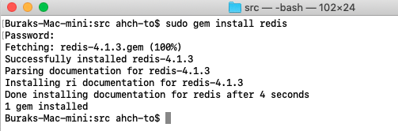
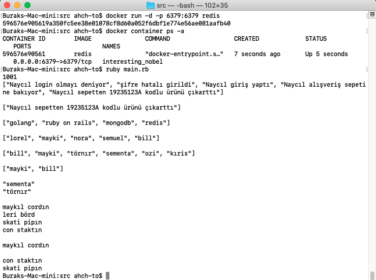
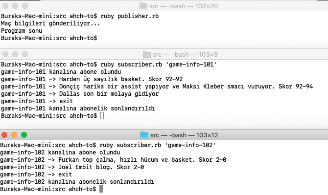
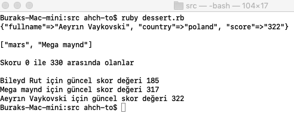
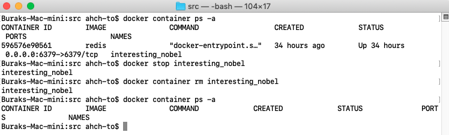

# Ruby Tarafından Redis(Docker bazlı) Veritabanı ile Konuşmak

Amacım Ruby kodlama ile docker container üzerinde host edilmiş bir Redis veritabanında basit işlemler yapabilmek. Redis, In-Memory NoSql veritabanı sistemlerinden birisidir. Tüm veriyi bellekte saklayıp buradan sorguladığından epeyce hızlıdır. Key-Value _(Tuple Store)_ tipinden bir veritabanı olup hash,list,set,sorted-set ve string [tiplerinden](https://redis.io/topics/data-types) oluşan zengin bir veri yapısına sahiptir. Dağıtılabilir caching stratejilerinde, otomatik tamamlama özelliklerine ait önerilerin hızla getirilmesinde, aktif kullanıcı oturumlarının takibinde, iş kuyruklarının modellenmesinde _(publisher/subscriber türevli)_ dağıtık bir NoSQL çözümü olarak kullanılabilir.

Redis, CAP _(Consistency, Availability, Partition Tolerance)_ üçgeninin CP kenarında yer alır. Kısaca hatırlatmak gerekirse dağıtık bir sistemde Consistency ilkesine göre tüm istemciler verinin her zaman aynı görünümüne ulaşır. Pi'nin değeri bir istemci tarafından 3.14 olarak belirlenmişse diğer istemciler Pi'ye baktıklarında bu değeri görür. Availability ilkesi tüm istemcilerin dağıtık sistem üzerinden her zaman okuma ve yazma yapabiliyor olmasını öngörür. Partition ilkesine göre node'larda fiziki olarak kopma meydana gelse bile sistem kullanılabilir durumdadır. Tabii en önemli nokta şudur ki CAP teoremine göre dağıtık bir sistem bu üç unsuru aynı anda karşılayamaz.

Çok sık gördüğümüz CAP üçgenini aklımızda kaldığı kadarıyla çizmeye çalışalım.


## ilk Adımlar

Öncelikle Redis Docker imajını ayağa kaldırıp ping atabilmeliyiz. Sistemde docker yüklüyse aşağıdaki komutlardan yararlanılabilir.

```
docker pull redis
docker run --name london --network host -d redis redis-server --appendonly yes
docker run -it --network host --rm redis redis-cli -h localhost
ping

docker stop london
docker container rm 0793a
```

İlk komut ile redis imajının son sürümünü indiriyoruz. Buradaki appendonly anahtarına verilen değer sebebiyle dataset üzerinde yapılan her değişiklik fiziki diskte kalıcılaştıracaktır. _([Persistance detayları için şuraya bakabiliriz](https://redis.io/topics/persistence))_ İkinci komutla container'ı başlatıyoruz ve üçüncü komut ile redis-cli terminal aracını devreye alıp redis ortamına bağlanıyoruz. ping karşılığında PONG mesajını görmemiz redis'in çalıştığının işaretidir. Son komutlar opsiyonel olmakla birlikte Docker container'ını durdurmak ve kaldırmak için kullanılabilir.


>Docker container'ı varsayılan olarak localhost:6379 üstünden ayağa kalkmıştır.

## Kod Tarafı için Hazırlıklar

Ruby tarafında redis ile konuşmak için _redis_ isimli gem paketinden yararlanacağız. Gerekli klasör ve dosya oluşturma işlemlerini takiben ilgili gem'i install parametresi ile terminalden yükleyebiliriz.

```
mkdir src
cd src
touch main.rb publisher.rb subscriber.rb dessert.rb

sudo gem install redis
```



## Çalışma Zamanı

Çalışma sırasında 3 farklı örneği denemek istedim.

### Başlangıç

İlk örnek ruby kodlarından Redis'e bağlanıp çok basit bir kaç işlemin nasıl icra edildiğini göstermektedir. Ağırlıklı olarak veri tipi kullanımları söz konusudur. 

Terminal komutlarından ilki ile docker container'ını ayağa kaldırıyoruz. İkinci komut kontrol amaçlı olarak container listesine bir bakmak için. Son terminal komutumuz tahmin edileceği üzere main.rb isimli ruby kodunu çalıştırıyor.

```
docker run -d -p 6379:6379 redis
docker container ps -a
ruby main.rb
```



### Ana Yemek

İkinci örnek biraz daha kapsamlı olup publish/subscribe modelinin uyarlamasını ele almaktadır. publisher görevini üstlenen uygulama sembolik olarak belirli aralıklarla broadcast yayını yapar ve game-info-101 ve game-info-102 kodlu kannalar üzerinden mesajlar yollar. Bu kanalları dinleyen aboneler mesajları görür. En az 3 terminal açıp birinde publisher.rb dosyasını diğer ikisinde de subscriber.rb dosyalarını dinleyecekleri kanalları parametre olarak verip çalıştırmak yeterlidir.

```
ruby subscriber.rb 'game-info-1'
ruby subscriber.rb 'game-info-2'
ruby publisher.rb
```



### Tatlı

Bu son örnekte SQL dünyasından Redis'e doğru bir bakış atmaya çalışacağız. Şema yapısı belli bir SQL tablosunu Redisce nasıl düşünebiliriz ve benzer sorguları nasıl atabiliriz bunu deneyimleyeceğiz. Redisin resmi dokümanlarına göre aşağıdaki her iki dünya arasında aşağıdaki çizelgede görülen benzerliği kurmak mümkün.


Bir tabloyu Hash olarak düşünmemiz mümkündür. Örneğin oyuncuların skorlarına göre sıralanacağı bir listeyi de Sorted Set nesnesi gibi düşünebiliriz. Son kod parçasını aşağıdaki terminal komutu ile çalıştırabiliriz.

```
ruby dessert.rb
```



### Tamamlarken

Eğer kullandığımız Redis Container'ı ile işimiz bittiyse durdurup kaldırmak isteyebiliriz. Bunun için aşağıdaki terminal komutlarını çalıştırmak yeterli olacaktır. _(Muhtemelen sizdeki Names değeri farklı olur)_

```
docker container ps -a
docker stop interesting_nobel
docker container rm interesting_nobel
docker container ps -a
```



## Neler Öğrendim?

- Redis docker imajını MacOS üzerinde kullanmayı
- Redis'in CAP teoreminde hangi ikiliye yakın olduğunu
- Redis gem'ini kullanarak yapılabilecek temel işlemleri
- Temel redis veri tiplerini
- Basit bir pub/sub kurgusunu işletmeyi
- SQL stilinde bir tablonun Redisce oluşturulmasını
- Bir hash içindeki tüm key değerlerini nasıl dolaşabileceğimi

## Eksikliği Hissedilen Konular

- Publisher tarafında farklı kanalların birbirinden bağımsız asenkron olarak yayın yapmasını nasıl sağlayabilirim?
- Subscribe.rb içerisinde birden fazla kanala abone olabilir miyim?
- Peki pub/sub senaryosunu Ruby on Rails tabanlı bir web projesinde nasıl kullanırım?