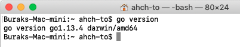
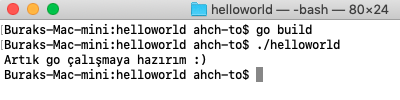
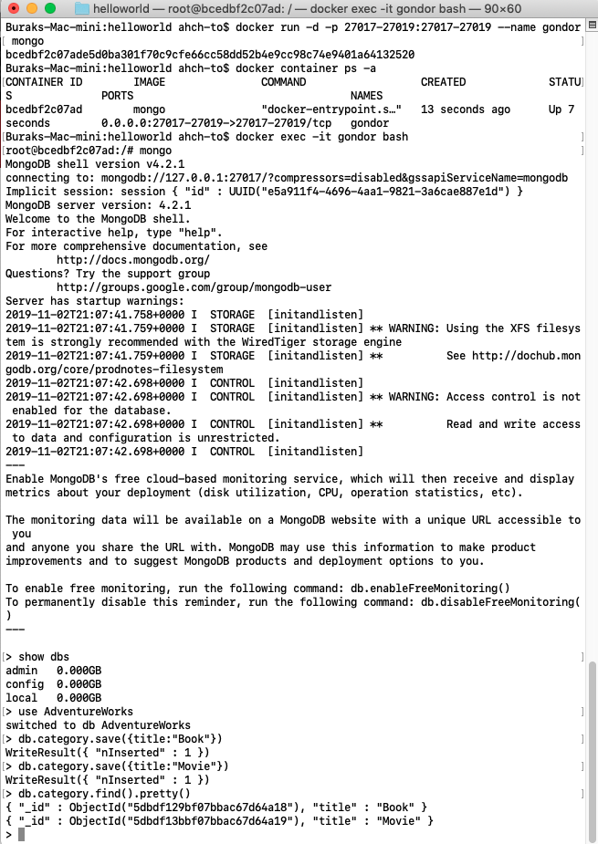

# MongoDB ile bir GO Uygulamasını Konuşturmak

Elimizdeki malzemeleri sayalım. MongoDB için bir docker imajı, gRPC ve GoLang. Bu üçünü kullanarak CRUD operasyonlarını icra eden basit bir uygulama geliştirmek niyetindeyim. Bir önceki öğretide Redis docker container'dan yararlanmıştım. Ahch-To sistemini kirletmemek adına MongoDB için de benzer şekilde hareket edeceğim. Açıkçası GoLang bilgim epey paslanmış durumda ve sistemde yüklü olup olmadığını dahi bilmiyorum.

```
go version
```

terminal komutu da bana yüklü olmadığını söylüyor. Dolayısıyla ilk adım onu MacOS'a yüklemek.

## İlk Hazırlıklar (Go Kurulumu ve MongoDB)

GoLang'i Ahch-To adasına yüklemek için [şu adrese](https://golang.org/dl/) gidip Apple macOS sürümünü indirmem lazım. Ben öğretiyi hazırlarken go1.13.4.darwin-amd64.pkg dosyasını kullandım. Kurulum işlemini tamamladıktan sonra komut satırından go versiyonunu sorgulattım ve aşağıdaki çıktıyı elde ettim.



Pek tabii içim rahat değildi. Evet versiyon bilgisi gelmişti ama bir "hello world" uygulamasını da çalışır halde görmeliydim ki kurulumun sorunsuz olduğundan emin olayım. Hemen resmi dokümanı takip ederek $HOME\go\src\ altında helloworld isimli bir klasör açıp aşağıdaki kod parçasını içeren helloworld.go dosyasını oluşturdum _(Visual Studio Code kullandığım için editörün önerdiği go ile ilgili extension'ları yüklemeyi de ihmal etmedim)_

```
package main

import "fmt"

func main() {
	fmt.Printf("Artık go çalışmaya hazırım :) \n")
}
```

Terminalden aşağıdaki komutları işlettikten sonra çıktıyı görebildim. 

```
go build
./helloworld
```



Go ile kod yazabildiğime göre MongoDB docker imajını indirip bir deneme turuna çıkabilirim. İşte terminal komutları.

```
docker pull mongo
docker run -d -p 27017-27019:27017-27019 --name gondor mongo
docker container ps -a
docker exec -it gondor bash

mongo
show dbs
use AdventureWorks
db.category.save({title:"Book"})
db.category.save({title:"Movie"})
db.category.find().pretty()

exit
exit
```



İlk komutla mongo imajı çekiliyor. İzleyen komut docker container'ını varsayılan portları ile sistemin kullanımına açmak için. Container listesinde göründüğüne göre sorun yok. MongoDB veritabanını container üzerinden test etmek amacıyla içerisine girmek lazım. 4ncü komutu bu işe yarıyor. Ardından mongo shell'e geçip bir kaç işlem gerçekleştirilebilir.

Önce var olan veritabanlarını listeliyor sonra AdventureWorks isimli yeni bir tane oluşturuluyor. Ardından category isimli bir koleksiyona iki doküman ekleniyor ve tümünü güzel bir formatta listeliyoruz. Arka arkaya gelen iki exit komutunu fark etmişsinizdir. İlki mongo shell'den, ikincisi de container içinden çıkmak için.

Ah çok önemli bir detayı unuttum. Örnekte gRPC protokolünü kullanacağız. Bu da bir proto dosyamız olacağı ve Golang için gerekli stub dosyasına derleme yapacağımız anlamına geliyor. Dolayısıyla sistemde protobuf ve go için gerekli derleyici eklentisine ihtiyacım var. brew ile bunları sisteme yüklemek oldukça kolay.

```
brew install protobuf
protoc --version
brew install protoc-gen-go
```

Kod tarafına geçmeye hazırız ama öncesinde ufak bir bilgi.

## gRPC Hakkında Azcık Bilgi

gRPC, HTTP2 bazlı modern bir iletişim protokolü ve JSON yerine ProtoBuffers olarak isimlendirilen kuvvetle türlendirilmiş bir ikili veri formatını kullanmakta _(strongly-typed binary data format)_ JSON özellikle REST tabanlı servislerde popüler bir format olmasına rağmen serileştirme sırasında CPU'yu yoran bir performans sergiliyor. HTTP/2 özelliklerini iyi kullanana gRPC ise 5 ile 25 kata kadar daha hızlı. Bu noktada hatırlamak için bile olsa gRPC ile REST'i kıyaslamakta yarar var. İşte karşılaştırma tablosu.

| REST Tarafı                                         |                                                    gRPC Tarafı |
|-----------------------------------------------------|---------------------------------------------------------------:|
| HTTP 1.1 nedeniyle gecikme yüksek                   | HTTP/2 sebebiyle daha düşük gecikme                            |
| Sadece Request/Response                             | Stream desteği                                                 |
| CRUD odaklı servisler için                          | API odaklı                                                     |
| HTTP Get,Post,Put,Delete  gibi fiil tabanlı         | RPC tabanlı, sunucu üzerinden  fonksiyon çağırabilme özelliği  |
| Sadece Client->Server yönlü talepler                | Çift yönlü ve asenkron iletişim                                |
| JSON kullanıyor (serileşme yavaş, daha büyük boyut) | Protobuffer kullanıyor (daha küçük boyutta ve serileşme hızlı) |

## Çalışma Zamanı

>throw new NotImplementedException();

## Neler Öğrendim?

>throw new NotImplementedException();

## Eksikliği Hissedilen Konular

>throw new NotImplementedException();