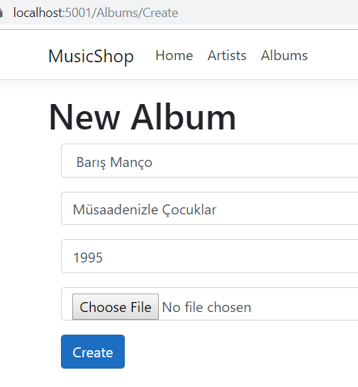
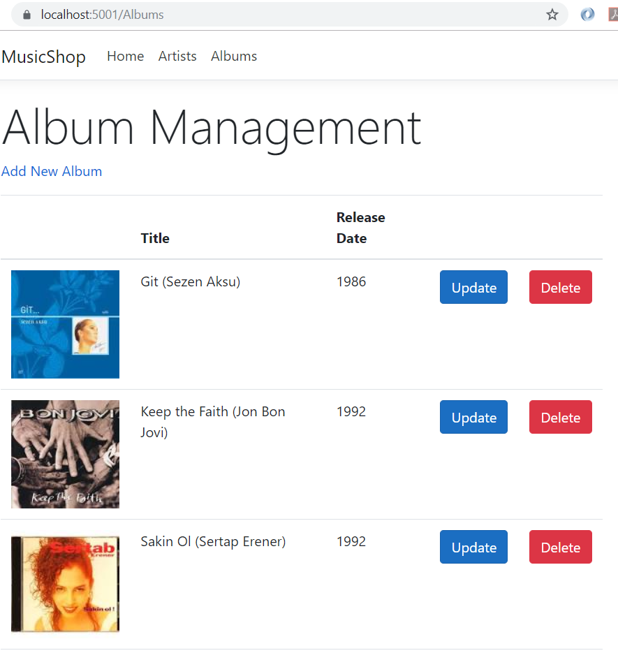
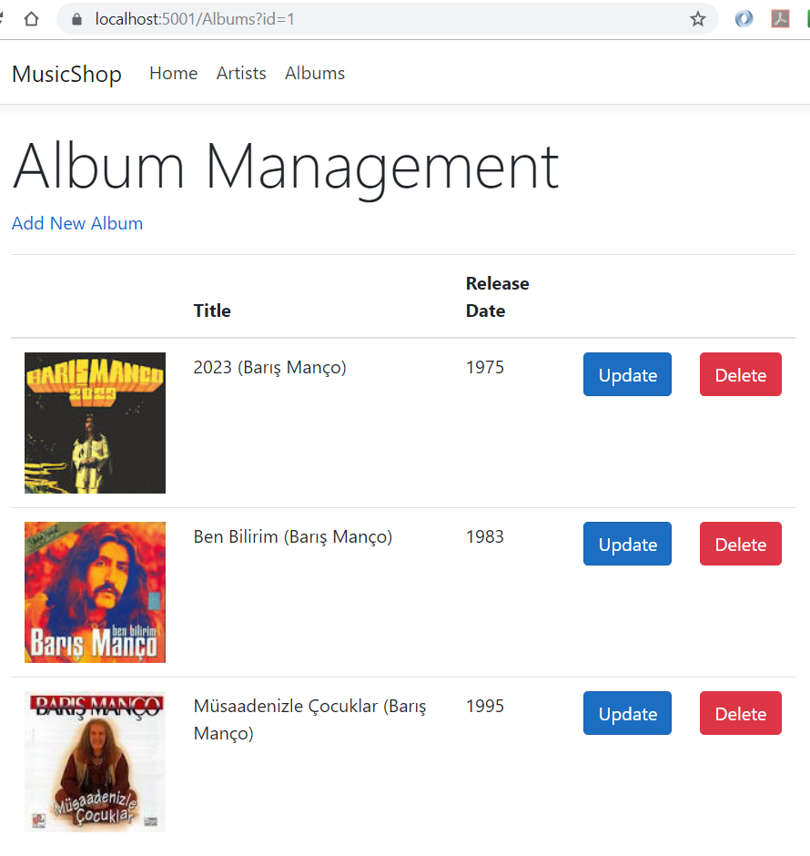

# .Net Core 3 Tabanlı Basit Bir Razor Uygulaması

Şu Razor'u gözü kapalı kavramam lazım. Başlangıç noktası olarak Microsoft'un resmi dokümanı pekala yeterli.

## To Do

- Albüm silme de popup deneyelim
- Albümlere kapak fotoğrafları için boyut küçültme gerekli
- Ana sayfada günün albümü olsun. Rastgele gelsin.
- Albümlerde veya artistlerde arama seçeneği koyalım

## Platform

Örnek uygulama Visul Studio Code kullanılarak geliştirilmiştir, veri tabanı olarak SQLite kullanılmıştır.
.Net Core 3.1 Runtime hedef alınmıştır.

## Uygulamanın İnşası

```bash
dotnet new webapp -o MusicShop
dotnet dev-certs https --trust
```

## Ortam İçin Gerekli Paket ve Araç Kurulumları

```bash
dotnet tool install --global dotnet-ef

dotnet add package Microsoft.EntityFrameworkCore.SQLite
dotnet add package Microsoft.EntityFrameworkCore.Design
```

## EF Migration Komutları

```bash
dotnet ef migrations add InitialCreate
dotnet ef database update
```

## Çalışma Zamanı

```bash
dotnet run
```

sonrasında localhost:5001 veya 5000 üstünden testlere başlanabilir.


**_Artistlerin görüntülendiği sayfa_**


**_Yeni bir artist eklenirkenki kullanılan sayfa_**



**_Albüm ekleme sayfası_**



**_Albüm eklendikten sonra gelinen albümler sayfası_**



**_Artist sayfasından bir artist seçildiğinde gidilen albüm sayfası_**
