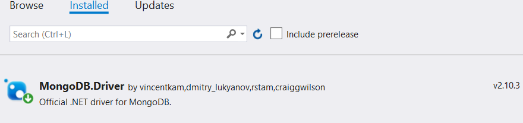
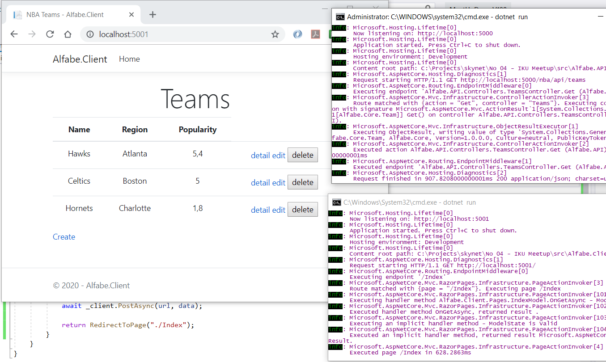
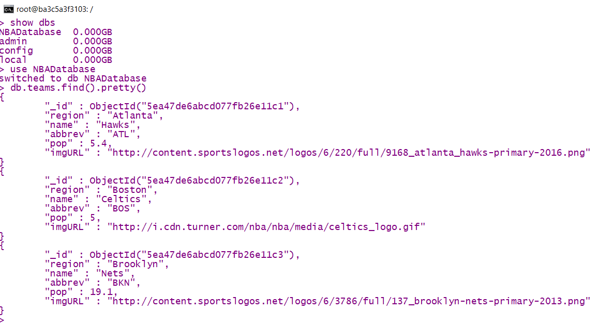
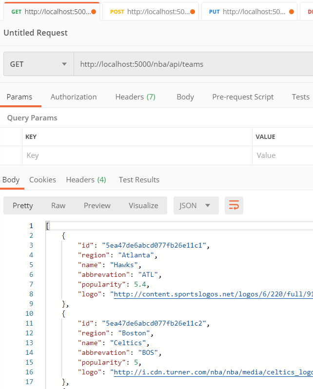
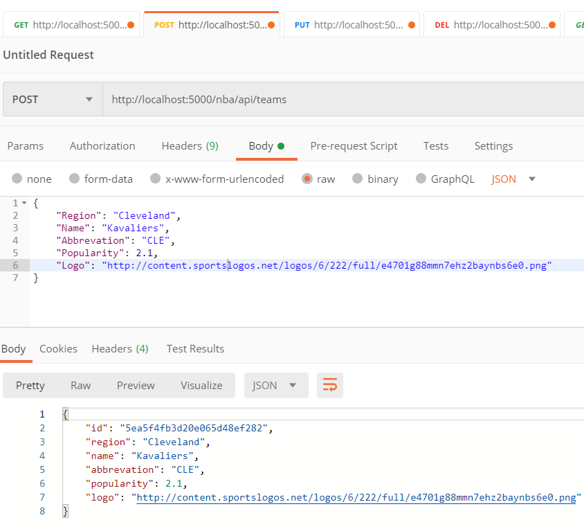
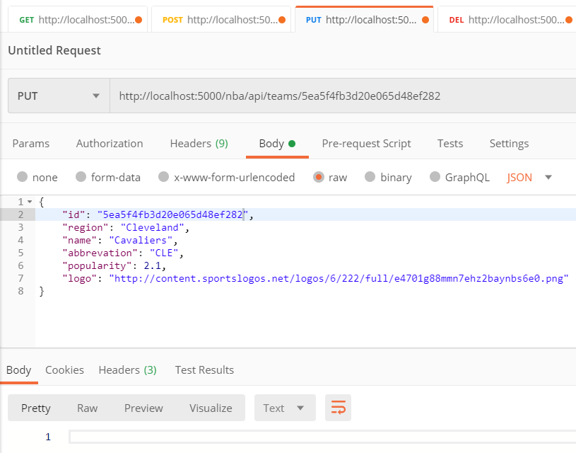
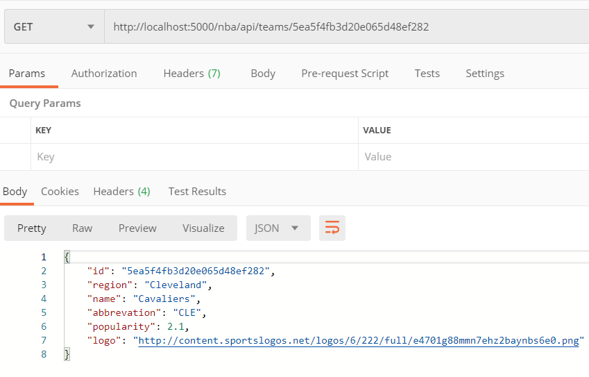
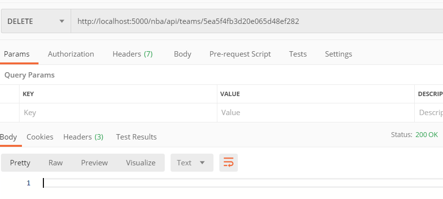

# IKU Tarafından Düzenlenen Meetup Çalışması

MongoDb ile çalışan bir Asp. Net Core Web API projesinin geliştirilmesi hedeflenmiştir. Servis tarafının kodları öncelikle Unit Test projesinde kodlanmıştır. MongoDB için Docker Container kullanılmıştır. Uygulama Visual Studio 2019 ile Windows 10 üstünde, Docker Desktop kurulu bir sistemde geliştirilmiştir. İlaveten Razor tipinden bir Asp.Net Core Web App eklenmiş ve CRUD operasyonları buraya alınmıştır.

## Kullanılan MongoDB Docker Komutları

```
docker run -d --name MongoLand -p 27017:27017 mongo:latest
docker exec -it MongoLand bash
```

## Yararlı Olabilecek Diğer Docker Komutları

```
docker images
docker container ls -a
docker stop container MongoLand
docker container rm MongoLand
```

## MongoDB Terminal Tarafında Yapılanlar

```
show dbs

use NBADatabase

db.stats()

db.createCollection('teams')

db.stats()

db.teams.insertMany([{
      "region":"Atlanta",
      "name":"Hawks",
      "abbrev":"ATL",
      "pop":5.4,
      "imgURL":"http://content.sportslogos.net/logos/6/220/full/9168_atlanta_hawks-primary-2016.png"
   },
   {
      "region":"Boston",
      "name":"Celtics",
      "abbrev":"BOS",
      "pop":5,
      "imgURL":"http://i.cdn.turner.com/nba/nba/media/celtics_logo.gif"
   },
   {
      "region":"Brooklyn",
      "name":"Nets",
      "abbrev":"BKN",
      "pop":19.1,
      "imgURL":"http://content.sportslogos.net/logos/6/3786/full/137_brooklyn-nets-primary-2013.png"
   }])

db.teams.find().pretty()

db.teams.find({"pop":{$gt:10}}).pretty()

exit

exit
```

> Kaynak JSON dosyası için Assets klasöründeki [NBA Takımları](./assets/NBATeams.json) dosyasından yararlanılabilir.

## Gerekli NuGet Paketi

MongoDB Client kullanımı için gerekli NuGet paketi, Alfabe.Core projesine paket yöneticisi üzerinden eklenmiştir.



## Testler(Postman-Web API)

Unit Test'ler haricinde Web API tarafı için Postman kullanılmıştır.

Tüm takım listesini çekmek için
```
HTTP Get
http://localhost:5000/nba/api/teams
```

Yeni bir takım eklemek için
```
HTTP Post
http://localhost:5000/nba/api/teams
Raw Body, JSON

{
    "Region": "Cleveland",
    "Name": "Kavaliers",
    "Abbrevation": "CLE",
    "Popularity": 2.1,
    "Logo": "http://content.sportslogos.net/logos/6/222/full/e4701g88mmn7ehz2baynbs6e0.png"
}
```

Belli bir takımı çekmek için
```
HTTP Get
http://localhost:5000/nba/api/teams/5ea4907c3ac6f5590cd4c2c6
```

Bir takım bilgisini güncellemek için
```
HTTP Put
http://localhost:5000/nba/api/teams/5ea4907c3ac6f5590cd4c2c6
Raw Body, Json

{
    "id": "5ea4907c3ac6f5590cd4c2c6",
    "region": "Cleveland",
    "name": "Cavaliers",
    "abbrevation": "CLE",
    "popularity": 2.1,
    "logo": "http://content.sportslogos.net/logos/6/222/full/e4701g88mmn7ehz2baynbs6e0.png"
}
```

Bir takımı silmek için
```
HTTP Delete
http://localhost:5000/nba/api/teams/5ea4907c3ac6f5590cd4c2c6
```

## Web Uygulamasının Çalıştırılması

Öncelikle MongoLand isimli bu projeye özel MongoDB Container'ının çalışır olduğundan emin olunmalıdır. Servis durmuşsa çalıştırmak için aşağıdaki komut kullanılabilir.

```
docker start MongoLand
```

Sonrasında Alfabe.API servisi komut satırından çalıştırılmalıdır. Bu uygulama klasöründe _dotnet run_ demek yeterlidir. API'de başarılı bir şekilde ayağa kalkarsa Alfabe.Client yine terminalden _dotnet run_ komutu ile çalıştırılabilir.



## Postman Çalışma Zamanı Testlerinden Görüntüler











