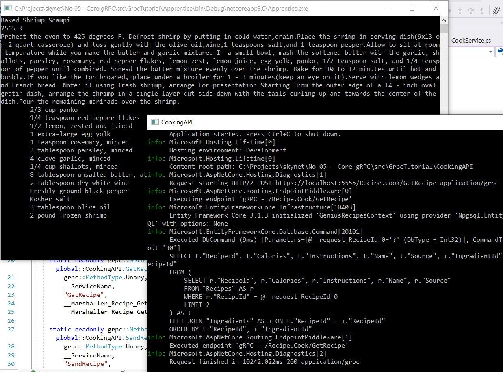

# gRPC Destekli Basit Bir .Net Core Servisinin Geliştirilmesi

gRPC üzerinden yayın yapan basit bir servis ve bunu yardımcı NuGet paketleri sayesinde tüketebilen çeşitli tipte istemcilerin geliştirilmesi amaçlanmıştır. Örnek Visual Studio 2019 üzerinde yazılmaktadır. gRPC servisi PostgreSQL ile çalışan bir uygulamadır ve CRUD operasyonları için Entity Framework ile entegre edilmiştir.

## Ön Hazırlıklar

Verileri saklamak için Postgresql tercih ettim. Sisteme yüklemek yerine docker imajını kullanmak işime geldi.

```bash
docker run --name London -e POSTGRES_PASSWORD=P@ssw0rd -p 5433:5432 -d postgres
docker exce -it London bash
psql -U postgres

Create Database GeniusRecipes;
Select datname from pg_Database;
```

## Servis Uygulaması için Gerekli NuGet Paketleri

gRPC servisi PostgreSQL tabloları için Entity Framework kullanabilir. Bunun için Npgsql.EntityFrameworkCore.PostgreSQL ve
Microsoft.EntityFrameworkCore.Design paketlerini yüklemek gerekir.

## EF Migration Komutları

Visual Studio 2019 üzerinde CookingAPI projesi seçiliyken Package Manager Console üzerinden çalıştırılan komutlardır. Böylece GeniusRecipesContext sınıfı baz alınarak Postgresql tarafındaki db nesneleri oluşturulur. Komutların çalışabilmesi için ilgili projede Microsoft.EntityFrameworkCore.Design paketinin yüklü olması gerekmektedir.

```bash
Add-Migration initial
Update-Database
```

## Olur ya

Olurda benim gibi yeni bir Linux makineye geçersiniz. Bu durumda Add-Migration ve Update-Database gibi komutlar bulunamayabilir.Böyle bir durumda EF CLI aracını yüklemek gerekir.

```bash
dotnet tool install --global dotnet-ef
dotnet ef migrations add initial
dotnet ef database update
```

## Client App için gerekli NuGet Paketleri

İstemci tarafında GRPC kullanımı için şu paketlerin yüklenmesi gerekir.

- Grpc.Net.Client
- Google.Protobuf
- Grpc.Tools

## Çalışma Zamanı

Önce CookingAPI servisi çalıştırılır. Ayarlamalar gereği <https://localhost:5555> üzerinden hizmet verecektir. Ardından Apprentice istemcileri yürütülebilir.


_(Console uygulamasında örnek bir yemek tarifinin eklenmesi)_

s
_(Console uygulamasına örnek yemek tarifinin çekilmesi)_


_(Console uygulamasında Include ile malzeme listesinin de döndürülmesi)_

```bash
docker exec -it London bash
\connect geniusrecipes
Select "Name","Calories" from "Recipes";
```

Verileri Postgresql tarafında analiz etmek için docker üzerinden bash'e geçip psql CIL aracı kullanılabilir ya da Azure Data Studio gibi çok şükela bir ürün de düşünülebilir.
