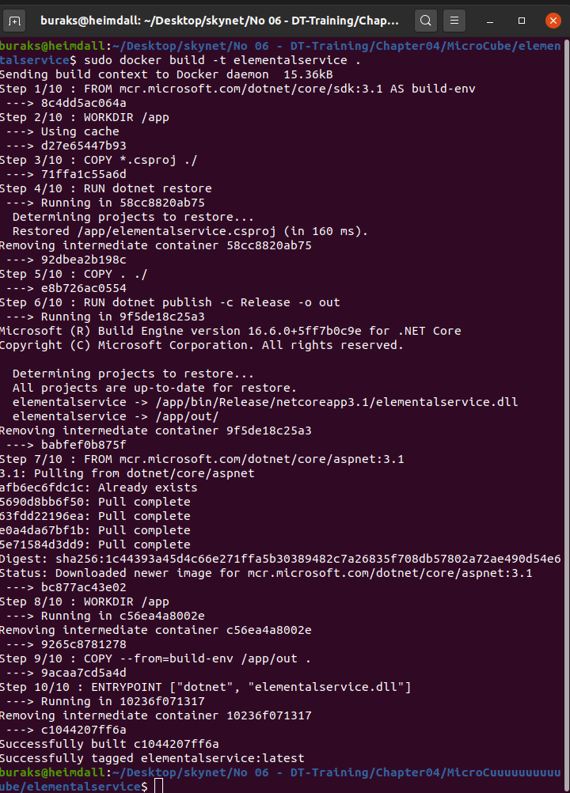
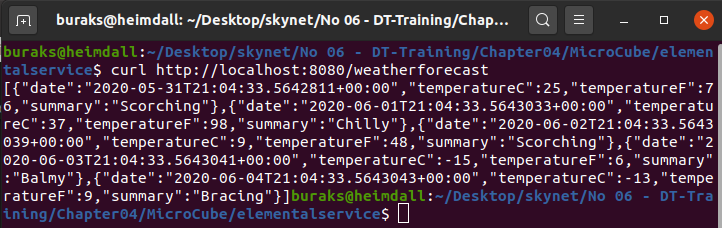

# Basit Bir .Net Core Web API Servisinin Docker Container Haline Getirilmesi

Amaç bir .Net Core Web API servisinin docker container haline getirmek. Öğrenilmesi istenen şey docker container'ının hazırlanması olduğu için,hazır web api şablonu ile uğraşılmamıştır.

## Hazırlıklar

```bash
mkdir MicroCube
cd MicroCube
dotnet new webapi -o elementalservice
cd elementalservice
touch Dockerfile
touch .dockerignore
```
## Yapılanlar

- Dockerfile ve .dockerignore dosyaları düzenlendi

## Container İşlemler

Proje klasörü içerisindeyken...

```bash
sudo docker build -t elementalservice .
```



## Testler

Docker build işlemi sorunsuz gerçekleştiyse...

```bash
sudo docker run -d -p 8080:80 --name elmntl elementalservice
curl http://localhost:8080/weatherforecast
```



## Bölüm Soruları

_Hadi yine iyisiniz?_

## Mini Lab Çalışması _(Süre: Bir sonraki güne ödev)_

Herhangibir veri tabanını Entity Framework ile kullanan bir api servisini dockerize etmeye çalışınız.