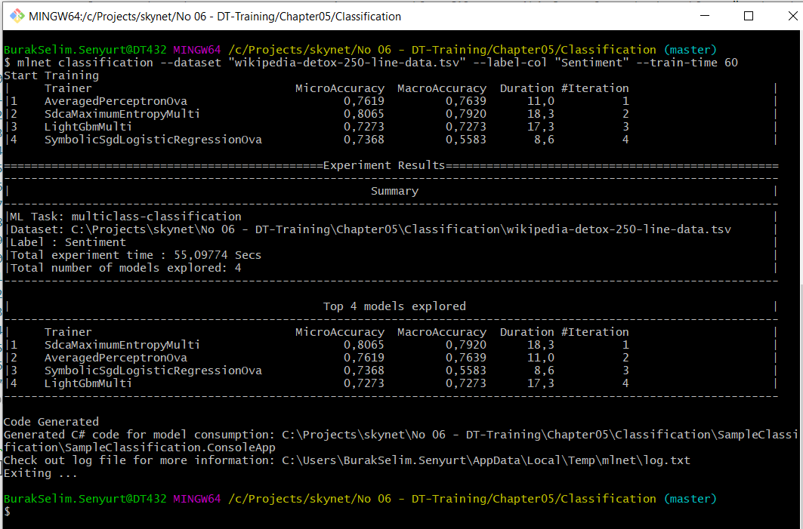
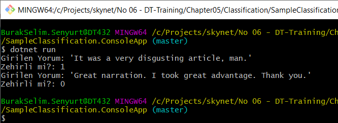

# ML.Net Alıştırmaları _(Microsoft'un Resmi ML.Net Örnekleri Kullanılmıştır)_

ML.Net, Microsoft'un platform bağımsız ve açık kaynak olarak sunduğu Machine Learning çatısıdır. Bu Framework'ten yararlanarak aşağıdakine benzer senaryolar işletilebilir.

- Classification: Müşterilerin geri bildirimlerinin duyarlılığını analiz ederek gelen yorumun positif veya negatif olup olmadığını tahminlemek.
- Image Classification: En bilinen senaryolardan.Bir fotoğrafın(imgenin) hangi kategoriye ait olduğunu tahminlemek.
- Regression _(Value prediction)_: Değer bazlı tahminleme. Örneğin bir yere giderkenki taksi ücretini tahminleme, bir seyahatin fiyatını tahminleme gibi.
- Recommendation: Kullanıcın geçmiş hareketliliklerine bakarak ona önerilerde bulunma.

## Hazırlıklar

```bash
#ml.net çatısını kullanabilmek için gerekli CLI aracının yüklenmesi gerekiyor
dotnet tool install -g mlnet
```

## Çalışma Zamanı

Classification klasöründeki örnek Wikipedia'nın örnek kullanıcı yorumlarını içeren bir dataset'tir. TSV formatındadır. Lakin ML.Net tsv formatı dışında csv,parquet, generic IEnumerable, file set gibi formatları da destekler. Örnekte kullanılan dataset içerisinde yorumların wikipedia'ca zehirli olup olmadığı bilgisi yer almaktadır. Sentiment kolonundaki değerin 1 veya 0 olması takip eden kolondaki yorumun zararlı olup olmadığını işaret eder. 1 ise zararlı. Console uygulması gelen yorumun zararlı olup olmadığını tahminlemektedir.

```bash
# Önce örnek veri setini kullanarak modelin eğitilmesi gerekiyor.

# classification yapacağımızı, wikipedia-detox-250-line-data.tsv isimli dosyadaki veri setini kullanacağımızı,
# Sentiment isimli kolonun değerlerini baz alacağımızı ve modeli 60 saniye boyunca eğiteceğimizi ifade ediyoruz.
mlnet classification --dataset "wikipedia-detox-250-line-data.tsv" --label-col "Sentiment" --train-time 60
```



Model eğitimi tamamlanınca hangi algoritmaların daha başarılı olduğu da görülebilir. Bununla birlikte CLI bir Solution oluşturur. İlk örneğe ait bir çalışma zamanı görüntüsü aşağıdaki gibidir.



## Bölüm Soruları

_Hadi yine iyisiniz?_

## Mini Lab Çalışması _(Süre: Bir sonraki güne ödev)_

- Örnek bir tsv veya csv veriseti bulup üzerinde Classification denemesi yapın ve tahminlemede bulunun.
