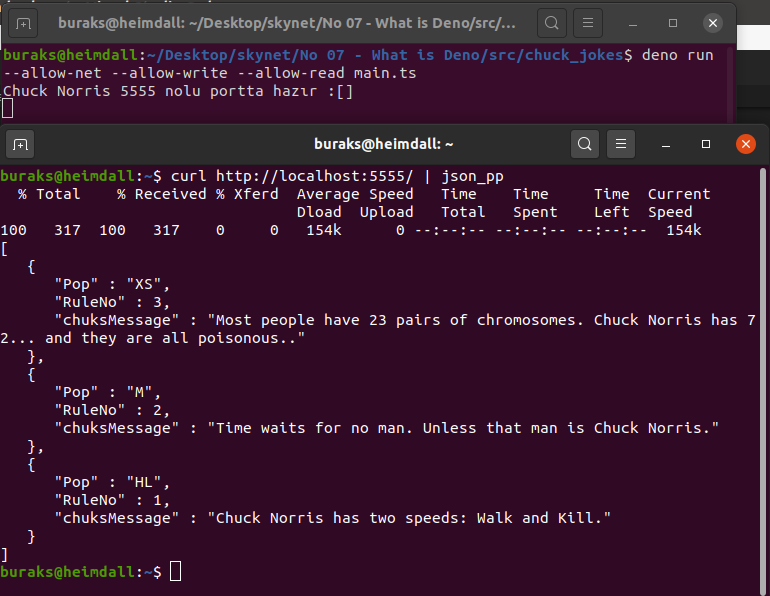
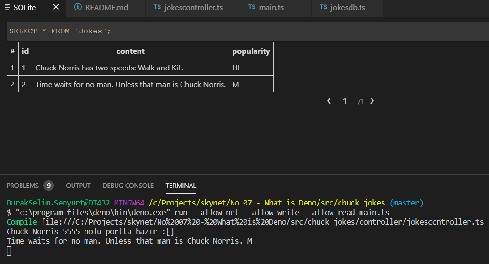
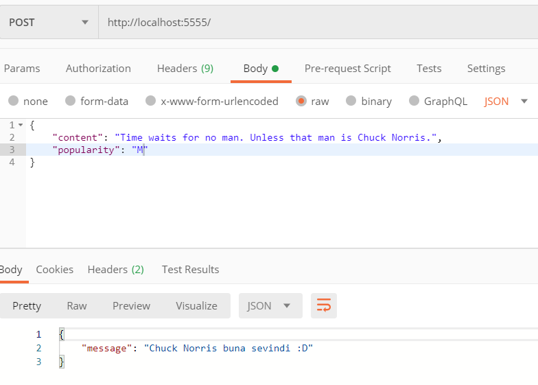
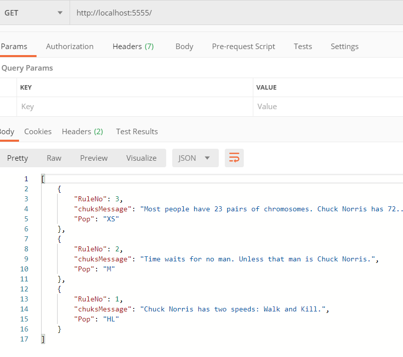

# Sıkça Duyduğum Deno'ya Hello Demek İstedim

Şu sıralar adını sıklıkla duyduğum ve NodeJs'in yerini alır mı almaz mı tartışmalarını(ki öyle bir şey yok) okuduğum Deno'yu incelemek istedim. Javascript haricinde dahili olarak Typescript desteği de sunan, V8 üzerinde koşan ve Rust ile yazılmış bir çalışma zamanı olarak nitelendiriliyor. Ben nasıl bir geliştirme tecrübesi yaşatacağını tatmak istiyorum. Klasik kurgu olarak REST tipinden bir servisin birkaç operasyonunu icra etsem yeterli. Örnek verileri almak için International Chuck Norris veritabanını kullanabilirim :D Biraz eğlence katmak lazım. Hatta verileri SQLite veritabanında tutmak da fena olmaz.

## Kurulum _(Aslında Pek de Değil)_

Tabii önce deno çalışma zamanını sisteme yüklemek lazım. [Resmi adresinde](https://deno.land/#installation) basit bir kılavuz mevcut. Ben şirket bilgisayarına(powershell üzerinden) ve evdeki linux sistemine aşağıdaki komutlarla kurulum yaptım. Windows tarafında tek bir exe geldi. Nefis ki zaten Deno'nun özelliği de buymuş. NodeJs gibi bir kurulum gerektirmiyor. Tek binary yeterli. İhtiyaç duyulan modüller https://deno.land/std ve benzeri deno adreslerinden import ile uygulamaya inebiliyor.

```powershell
$env:DENO_INSTALL = "C:\Program Files\deno"
iwr https://deno.land/x/install/install.ps1 -useb | iex
```

```bash
curl -fsSL https://deno.land/x/install/install.sh | sh
```

Doğruyu söylemek gerekirse zahmetsiz bir kurulum oldu :)

## Uygulama İskeleti

```bash
mkdir chuck_jokes
cd chuck_jokes
touch main.ts
mkdir data model controller route
touch data/jokesdb.ts controller/jokescontroller.ts  model/joke.ts route/jokesrouter.ts
```

## Çalışma Zamanı

Uygulamayı çalıştırırken internetten indireceği modüller olması sebebiyle --allow-net ile erişime izin vermemiz gerekiyor. Ayrıca SQLite veritabanı için diske yazma ve diskten okuma izni de vermek lazım. Write ve read bunun için eklendi.

```bash
deno run --allow-net --allow-write --allow-read main.ts
```

Hem Heimdall _(Ubuntu 20.04)_ hem de şirket bilgisayarından _(Windows 10)_ birkaç görüntü.









Chuck Norris artık mutlu :P
