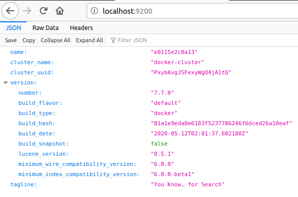
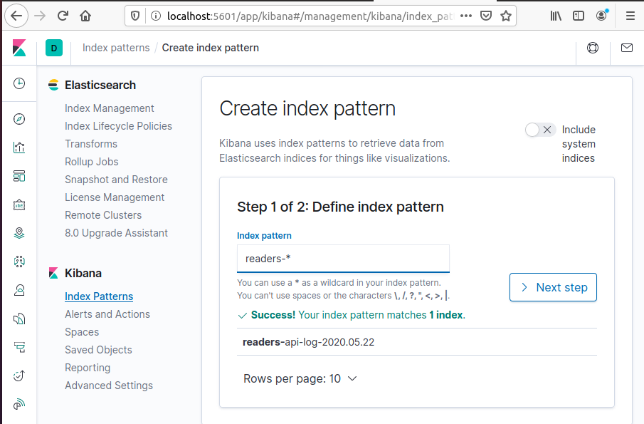
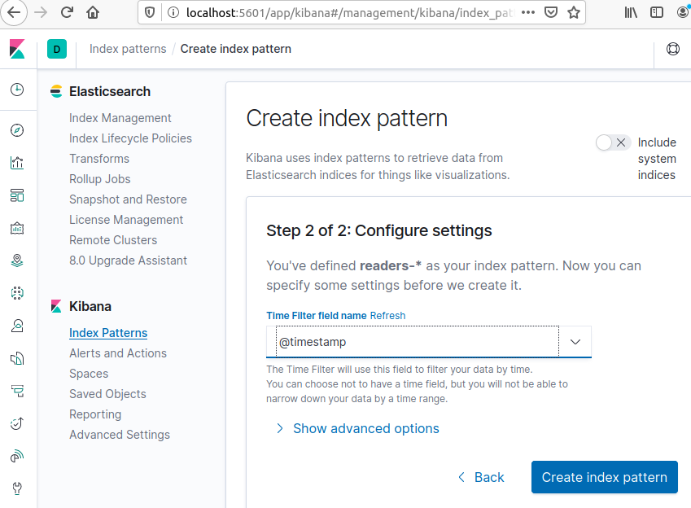
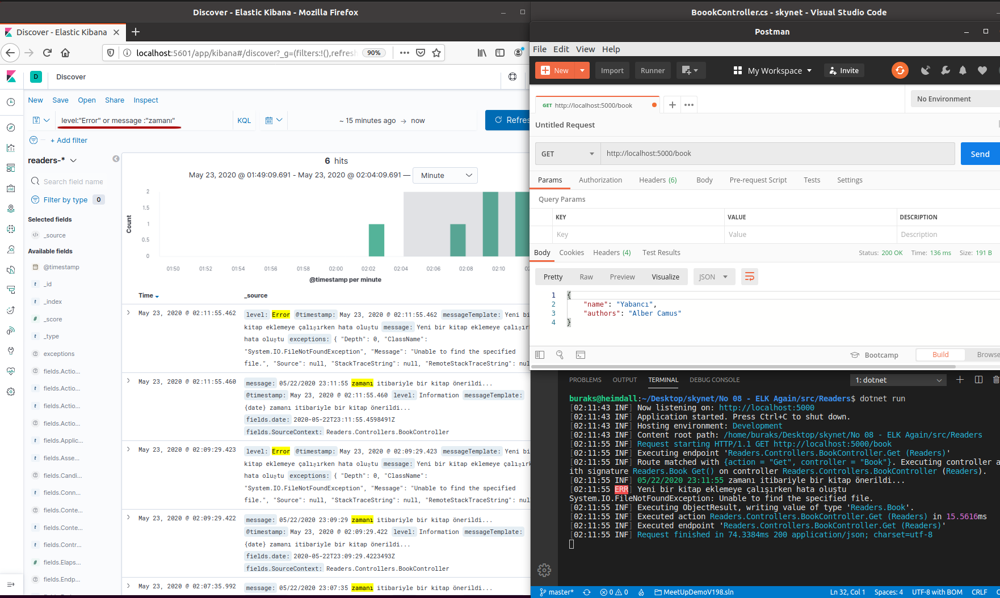

# ELK _(Elasticsearch Logstash Kibana)_ Üçlüsünü Hatırlamak

Amacım .Net Core 3.1 üstünden ELK düzeneğini kurgulayıp loglama, izleme işlerini tekrarlamak. Bu sefer  ElasticSearch Kibana containerları için docker compose aracını kullanmayı da öğrenmek istiyorum.

## Düzeneğin Hazırlanması

Aşağıdaki şekilde çalışmanın iskeleti ve Asp.Net Web API'nin ihtiyaç duyacağı Nuget paketleri yüklenerek işe başlanabilir.

>Docker Extension, yaml dosyasının hazırlanmasında epey yardımcı oldu.

```bash
mkdir docker
touch docker/docker-compose.yml
dotnet new webapi --no-https -o Readers
cd Readers
dotnet add package Serilog.AspNetCore
dotnet add package Serilog.Enrichers.Environment
dotnet add package Serilog.Sinks.Debug
dotnet add package Serilog.Sinks.Elasticsearch
dotnet add package Serilog.Exceptions
```

Bu arada Heimdall' da _(Ubuntu 20.04)_ docker-compose yoktu. Bu nedenle _sudo apt install docker-compose_ ile yüklemem gerekti.

## Çalışma Zamanı

Öncelikle Elasticsearch ve Kibana ortamlarının ayağa kaldırılması gerekiyor.

```bash
cd docker
sudo docker-compose up -d
```

http://localhost:9200 adresinden ElasticSearch, http://localhost:5601 adresinden de Kibana ayağa kalkmış olmalı.



Sonrasında kobay web api ayağa kaldırılabilir.

```bash
cd Readers
dotnet run
```

http://localhost:5000/book adresinden bir HTTP Get denenebilir. Get için de Information türünden bilgi dışında Error türünden hata logu da yazdırılmakta. Kibana'da Error seviyesini de görmek için sadece. Tabii ki pratikte exception oluştuğu durumlarda kullanmak lazım.

Kibana'ya erişmek log'ları takip etmek için kafi ama yeterli değil. http://localhost:5601 adresine gittikten sonra Readers isimli web api için bir index eklemek gerekli.





Kibana'da kullanılan filtre şöyle _(KQL - Kibana Query Language ile yazılıyor)_

```text
level : "Error" or message : "zamanı"
```



