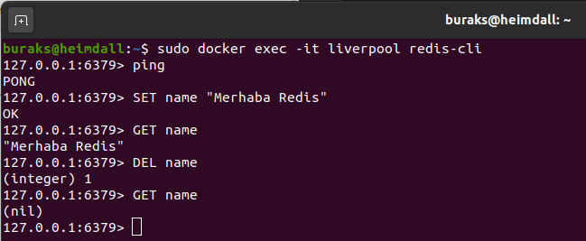
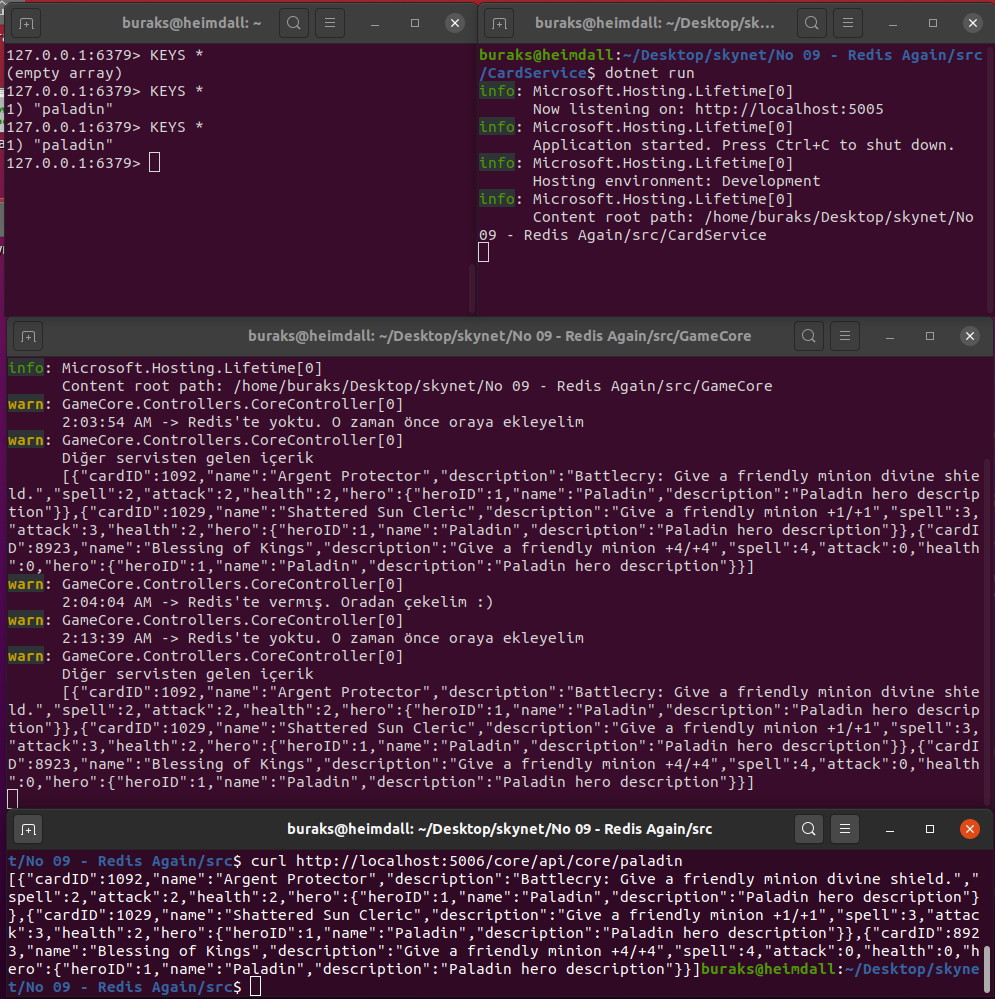

# Distributed Cache Gerekiyorsa Elbette Redis

An itibariyle Heimdall _(Ubuntu 20.04)_ üzerinde çalıştığım için Redis için docker kullanmak oldukça mantıklı. Resmi imajı indirip redis-client ile bağlanarak ping pong oynamak başlangıç için yeterli. Amacım dünyanın dağıtık cache sistemleri arasında en popüleri olan bu key-value based NoSQL ürününü bir .Net Core 3.1 Web API arkasında kullanmak.

## Hazırlıklar

Redis hazırlıkları ve ping pong...

>Docker container çalıştırılırken -p ile verilen port bilgisi önemli. Aksi durumda .Net uygulması Redis'e erişemeyecektir

```bash
sudo docker run -d --name liverpool -p 6379:6379 redis
sudo docker exec -it liverpool redis-cli
ping
SET name "Merhaba Redis"
GET name
DEL name
GET name
```



```bash
dotnet new classlib -o GameModel
dotnet new webapi --no-https -o GameCore
dotnet new webapi --no-https -o CardService
dotnet add ./CardService/CardService.csproj reference ./GameModel/GameModel.csproj
dotnet add ./GameCore/GameCore.csproj reference ./GameModel/GameModel.csproj
cd GameCore
dotnet add package Microsoft.Extensions.Caching.Redis
dotnet add package Newtonsoft.Json
```

GameCore, oyuncu kartlarını çeken CardService'i kullanır ve oyuncu kartlarını çekerken önce bir Redis'e sorar "dostum bu kahramanın kartları sende var mı?" diye ;)

## Çalışma Zamanı

GameCore Web API servisi _(5006 nolu porttan core/api ön ekiyle)_ Redis'i kullanıyor. Hearthstone kartları çok sık değişmeyeceği için CardService'ten _(5005 nolu porttan api ön ekiyle)_ çektiği kart bilgilerini Redis Cache ile saklıyor. Önce CardService sonrasında GameCore çalıştırılmalı.

```bash
dotnet run
```

Eğer sorun olmazsa ilk servis çağrısında kartların doldurulup Redis' kahraman adıyla atılması ve KEYS * ile görülmesi gerekiyor. Sonraki çağrıda verinin CardService yerine Redis üstünden gelmesi lazım. 5 dakika boyunca Core servise hiç çağrı yapmadığımızda ise expire tanımı nedeniyle verinin yeniden çekilip Redis'e atıldığını görmemiz gerekiyor.


