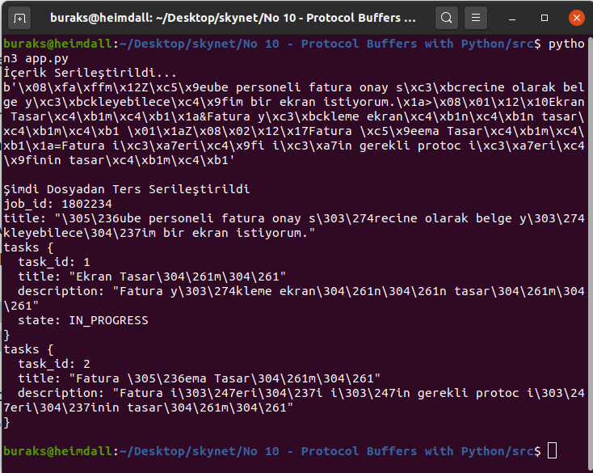

# Python Tarafında ProtoBuf _(Protocol Buffers)_ Serileştirme

Protocol Buffer, Google'ın yapısal verilerin _(structured data)_ serileştirilmesi için geliştirdiği bir protokol. gRPC ile sıklıkla anılır. XML benzeri düşünebiliriz ama çok daha az yer tutar ve serileştirme süreleri hızlıdır. Şu sıkça gördüğümüz proto uzantılı dosyaların ana fikridir. Nam-ı diğer ProtoBuf örneğin ağ üzerinden gönderilecek verinin tanımını yapan bir sözleşmedir. Sözleşmenin ana unsuru mesajdır. Dosya içeriğine bakınca anlaşılması kolay bir mevzu. Tek başına bir anlamı yoktur. protoc isimli derleyiciden geçmesi gerekir. Bu derleme sonucu insan gözüyle pek de okunamayan binary bir türev ortaya çıkar. Bunu ağ üstünden gönderebilir, bir yerlerde veri olarak saklayabilir ya da ille de okumak istersek JSON, XML gibi formatlara dönüştürebiliriz.

>Mikroservisler denilince akla gelen REST, WebSockets ve GraphQL iyidir hoştur ama yüksek hız gerektiren durumlar varsa low-level RPCs önem kazanır. Lakin uygulanması çok kolay olmadığından over-engineering anti-pattern'ine sürükleyebilir. ProtoBuf'ın JSON'dan 6 kat daha performanslı olduğu söyleniyor. [Detaylı bilgi için bakınız](https://auth0.com/blog/beating-json-performance-with-protobuf/)

Amacım ProtoBuf serileştirme işlemini Heimdall _(Ubuntu 20.04)_ üzerinde Python kodları ile incelemek. ProtoBuf'ın uygulandığı tüm dillerde benzer altyapı söz konusu. Bir proto sözleşmesinin hazırlanıp ilgili dil için protoc derleyicis ile hazırlanması ve kullanımından ibaret.

## Hazırlıklar

Tabii heimdall üzerinde protoc derleyicisi yüklü değildi. Bu nedenle [şu adresteki kurulum talimatlarını izledim](http://google.github.io/proto-lens/installing-protoc.html)

```bash
PROTOC_ZIP=protoc-3.7.1-linux-x86_64.zip
curl -OL https://github.com/protocolbuffers/protobuf/releases/download/v3.7.1/$PROTOC_ZIP
sudo unzip -o $PROTOC_ZIP -d /usr/local bin/protoc
sudo unzip -o $PROTOC_ZIP -d /usr/local 'include/*'
rm -f $PROTOC_ZIP

protoc --version
```

Yazılan proto dosyasını pyhton ile kullanmak için çıktı parametresini buna göre ayarlamak gerekli.

```bash
protoc -I=. --python_out=. ./jobs.proto
```

## Çalışma Zamanı

app.py isimli Python dosyasını çalıştırmak için

```bash
python3 app.py
```


