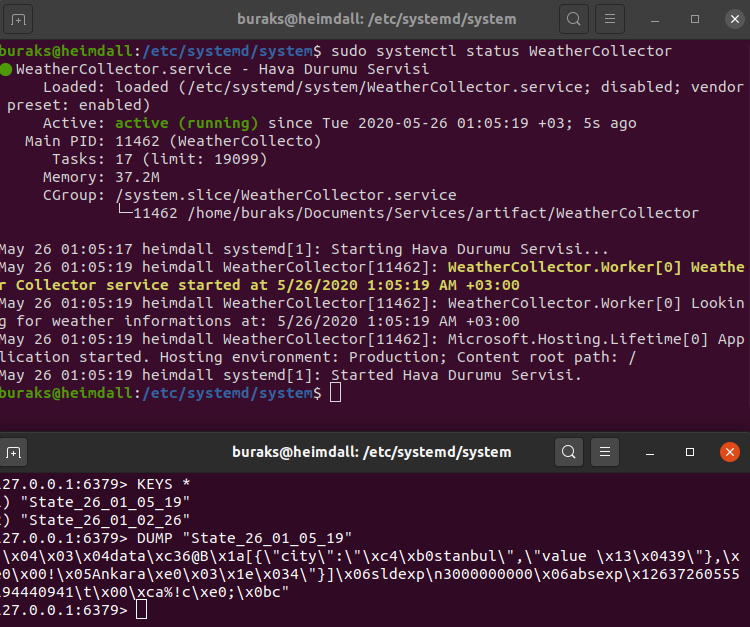
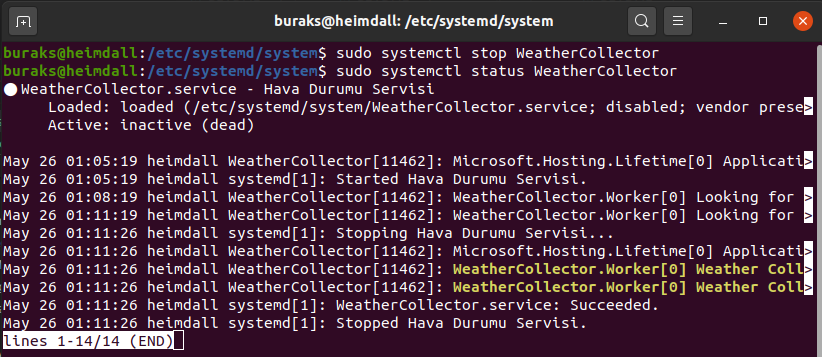

# Basit Bir .Net Core Worker Servisi _(Linux Daemon Olarak)_

.Net Core worker service'ler ile planlanmış görevlerin arka planda icra edilmesi de mümkün. Mesela belirli aralıklarla sistemden veri toplayıp kullanan bir Windows Service'i bu şekilde geliştirebiliriz. Lakin o zaman .Net Core kullanmanın bir esprisi olmaz :) Bunun yerine bir Linux servisi geliştirmeyi deneyebiliriz. Benim amacım Heimdall _(Ubuntu 20.04)_ üzerinde Linux Daemon olarak çalışacak bir servis geliştirmek. Örneğin günlük hava durumu bilgilerini 24 satte bir toplayıp Redis üzerinde saklayan bir servis. Dokuzuncu örnekte kullandığım Redis Docker Container'ını bu örnek için de değerlendirebilirim. Kodları da hazır.

## Hazırlıklar

Projenin oluşturulması ve gerekli hazırlıklar.

```bash
dotnet new worker -o WeatherCollector
cd WeatherCollector
dotnet add package Microsoft.Extensions.Hosting.Systemd
dotnet add package Microsoft.Extensions.Caching.Redis       
```

>Systemd modülü Linux Daemon kullanımı için eklenmiştir. Redis tahmin edileceği üzere...

## Daemon Kurulumu için Hazırlıklar

Uygulama kodu tamamlandıktan ve _dotnet run_ sonrası düzgün bir şekilde çalıştığı izlendikten sonra uygulamanın publish edilmesi gerekiyor. 

```bash
dotnet publish -o artifact
```

Ardından .service uzantılı bir Unit dosyası hazırlanmalı. _(src klasöründeki WeatherCollector.service dosyası)_ Bu dosya /etc/systemd/system altına alınmalı. Normalde dosya systemd/system klasörüne atılır atılmaz etkinleşiyor ama etkinleşmezse dameon-reload çağrımı denenebilir. Durum kontrolü için status komutundan yararlanmak önemli.

```bash
sudo cp WeatherCollector.service /etc/systemd/system/
sudo systemctl daemon-reload
sudo systemctl status WeatherCollector
```

Servisi yeniden başlatmak, durdurmak veya sistemden kaldırmak için systemctl aracının belli başlı komutlarını bilmekte yarar var.

```bash
sudo systemctl daemon-reload
sudo systemctl status WeatherCollector
sudo systemctl restart WeatherCollector
sudo systemctl stop WeatherCollector
sudo systemctl disable WeatherCollector
sudo rm WeatherCollector.service    
```

İlk komut servis dosyasında değişiklik olduysa demaon'ı yeniden yüklemek için. İkinci komut servisin güncel durumunu görmek, üçüncüsü yeniden başlatmak, dördüncüsü durdurmak ve beşincisi pasif hale çekmek için. Son komut ile de servis dosyasını kaldırıyoruz. 

>Bu bir öğreti çalışması olduğu için servisi içerde unutmamak lazım. Yoksa üç dakikada bir... :D





Uygulamayı servis olarak daemon'a eklemeden _dotnet run_ ile çalıştırıp sonuçları görebiliriz. Önce doğru çalıştığından emin olmakta sonra system'e yüklemekte yarar var.
