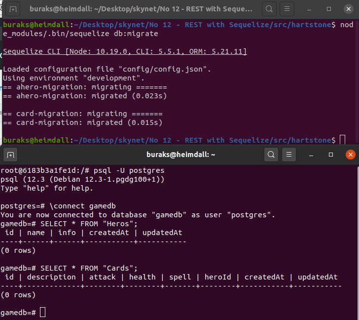
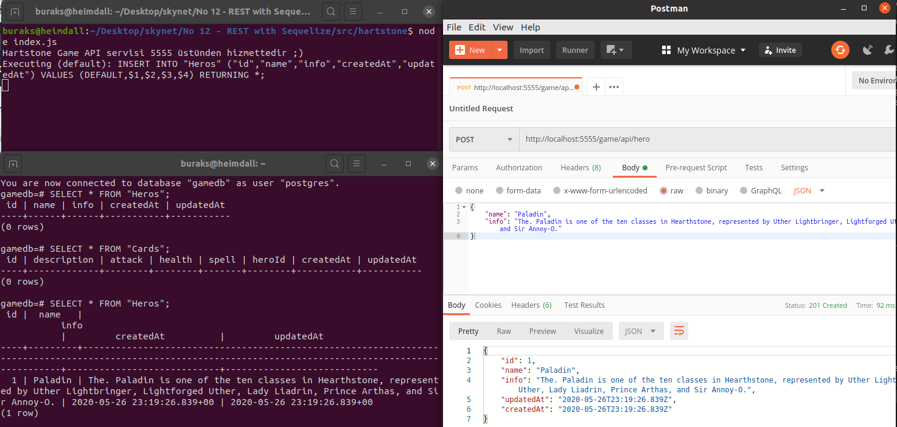
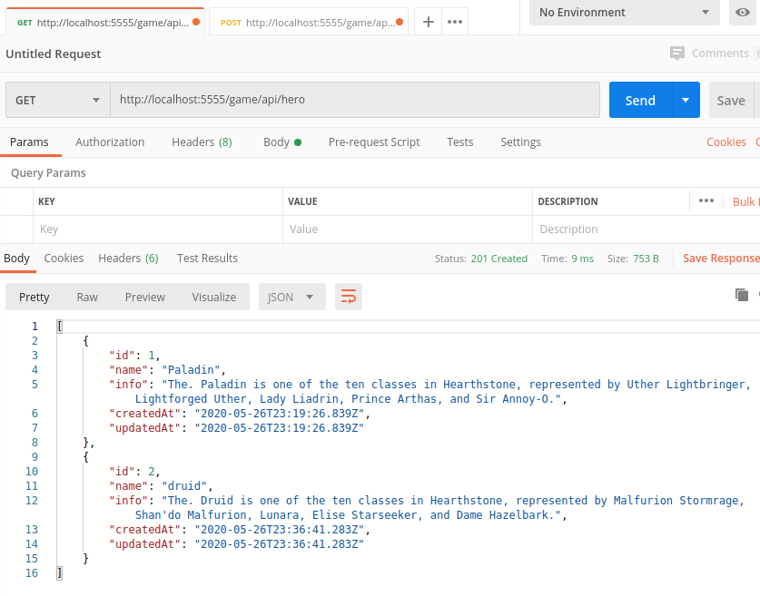

# Sequelize Kullanılan Bir NodeJs Rest Servisi Geliştirmek

Epey zamandır Nodejs ile kod yazmıyordum. Bu öğretideki amacım Postgresql veritabanını kullanan bir REST servisini NodeJs ile geliştirmek. Kod tarafındaki Entity nesneleri ile Postgresql arasındaki ORM _(Object Relational Mapping)_ katmanında Sequelize paketini kullanmayı tercih ettim. Postgresql için sistemde önceden yüklemiş olduğum _(ve No 05 örneğinde kullandığım)_ Docker container'ını ele alacağım. Ama olur ya sisteminizde yoktur o zaman aşağıdaki terminal komutu ile çalıştırabiliriz.

```bash
sudo docker run --name London -e POSTGRES_PASSWORD=P@ssw0rd -p 5433:5432 -d postgres
docker exec -it London bash
psql -U postgres
Create Database gamedb;
```

## Proje Açılışı

Heimdall _(Ubuntu 20.04)_ ile aşağıdaki komutları kullanarak açılışı gerçekleştirdim. _(Sistemlerinizde node ve npm'in yüklü olduğunu varsayıyorum)_

```bash
mkdir hartstone
cd hartstone
npm init
touch index.js
npm install express body-parser sequelize sequelize-cli pg pg-hstore
```

express REST servisini yazmak, body-parser HTTP taleplerini kolayca parse etmek, pg postgresql iletişimini kurmak, pg-hstore JSON verilerini hstore formatında serileştirebilmek için _(hstore Postgresql'e özgü olan key-value türünden bir kolon tipidir)_ sequelize aracı ile standart bir proje şablonu oluşturulabilir. Bunun için aşağıdaki terminal komutu yeterli.

```bash
node_modules/.bin/sequelize init
```

Bu işlemle üç klasör oluşur. Veritabanı ayarları config klasöründeki config.json dosyasında tanımlanır. Migration işlemlerinin bulunduğu kod dosyaları için migrations klasörü kullanılır. Entity modelleri ise models klasörüne konuşlandırılır. 

## Yapılanlar

- config/config.json içeriği postgresql kullanılacak şekilde düzenlendi.
- models klasöründe hero ve card isimli iki javascript dosyası eklendi.
- migrations klasöründe hero-migration ve card-migration isimli javascript dosyaları oluşturuldu.
- controller klasörü oluşturuldu ve içerisine hero, card, index javascript dosyaları eklendi.
- routes klasörü oluşturuldu ve içerisine index.js eklendi
- ana klasördeki index.js içeriği yazıldı

Bu işlemler ardından db migration süreci başlatılabilir ve tabloların oluşup oluşmadığı kontrol edilebilir.

```bash
node_modules/.bin/sequelize db:migrate
```

>İpucu: Hero ve Card arasında one-to-many ilişki var. Yani bir kahramana ait birden fazla kart olabilir. Bu nedenle migration sırasında önce Hero planının çalıştırılması lazım ki postgresql tarafında relation kurgulanabilsin. Bu nedenle hero-migration.js dosyasının başında bir a harfi bulunuyor. Çünkü db:migrate komutu klasördeki javascript içeriklerini alfabetik sırada çalıştırıyor. En azından ben denerken böyle bir şey fark ettim.



## Çalışma Zamanı

Ana klasördeki index.js dosyasını çalıştırmak ve Postman ile 5555 portundan hizmet veren servise HTTP Get, Post talepleri göndermek yeterli.

```bash
node index.js
```

Örnek bir kahramanın oluşturulması.

```text
HTTP Post
http://localhost:5555/game/api/hero

JSON

{
    "name": "Paladin",
    "info": "The. Paladin is one of the ten classes in Hearthstone, represented by Uther Lightbringer, Lightforged Uther, Lady Liadrin, Prince Arthas, and Sir Annoy-O."
}
```



Tüm kahramanların getirilmesi. _(http://localhost:5555/game/api/heros daha iyi durabilir)_

```text
HTTP Get
http://localhost:5555/game/api/hero
```



_Card oluşturma ve bir Hero altındaki kartların listelenmesine ait kodların çalışıp çalışmadığı kontrol edilmedi_