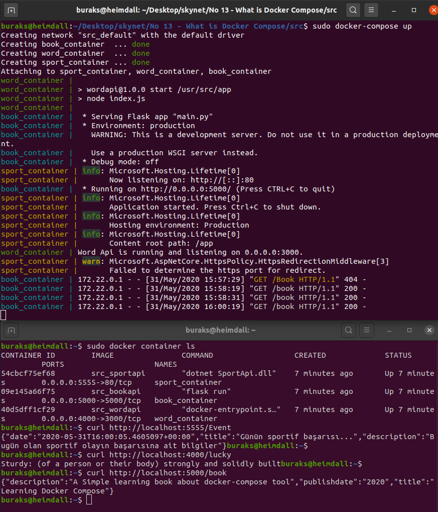

# Şu Docker-Compose Dedikleri

Birden fazla Container'ın yönetilmesi için kullanılan araçlardan birisi de Docker-Compose. Amacım en az iki farklı servisi ve olası bir veritabanı container'ını docker compose senaryosu içerisine dahil edip kullanmak. Planımda üç dummy servis var. Birisi Asp.Net Core Web Api, diğeri Flesk kullanan Python ve sonuncusu da Express bazlı nodejs uygulaması. Servislerin ne iş yaptığı çok önemli değil. Odaklanmam gereken nokta Dockerfile içerikleri ile docker-compose.yml üstünde Container kompozisyonunun nasıl tasarlandığı.

>Buradaki servislere birde veritabanı bağımlılığı eklemeyi denemek iyi olabilir. Örneğin Nodejs uygulamasının Postgresql kullanacak şekilde dockerize edilmesi ve Postgresql için docker-compose'da bir imajın kullanılacağının ifade edilmesi iyi bir pratik olacaktır.

## Hazırlıklar

Klasör ağacı ve gerekli dosyaların oluşturulması.

```text
src
---docker-compose.yml
---BookApi
------Dockerfile
---SportApi
------Dockerfile
---WordApi
------Dockerfile
```

Heimdall _(Ubuntu 20.04 üzerinde uyguladığım komutlar)_

```bash
dotnet new webapi -o SportApi
touch SportApi/Dockerfile
touch docker-compose.yml

mkdir BookApi
touch BookApi/main.py
touch BookApi/Dockerfile
touch BookApi/requirements.txt

mkdir WordApi
cd WordApi
npm init
touch index.js
touch Dockerfile
npm install --save express cors body-parser
```

## Kompozisyonun Hazırlanması ve Çalıştırılması

```bash
sudo docker-compose build
sudo docker-composse up
```

>Antrenman bitince kompozisyona dahil olan container'ları kaldırmak için _sudo docker-compose down_ komutu kullanılabilir.

