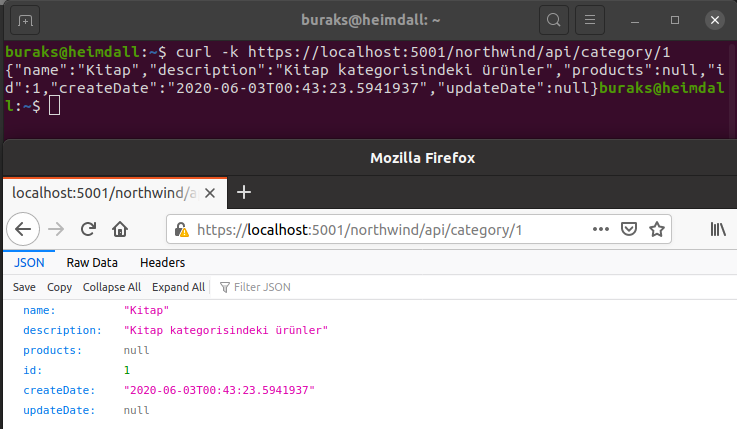
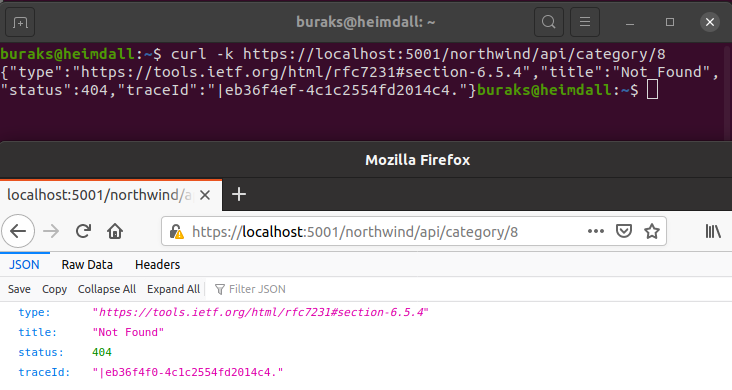
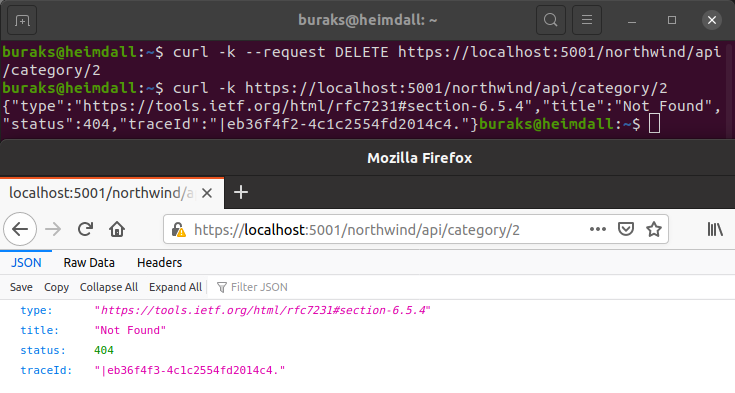

# Bir Asp.Net Core Web Api Projesinde Generic Repository Deseninin Kullanımı

Eski pratikleri de hatırlamak istiyorum. Çok eskiden .Net Framework tarafında deneyimlediğim generic repository tasarım kalıbını birde .Net Core 3.1 tarafında uygulamak iyi olacak. Senaryo basit. Kobay türlerimiz kategori ve ürün listeleri. Tahmin edileceği üzere bir kategoride n adet ürün olabilir. Northwind ismi de oldukça tanıdık değil mi? Uygulama sırasında Interface'lerin nasıl tasarlandığına, .Net Core'un dahili dependency injection mekanizması ile Controller'lara bağımlılıkların nasıl aktarıldığına da odaklanmak önemli.

## Hazırlıklar

Proje iskeletinin ve ek klasörlerin ve gerekli Nuget paketlerinin oluşturulması.

```bash
dotnet new webapi -o NorthwindApi
cd NorthwindApi

# Sqlite ve EF Kullanımı için
dotnet add package Microsoft.EntityFrameworkCore.Sqlite

# migrations için
dotnet add package Microsoft.EntityFrameworkCore.Design

# Console'a EF loglama yaptırmak için
dotnet add package Microsoft.Extensions.Logging.Console

mkdir Models
touch Models/IEntity.cs
touch Models/Entity.cs
touch Models/Category.cs
touch Models/Product.cs
mkdir Repositories
touch Repositories/IRepository.cs
touch Repositories/Repository.cs
touch Repositories/IProductRepository.cs
touch Repositories/ProductRepository.cs
mkdir Context
touch Context/NorthwindContext.cs
touch Controllers/CategoryController.cs
touch Controllers/ProductController.cs
```

## Çalışma Zamanı

Tabii Entity Framework kullandığımızdan bir migration işlemi ile işe başlamak lazım ki SQlite veritabanı dosyamızda gerekli tablolar oluşsun. Sonrasında koşabiliriz.

>ef aracı yoksa _dotnet tool install --global dotnet-ef_

```bash
dotnet ef migrations add InitialCreate
dotnet ef database update

dotnet run
```

>Bu arada kodun içerisinde belirli kısımlarda TODO[Homework] şeklinde ibareler var. Onları yapmaya çalışın ;)

## Eksikler _(İsteyene Ödevler)_

- Eyvah! Biri ProductController dosyasının içini silmiş. :[]
- Category eklerken topluca ürün listesini de ekleyebilsek çok güzel olmaz mı? Ayrı bir HTTP Post'u bu şekilde tasarlayabiliriz belki.
- Category'nin Update fonksiyonelliği eksik
- Category'yi çekerken bağlı olan ürünleri de yükletmek istersek bunu nasıl sağlarız?

## Testler

Örnek birkaç curl sorgusu ve çalışma zamanına ait ekran görüntüleri şöyle.

```bash
#Kategori eklemek ve listelemek için

curl -k --request POST https://localhost:5001/northwind/api/category --header "Content-Type: application/json" --data '{"Name":"Enstrüman","Description":"Çeşitli türlerde müzik enstrümanları"}'

curl -k https://localhost:5001/northwind/api/category
```


```bash
#Belli bir kategori bilgisini çekmek için

curl -k https://localhost:5001/northwind/api/category/1

#HTTP 404 Not Found testi
curl -k https://localhost:5001/northwind/api/category/8

#Delete testi
curl -k --request DELETE https://localhost:5001/northwind/api/category/2
```





