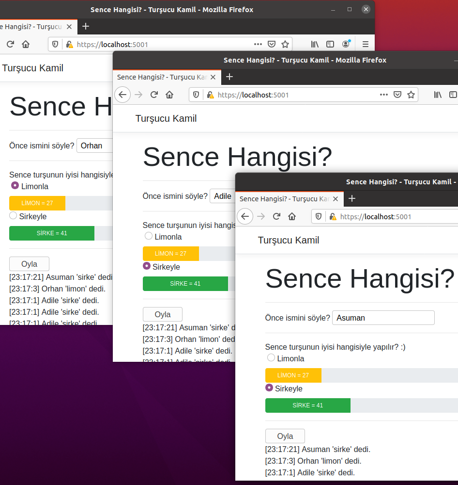

# Eğlenceli Sayılabilecek bir SignalR Uygulaması

Birkaç kez .Net Core'un farklı versiyonları ile SignalR uygulaması yazmaya çalışmıştım. Tazelenme sürecindeki skynet'te ona yer vermezsem olmazdı. Bu sefer biraz daha eğlenceli olsun istedim. Amacım siteye bağlanan kullanıcıların oy vermek suretiyle iyi turşunun limonla mı yoksa sirkeyle mi yapılacağına karar vermelerini sağlamak :D Yarışma gibi olan oylamada birden fazla kullanıcı bağlanınca sonuçları anlık olarak progress bar'lar üzerinde de görsünler istiyorum. En azından klasik chat uygulamasından farklı olacak.

## Ön Hazırlıklar

Normal bir web uygulaması açmak kolay. Ancak istemcinin SignalR Hub ile iletişim kurması için gerekli Javascript kütüphaneleri haricen yüklenmeli. Bunun yollarından birisi LibMan _(Library Manager)_ aracını kullanmak. Bu nedenle tool olarak install ediliyor. Takip eden komut proje için gerekli Javascript kütüphaneleri wwwroot/js altına açmakta. _(signalr.js ve signalr.min.js)_

```bash
dotnet new webapp -o Tursucu
cd Tursucu
mkdir HubStation
touch ./HubStation/VoteHub.cs
touch ./wwwroot/js/votemngr.js

# libman aracı kuruluyor
dotnet tool install -g Microsoft.Web.LibraryManager.Cli

# libman ile gerekli signalr js dosyaları kuruluyor
libman install @microsoft/signalr@latest -p unpkg -d wwwroot/js/signalr --files dist/browser/signalr.js --files dist/browser/signalr.min.js
```

## Uygulamaya Bırakılan Bomba!

Birden fazla kullanıcı kendi tarayıcılarında sayfayı açtı ve oylamaya başladı. Herhangi birisi sayfayı tazelerse ondaki değerler sıfırlanacak diğerlerindekiler kaldığı yerden devam edecek. Yani herkes aynı sayfayı göremeyecek. Çünkü votemngr.js başındaki toplam değerleri tutan değişkenler sayfa tazelenip istemciye tekrar gönderildiklerinde sıfır değerini alacaklar. Bu problemi nasıl çözeriz?

## Çalışma Zamanı

Bu çalışmada dotnet çalışma zamanına eklenen watch parametresinin kullanımını öğrendim. Yapılan değişikliker sonrası uygulamayı tekrardan başlatmama gerek kalmadan kodlama yapmamı sağladı.

```bash
dotnet watch run
```

