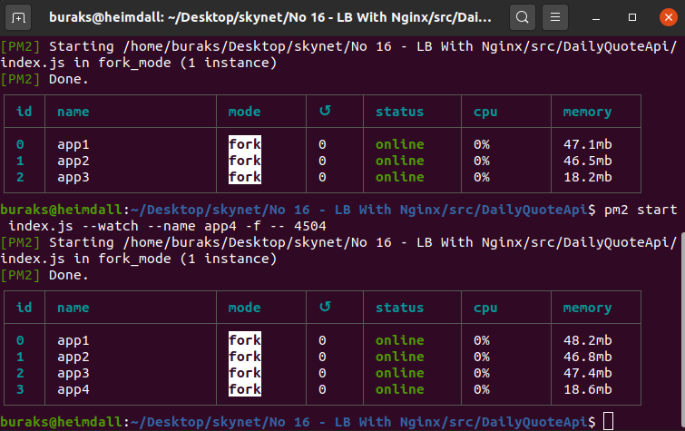
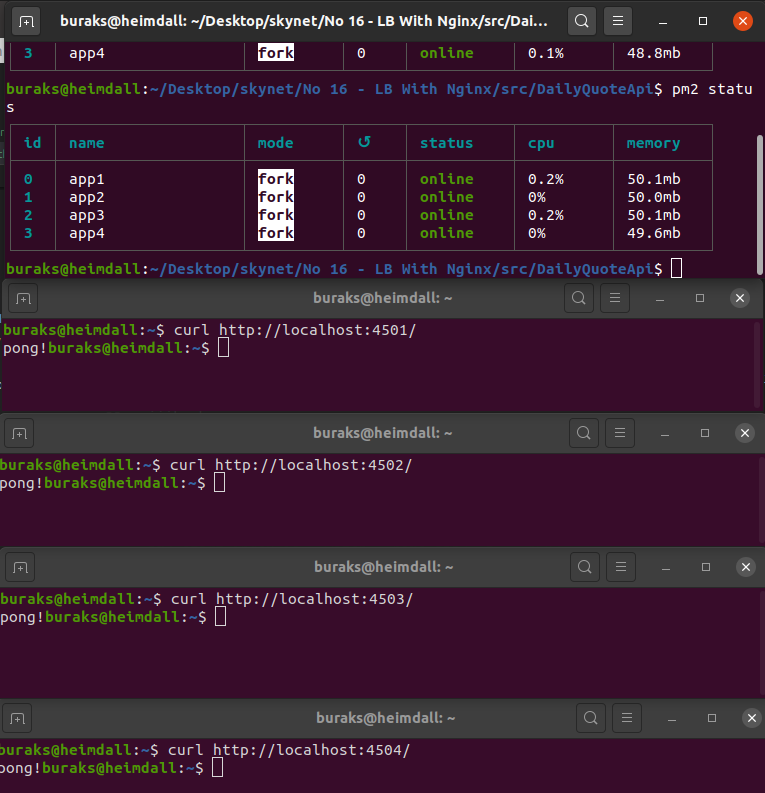
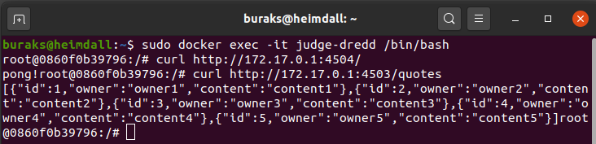
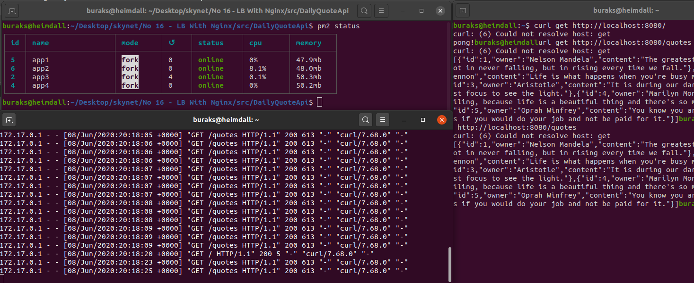

# Nginx Kurgulu Hafif Bir Load Balancer Senaryosu

Senaryo gereği NodeJS ile yazılmış basit bir dummy servisin birkaç kopyasını çalıştırmayı planlıyorum. Aynı makinede farklı portlardan hizmet verecekler. Bu servislere gelecek olan taleplerin dağıtımını ise önde Load Balancer görevi üstlenecek olan Nginx sunucusuna devredeceğim. Nginx'i Heimdall'a kurmak istemiyorum. Bu nedenle docker imajını kurcalayacağım. Hattı bu senaryo özelinde kendi docker imajımı da kullansam fena olmaz. Docker build işlerini biraz kurcalamış olurum.

## Dummy Service ve Diğer NPM Kurulumları

Express paketini kullanan dummy NodeJs servisi aşağıdaki gibi oluşturulabilir.

```bash
mkdir DailyQuoteApi
cd DailQuoteApi

# Node proje açılışı
npm init --y
# REST Servis özellikleri için express, HTTP Request loglama için morgan paketlerinin yüklenmesi
npm i --save express morgan
touch index.js

# Global paket olarak Process Manager'ın eklenmesi (servisin birden fazla örneğini çalıştırmak için işimizi kolaylaştıracak)
sudo npm i --g pm2
# versiyon kontrolü
pm2 -v 
```

## Faydalı Birkaç PM2 Komutu

Tabii Node servislerini arkada çalıştırırken PM2 _(Process Manager)_ aracı epey işe yarıyor. Örneğin,

```bash
# --name ile process'i isimlendirelim ki tanımamız kolay olsun
# -f ile Obi Van Kenobi gücü kullanıyoruz (force yahu)
# -- 4501 sıralamasına dikkat. 4501 programa argv[2] ile gelen komut satırı parametre indeksi
# --watch uygulama değişiklikleri otomatik algılansın diye
pm2 start index.js --watch --name app1 -f -- 4501
pm2 start index.js --watch --name app2 -f -- 4502
pm2 start index.js --watch --name app3 -f -- 4503
pm2 start index.js --watch --name app4 -f -- 4504

# Process'leri görmek için kullanılır
pm2 status

# id bilgisi ile process'leri silmek için
pm2 delete 0 1 2 3
```





## Nginx Tarafı

Bu senaryoda kendi nginx docker imajımı kullanmayı tercih ettim. Oldukça basit bir imaj. Önemli olan içerisine nginx.conf dosyasının eklenmesi ki burada yer alan upstream modülü ile load balancer işlevselliğini kazandırıyoruz. 

```bash
mkdir judgedredd
cd judgedredd

touch nginx.conf
touch dockerfile

# Senaryoya özel nginx imajının hazırlanması
# Dockerfile içeriğine göre tap taze bir nginx imajı oluşturuyoruz
sudo docker build -t freshnginx .

# Container çalıştırılır ve 8080 portu dışarıya açılır
sudo docker run -d --name judge-dredd -p 8080:80 freshnginx
# Container çalışıyor mu bir bakmak usüldendir
sudo docker ps
```

## Bazı Notlar

Bulmakta zorlandığım şeylerden birisi nginx container'ından makinedeki _(Heimdall)_ nodejs servislerine hangi IP ile çıktığımı öğrenmek oldu. Bunun için 

```bash
sudo docker container attach judge-dredd
```

komutu ile çalışan container'a log açıp http://localhost:8080/ adresine talep gönderdim. Bu sayede nginx.conf içerisinde kullanılan dış IP adresinin ne olduğunu görmeyi başardım. Servislere docker container'ı içinden gidilip gidilmediğinden emin olmak içinse, container içerisindeki terminale girip curl ile talep göndermeyi ihmal etmedim.

```bash
sudo docker exec -it judge-dredd /bin/bash
```



>TODO For You :) Şu anki senaryo varsayılan olarak kabul edilen Round-Robin isimli Load Balancer algoritmasını kullanıyor. Bunun dışında hash, ip_hash, least_conn gibi farklı modeller de var. 

## Çalışma Zamanı

Nginx Container'ını çalıştırdıktan sonra curl ile çeşitli talepler gönderilebilir.

```text
curl http://localhost:8080/
curl http://localhost:8080/quotes
```

Aşağıdaki gibi sonuçlar elde edebilmeniz gerekiyor.




## Uygulamaya Bırakılan Bomba!

Evet bir şekilde Docker Container ayağa kalkı, reverse proxy olan Nginx görevini yerine getirdi ve gelen talepleri ilgili servislere iletti. Senaryomuza göre aynı servisin makine üstünde farklı portlardan çalıştırılan dört örneği var. Nginx sunucusundaki upstream ayarlarına göre 8080 üstünden gelen taleplerin bu servislere dağılıyor olması lazım. Gerçekten dağıldıklarını nasıl ispatlarsınız?

## Ödev

- Daha işe yarar bir servi kullanın. Mümkünse özlü sözler bir veritabanından _(mesela mongodb)_ gelsin.
- Arka plan servisini de bir docker imajı olarak build edip ayağa kaldırın. Nginx Container'ı diğer servis Container'larını kullansın.