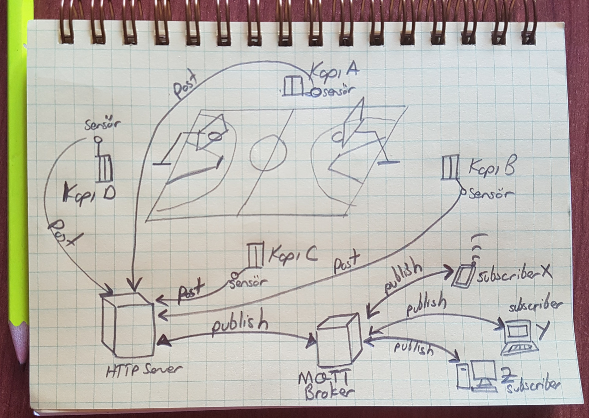
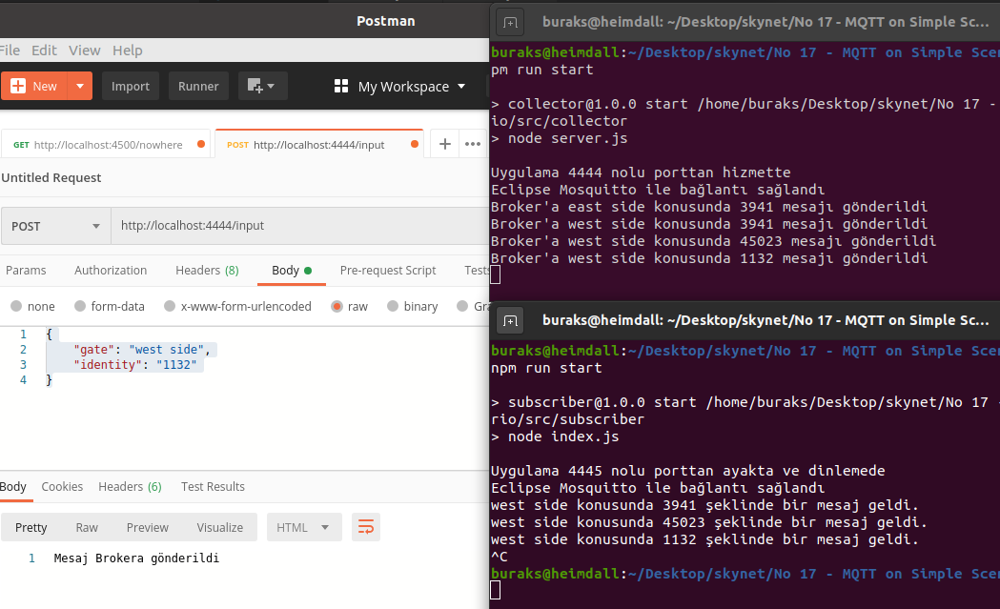
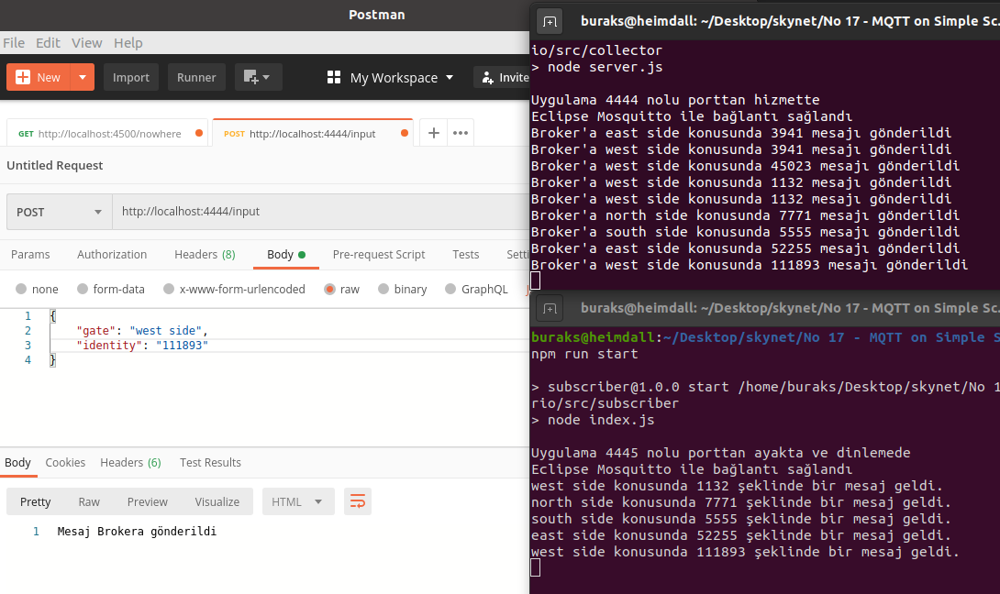

# MQTT Protokolünün Kullanıldığı Basit Bir Publisher/Subscriber Senaryosu

Yine bir yerlerde bir şeyleri araştırırken özellikle IoT ve M2M konseptinde yaygın olarak kullanılan MQTT _(Message Queuing Telemetry Transport)_ isimli bir mesajlaşma protokolüne rastladım. Düşük bant genişliklerinde, yüksek gecikme sürelerinin olduğu senaryolarda hafif bir mesajlaşma protokolü olarak karşımıza çıkıyor. En sık verilen senaryo bir IoT cihazının ısı sensöründen yayınlanan bir mesajın abone olan cep telefonu veya bilgisayarlar tarafından görülebilmesi. Elimde bir Raspberry PI vardı ama ısı sensörü yoktu. Dahası sensör alıp kurcalamaya üşendim diyelim. Hızlı bir antrenman için hayali şu senaryo geldi aklıma.



Bir basketbol sahasının seyirci giriş çıkıp kapılarını düşündüm. Bilet okutulur, kapıdaki cihaz bunla alakalı bir konuda _(topic)_ mesaj yayınlamak ister. Cihaz akıllıdır ve salonun WiFi ağına bağlıdır. Kapı giriş çıkış taleplerini toplayan bir REST servisine HTTP Post ile bilgi gönderir. Servis bunu MQTT protokolü üzerinden bir Broker'a gönderir _(ki benim senaryoda O açık kaynak Eclipse Moqsquitto'nun docker container'ıdır)_ Broker MQTT mesajlarını dinleyip abonelere dağıtan bir aracıdır. Abone olan cep telefonu, bilgisayar veya farklı IoT cihazları bu mesajları yakayabilir. Senaryo çok anlamlı değil ama ben ille de MQTT'yi kullanacağım ya ben. O yüzden benim için ideal.

## Malzemeler

- Mosquitto Docker Image
- NodeJs

## Ön Hazırlıklar

Broker için gerekli docker imajını yükleyip sonrasında proje klasör yapısını oluşturmak lazım. İki nodejs uygulaması var. Birisi 4444 nolu porttan yayın yapan ve gelen mesakları Mosquitto Broker'ına gönderen, diğeri 4445 nolu portta ayağa kalkan ve abone olduğu konuları broker'dan dinleyen.

```bash
# Gerekli docker imajını yükleyip başlatıyoruz. MQTT Broker hazır ve nazır
sudo docker run -d --name jerry-maguire -p 1883:1883 eclipse-mosquitto

# Verileri toplayan REST Servisin oluşturulması
mkdir collector
cd collector
touch server.js
npm init --y
# REST Api için express paketini kullanabiliriz. JSON içerikleri içinde body-parser biçilmiş kaftan
# MQTT Broker ile iletişim kurabilmek içinse mqtt paketini yüklüyoruz
npm install --save express body-parser mqtt
cd ..

# istemci tarafını da basit bir NodeJs uygulaması olarak tasarlayabiliriz
mkdir subscriber
cd subscriber
touch index.js
npm init --y
# istemci tarafında da mqtt paketini kullanmamız gerekiyor tabii
npm install --save mqtt express
```

## Çalışma Zamanı

Her iki node uygulamasını _npm run start ile kendi klasörlerinde_ çalıştırdıktan sonra http://localhost:4444/input adresine 

```text
{
    "gate": "west side",
    "identity": "1132"
}
```

benzeri talepler göndererek abone olan diğer istemcide mesajların çıkıp çıkmadığını görebiliriz.



## Uygulamanın Bomba Sorusu

Yukarıdaki ekran görüntüsünde dikkat edilecek olursa abone olan taraf 'east side' konu başlıklı mesajı yakalayamadı. Bunun sebebi sizce nedir? Eğer sebebi bulabildiyseniz tüm konulara abone olup bütün mesajları nasıl yakalayabilirsiniz? Aynı aşağıdaki ekran görüntüsünde olduğu gibi.



## Ödevler

- subscriber uygulamasından birden fazla örnek çalıştırıp her bir dinleyiciye aynı mesajlar ulaşıyor mu kontrol edin
- subscriber olarak NodeJs'ten farklı bir diller program geliştirip broker ile çalışmayı deneyin
- Ben üşendim siz üşenmezseniz bir Raspberry PI'ye ısı sensörü bağlayıp sensörden okuduğunuz bilgiyi REST servisine veya doğrudan Mosquitto broker'ına göndermeyi deneyin. Sonra da abonelerden bu topic'leri yakalamaya çalışın.
