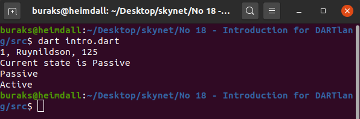
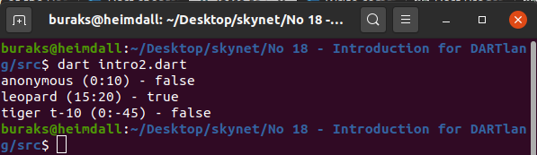
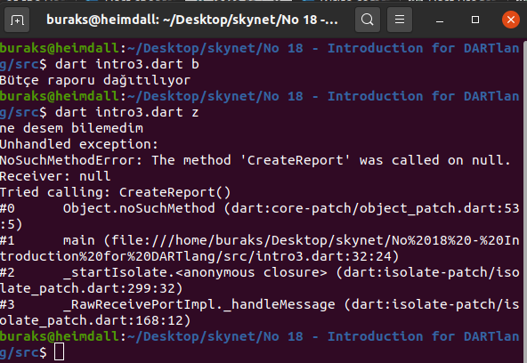
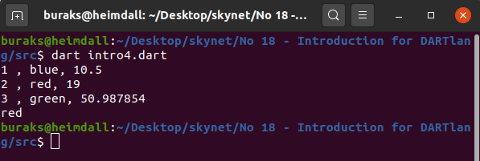
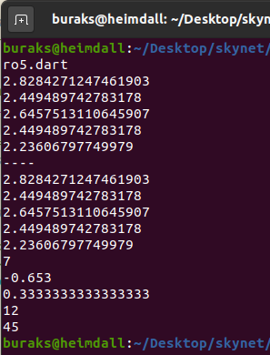
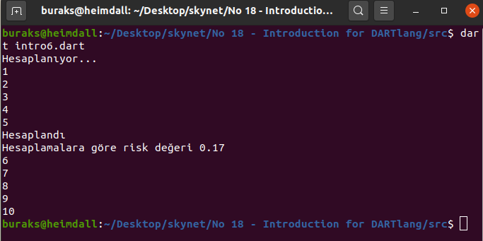
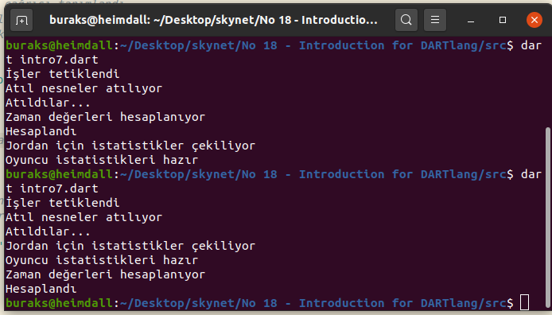
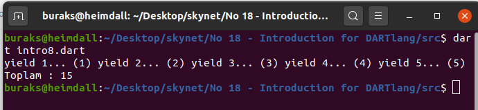

# DART Programlama Diliyle Az Biraz Uğraşmak

Çok duydum. Çok bahsedildi. Hep Flutter arkasında kaldı. Aslında yıllardır vardı. Birazcık bakmamın zamanı gelip de geçmişti. Haydi dedim o zaman. Önce onu Heimdall'a yüklemem gerekiyordu tabii. [Bu adresteki talimatları](https://dart.dev/get-dart) takip ederek kurulumu gerçekleştirdim ve birkaç örnek kod parçasını bol yorum satırları ile buraya bırakmaya karar verdim.

>Java veya C# kökenliyseniz DART diline alışmanız çok zor değil.

Adettendir dil ile ilgili sözü geçen genel özellikleri de paylaşalım.

- Google tarafından yazılmış çok amaçlı bir programlama dilidir. A,B,C,D,E,F,G vitaminlerinin hepsini...Pardon :D Onunla web, mobil, masaüstü ve sunucu bazlı uygulamalar geliştirilebilir. Pek tabii google içindeki birçok uygulama onunla geliştirilmektedir _(Adwords,AngularDart, Fuchsia ve tabii ki Flutter)_
- Merak edenler için...2011 de GOTO konferansında duyurulmuş ve ilk sürümü 2013'te çıkmıştır. Amaç kolayca web uygulamaları geliştirmektir.
- Nesne yönelimlidir, sınıf tabanlıdır, açık kaynaktır ve C türevli söz dizimine sahiptir.
- Statik tip desteği vardır ama "var" da vardır :) Yani tip tahmini _(type inference)_ özelliğini de sunar. Her ikisinin birleşimi = optionally typed. 
- Fonksiyonel ve reactive programlama paradigmalarını gayet güzel destekler.
- Native _(mobil taraf için çok kıymetli)_ veya Javascript olarak _(bu enteresan ve bakılası bir bilgi)_ derlenebilir. 
- Garbage Collector mekanizması vardır.
- Flutter ile çok anılır ama flutter bilmeyen birisi bence önce Dart diline aşina olmalıdır. Ayrıca Flutter'ın performansında önem arz eden Hot Loading konusunu da doğrudan destekler. Zaten Ahead-Of-Time ve Just-In-Time gibi derleme opsiyonları sunar.
- Denilene göre TIOBE endeksinde ilk yirmide bile değil ancak diyoruz ya; önce dart sonra flutter. Hem sıralamada değil de öğrenme merakımıza da ket mi vuralım!? :)
- Öğrenilmesi kolay bir dildir ve "hangi dille programlamaya başlayayım?" konusunda iyi bir alternatif olabilir

## Uygulamanın Bomba Soruları

- Terminalden _dart intro3.dart z_ çalıştırıldığında alınan exception'ın sebebi nedir? Nasıl düzeltilebilir?
- Bir sınıf metodunun başka library'ler tarafından kullanılmasını istemezsek ne yapabiliriz?
- Dart dilinde asenkron programlama denince aklınıza gelen ilk 3 keyword hangileridir? Ne işe yaradıklarını açıklayınız.

>To Be Continued!

## Ödevler

- Dart ile en az iki tasarım kalıbını uygulamaya çalışınız
- Komut satırından çalışan basit dört işlem yapan hesap makinesi yazınız _(hesaplama komutları ayrı bir kütüphanede olsun)_
- Bir şirket çalışanına ait bilgileri içeren bir sınıfa ait nesne dizisini JSON formatından nasıl serileştiririz.

>To Be Continued!

## Çalışma Zamanı

Dilin temel özelliklerini öğrenmeye çalıştığım program kodlarını çalıştırmak oldukça kolay.

```bash
dart intro.dart
```

demek yeterli. Aşağıdaki görsellerde Heimdall üzerindeki çıktılar yer alıyor. Hangisinin hangi örneğe ait olduğunu anlamak için örnekteki kodları yazıp çalıştırmanız yerinde bir antrenman olabilir. Doğrudan kopyalamayın, üşenmeyin, yazın ;)

















>To Be Continued!
