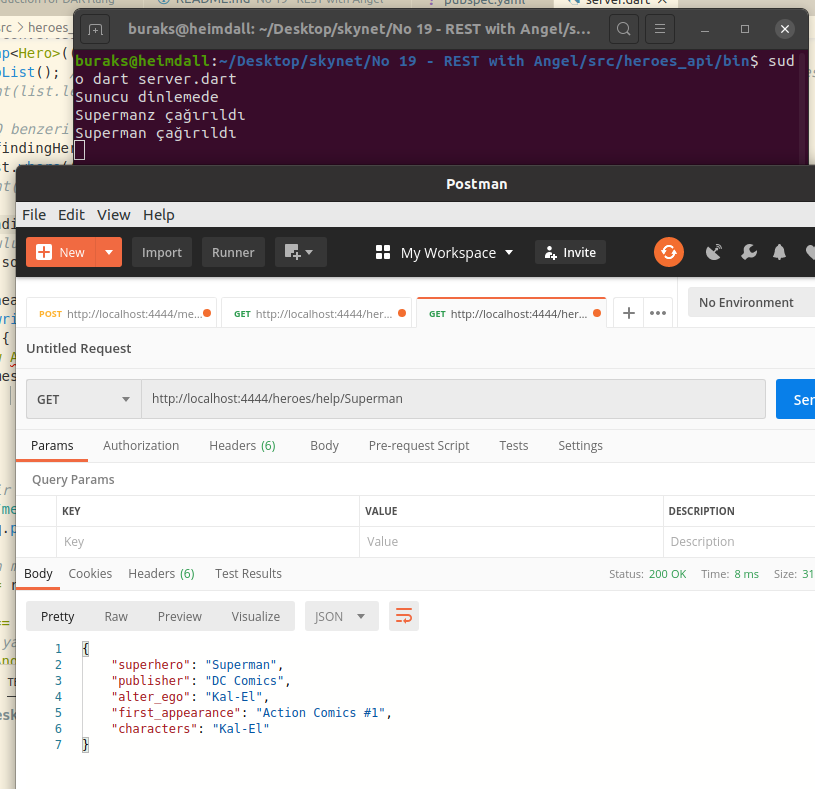
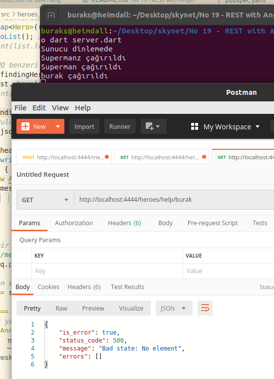
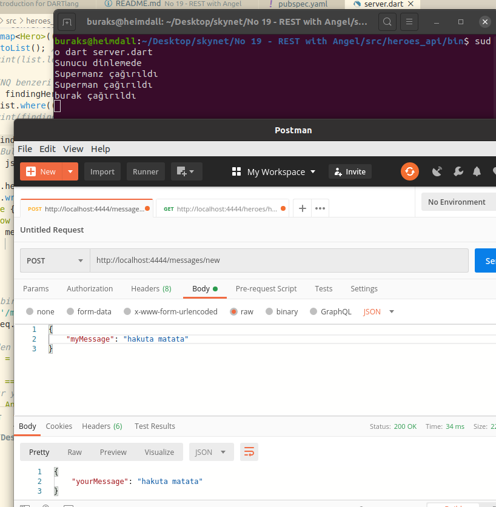

# Daha Kolay REST Api Yazmak için Angel Paketini Kullanmak

Birkaç zamandır dart dilinin temel özelliklerini incelemeye çalışıyorum. Bu konuda "No 18 - Introduction for DARTlang" başlığı altında çeşitli tipte örnekler var. Örneklerin bir kısmı HTTP Server yazmak ve basit HTTP taleplerini karşılamakla ilgili. Aslında bu temelleri kullanarak REST Api'ler geliştirmek mümkün. Lakin pek çok platformda olduğu gibi Dart tarafında da işleri özellikle route işlemlerini kolaylaştıracak paketler var. Bunlardan birisi Angel. Bu örnekte çok basit ve ilkel bir şekilde Angel'i nasıl kullanabileceğimi inceliyorum. Öncelikli operasyonlarımdan birisi JSON dosya içeriğini bir nesne listesine almak, gelen talebe göre içerisinde arama yaptırmak ve bulunan sonucu yine JSON tipine dönüştürerek istemciye göndermek. Haydi bakalım...

## Ön Hazırlıklar

Aşağıdaki terminal komutları ile işe başlanabilir

```bash
mkdir heroes_api
cd heroes_api

#uygulama hakkındaki bilgilerle birlikte bağımlı olduğu paketlerin tanımlandığı metadata dosyasıdır
#Dart'ın paket yöneticisi olan pub bu dosyadaki dependencies bildirimlerini takip eder.
touch pubspec.yaml

# kod dosyası
touch server.dart 

#pubscpec.yaml içeriğini doldurduktan sonra aşağıdaki terminal komutu işe yarayacaktır.
sudo pub get
```

## Çalışma Zamanı

server.dart dosyasının çalıştırılması sonrası Postman veya Curl gibi araçları kullanarak çeşitli HTTP taleplerini icra edebiliriz.

```bash
sudo dart server.dart
```

Örnek sorgular ve sonuçları

Supermane karakterinin talep edilmesi ve listeden döndürülmesi...



Burağın bir süperkahraman olmadığının ispatı olan GET talebi :D



Örnek POST talebi



## Uygulamanın Bomba Soruları

- 

## Ödevler

- Servis tarafına gelen talepler için log atacak bir middleware entegrasyonu söz konusu olabilir mi?. Bunu uygulamaya entegre etmeye çalışın.
- Heroes içeriğini bir veritabanı kaynağından okuyup döndürmeyi ve yeni karakterleri HTTP Post ile eklemeyi deneyin
- Tüm kahramanların listesini geriye döndürecek get operasyonunu yazınız. _(Dosyadan okuma işlemi bir metot içerisinde yapılıyor. Kod tekrarının önüne geçiniz)_