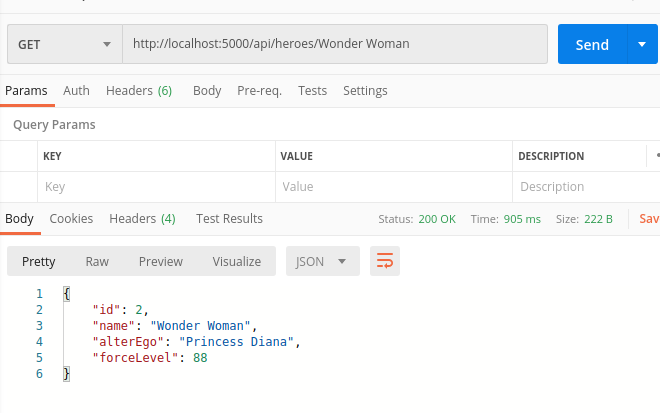
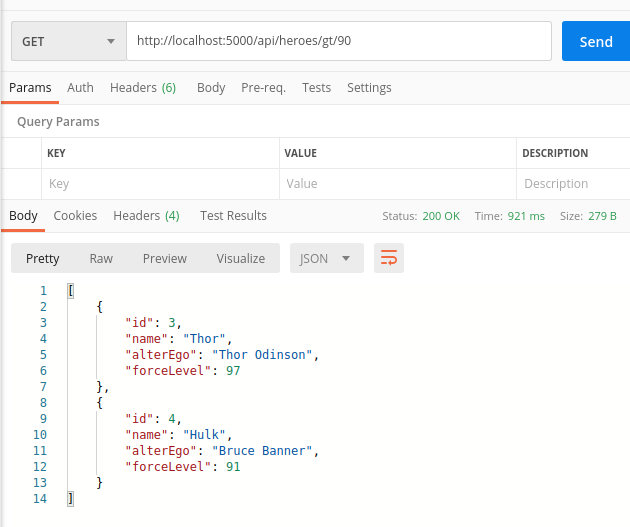
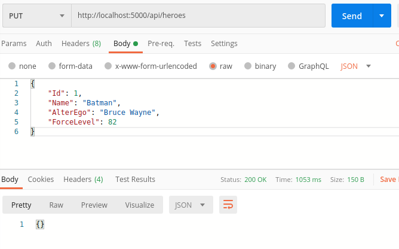

# Bir Web API Hizmetinde Request'ler ile CQ Arasında Mediator Kullanmak

CQRS, nam-ı diğer Command Query Responsibility Segregation mimari deseni, veritabanına doğru yapılan yazma, güncelleme, silme gibi aksiyonlar ile veri çekme işlemlerini ayrıştırmayı önerir. Command tarafı ile ilişkilendirilen aksiyonlar sadece veri üzerinde işlem yapar ve geriye bir şey döndürmezler. Query tarafına ayrılan aksiyonlar da tam tersine sadece veri döndürmekten sorumludurlar _(Listeleme veya tek bir öğe detayının döndürülmesi gibi)_ Bir Web API ve CQRS söz konusu olduğunda karşımıza birde Mediator tasarım kalıbının uygulanışı çıkar. Şöyle düşünebiliriz; 

Veritabanındaki kahramanların listesini çekmek Controller tarafına gelen bir HTTP Get talebidir ve davranışsal olarak listelemeyi ifade eder. Listelemeyi ele alacak bir Handler tanımlanabilir. Listeleme ihtiyacı oluştuğunda bunun doğru Query ile çalışması sağlanabilir. İşte bu noktada devreye girecek Mediator, Controller üzerinden doğru Handler-Command/Query ilişkisini tesis eder. Benzer şekilde yeni bir kahramanın veritabanına eklenmesi veya silinmesi CQRS'in Command kısmını ilgilendiren bir mevzudur. Yeni kahraman eklenmesini Create isimli bir tip olarak ifade edersek bu tasarım içerisinde bir Handler ve Command ilişkisini kurabiliriz.

Bu teoriyi daha kolay anlayabilmek için temel CRUD _(Create Read Update Delete)_ operasyonlarını içeren bir .Net Core Web API hizmeti üstünde CQRS ve Mediator'ü uygulamalı olarak çalışmam gerekiyordu. Amacım uygulamalı olarak konuyu anlamak.

>Örnekte Handler'ların tasarlanması, Controller tarafında Command/Query ile Handler ilişkilerinin tesis edilmesi için MediatR isimli bir Nuget paketinden yararlanılıyor.

## Proje Hazırlıkları

Örnekte kullanılan veri kaynağı çok önemli değil. Basit olması için SQLite ve Entity Framework kullanmayı tercih ettim. İskelet ve gerekli kurulumları aşağıdaki gibi yapılabiliriz.

```bash
dotnet new webapi -o Marvil
cd Marvil
mkdir Model

# DbContext, basit model sınıfı ve Controller
touch Model/Hero.cs Model/MarvilDbContext.cs Controllers/HeroesController.cs

# Entity Framework, SQLite ilişkisi ve migration desteği için gerekli nuget paketlerinin yüklenmesi
dotnet add package Microsoft.EntityFrameworkCore
dotnet add package Microsoft.EntityFrameworkCore.Sqlite

# Hero.cs, MarvilDbContext.cs, appSettings, startup.cs içerisinde gerekli hazırlıkları yaptıktan sonra migration işlemini uygulayabiliriz
dotnet ef migrations add initial
dotnet ef database update

# Mediator rolünü üstlenecek MediatR paketinin eklenmesi
dotnet add package MediatR.Extensions.Microsoft.DependencyInjection

# Handler klasörünün açılması ve ilgili sınıf dosyalarının açılması
mkdir Handler
touch Handler/List.cs Handler/Single.cs Handler/Create.cs Handler/Delete.cs Handler/Update.cs Handler/GreaterThan.cs

```
## Çalışma Zamanı

Web API'yi çalıştırdıktan sonra Postman veya muadili bir araçla gerekli testler yapılabilir.

```
dotnet watch run
```

Sorgular 

```text
#Yeni Kahraman Ekleme
HTTP Post
http://localhost:5000/api/heroes

{
    "Name": "Batman",
    "AlterEgo": "Bruce Wayne",
    "ForceLevel": 76
}

#Tek bir kahraman detayını çekme
HTTP Get
http://localhost:5000/api/heroes/Wonder Woman

#Tüm kahramanların listesini çekme
HTTP Get
http://localhost:5000/api/heroes

#Gücü 90nın üstünde olan karakterlerin çekilmesi
HTTP Get
http://localhost:5000/api/heroes/gt/90

#Bir kahramanı veritabanından silme
HTTP Delete
http://localhost:5000/api/heroes/Black Canary

#Bir kahramanın verisini güncelleme
HTTP Put
http://localhost:5000/api/heroes
{
    "Id":1,
    "Name": "Batman",
    "AlterEgo": "Bruce Wayne",
    "ForceLevel": 82
}
```








## Uygulamanın Bomba Sorusu

- CQRS desenini Mediator ile bir arada kullanmanın avantajları nelerdir?

## Ödevler

- Kahramanların katıldığı görevleri tutan Mission isimli bir sınıf tasarlayıp, Hero ile Mission arasında çoğa çok _(karmaşık gelirse bire çok da olur)_ ilişki tesis edip bir kahraman ve katıldığı görevler listesini kontrol edecek Handler-Query tiplerini uygulamaya entegre etmeye çalışınız.
- Kahramanın gücünün belli bir değerden küçük olması için ayrı bir Handler _(LessThan isimli)_ yazmak yerine GreaterThan,Equal gibi operasyonları da içerisine alacak ortak bir Handler tasarımı yapmaya çalışınız.
