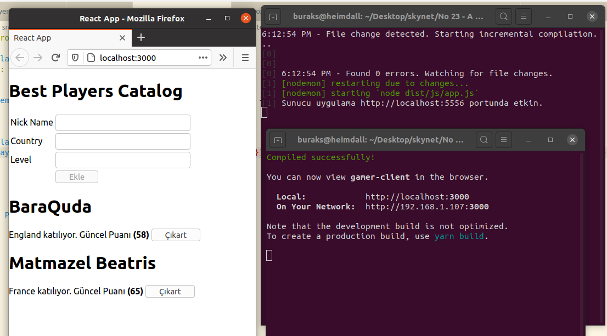
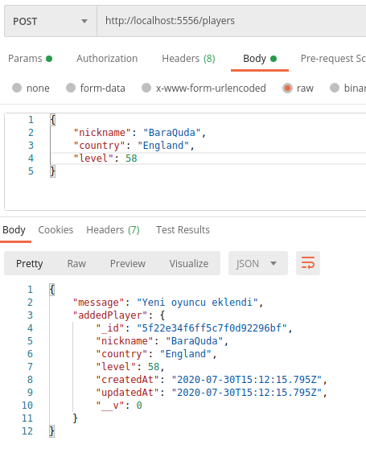
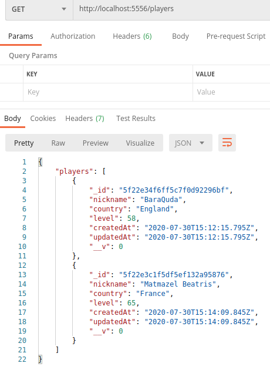
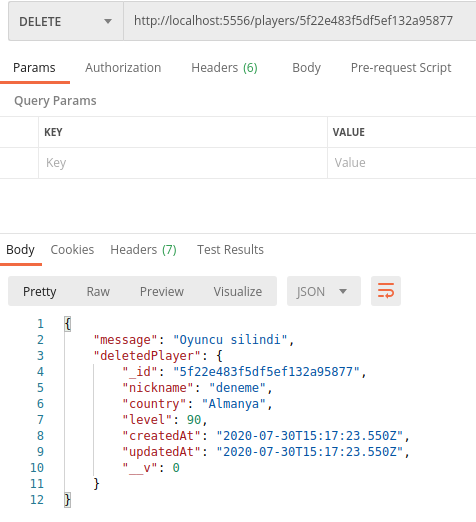

# Basit Bir React Uygulaması Geliştirmek _(Typescript, NodeJs, Express ve MongoDB ile)_

Başlıktan da anlaşılacağı üzere konumuz Typescript _(Hem sunucu hem istemci tarafında kullanacağız)_ , NodeJs ve MongoDb kullanan bir React uygulaması geliştirmek.

## Kurulum ve Hazırlıklar

### Sunucu(NodeJS) Tarafının İnşaası

Heimdall üzerinde bu kez npm yerine yarn'dan faydalandım.

```bash
mkdir gamer
cd gamer

yarn init

#Proje iskeletinin oluşturulması

#Dağıtım klasörü
mkdir dist

#Source Code klasörü
mkdir src

#Sunucu uygulamanın giriş noktası
touch src/app.ts

#Model bölümü
mkdir src/models
touch src/models/player.ts

#Controller bölümü
mkdir src/controllers
mkdir src/controllers/players
touch src/controllers/players/index.ts

#Router bölümü
mkdir src/routes
touch src/routes/index.ts

mkdir src/types
touch src/types/player.ts

#gerekli konfigurasyon dosyası (Derleyici için gerekli bilgileri dolduracağız)
touch tsconfig.json

#NodeJs(Sunucu) Tarafında Typescript kullanabilmek için gerekli yükleme
yarn add typescript

#NodeJs sunucu tarafındaki servis yetenekleri için express ve cors paketlerinin yüklenmesi
#Ek olarak Mongodb ile konuşabilmemizi sağlayacak mongoose paketinin yüklenmesi
yarn add express cors mongoose

#Typescript tarafının üstteki paketlerdeki tipleri anlayabilmesi için de aşağıdaki komut
yarn add -D @types/node @types/express @types/mongoose @types/cors

#tsc ile compile yapılacağının ve app.js'in eş zamanlı olarak nasıl başlatıldığının bilgisi package.json dosyasındaki scripts bölümünde gizli ;)
yarn add -D concurrently nodemon
```

### MongoDB için

MongoDB tarafı için elbette ki docker kullanacağım. Aşağıdaki gibi container'ı ayağa kaldırabiliriz.

```bash
docker run -d -p 27017-27019:27017-27019 --name gondor mongo
```

### İstemci Tarafı(React) Uygulamasının İnşaası

İstemci bir React uygulaması olacak ancak yine Typescript kullanacağız.

```bash
#npx aracını kullanarak typescript kullanacak şekilde template'imizi açıyoruz
npx create-react-app gamer-client --template typescript

cd gamer-client

# Sunucu uygulama ile haberleşmek için axios paketini dahil ediyoruz
yard add axios

# Player tipinin React tarafındaki eş nesnelerini tutan dosya
touch src/types.d.ts

# API Nesnesi (Servisle iletişim kuran)
touch src/proxy.ts

#bileşenler için bir klasör
mkdir src/components

# Oyuncu eklemek için kullanılacak bileşenin oluşturulması
touch src/components/player-add-view.tsx

#Bir oyuncu kartını gösteren bileşenin oluşturulması
touch src/components/player-item-view.tsx
```

## Çalışma Zamanı

Önce sunufu tarafını çalıştırmamız gerekiyor. gamer klasöründeyken terminalden _yarn start_ dememiz yeterli. Benzer şekilde istemci tarafını da farklı bir terminal penceresindeyken yine _yarn start_ ile çalıştırabiliriz.



### Sunucu Tarafı Testleri

Uygulamanın yazımı oldukça uzun sürüyor. Bu nedenle istemci tarafına geçmeden önce sunucuyu test etmek isteyebilirsiniz. Örneği çalıştığım tarih itibariyle Post metodunda karşılaştığım bir sorun oldu. bodyParser paketini kullanmazsam, Http Post ile gelen body nesnesini yakalayamadım. Sunucu tarafını Postman veya curl aracı ile kolayca test edebilirsiniz.







## Bölümün Bomba Sorusu

- Sunucu uygulamasında cors paketinin kullanmazsak ne gibi sonuçlarla karşılaşırız?

## Ödevler

- Eksik olan oyuncu güncelleme işlevselliğini hem sunucu hem de istemci tarafında geliştiriniz.