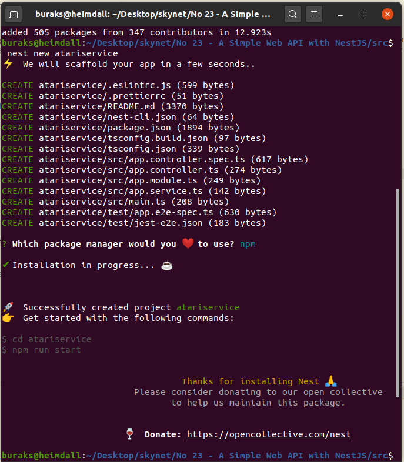

# NestJS Kullanarak Çok Basit Bir Web API Geliştirmek

Typescript ile geliştirilmiş olan NestJS, NodeJs tarafında MVC _(Model View Controller)_ tabanlı uygulamalar geliştirmek için kullanılan bir framework. Son zamanlarda adını sıkça duyduğum için incelemek istedim. Örnekteki amacım NestJS'i kullanarak PostgreSQL _(Docker imajından yararlanacağım)_ ile konuşan ve ORM olarak arada Sequelize' dan yararlanan bir REST Api hizmeti geliştirmek.

## Kurulum ve Hazırlıklar

NestJS'in işleri kolaylaştıran bir Command Line Interface _(CLI)_ aracı var. Bunu yükleyerek işe başlamak lazım.

```bash
#Önce proje açmamızı kolaylaştıracak NestJS CLI aracını yükleyelim.
npm i -g @nestjs/cli

#Projemizi aşağıdaki gibi oluşturabiliriz.
#Kurulum sonrası komut satırından verilen talimatları takip edip http://localhost:3000 adresine gidersek bir selamlama ile karşılaşmamız gerekir.
nest new atariservice

#Sequelize ve diğer gerekli paketlerin yüklenmesi
sudo npm install -g sequelize
sudo npm install --save sequelize sequelize-typescript pg-hstore pg
sudo npm install --save-dev @types/sequelize
sudo npm install dotenv --save

#Veritabanı modülünün oluşturulması
nest generate module /core/database

#Veritabanı konfigurasyonu için yapılanlar
mkdir src/core/database/interface
touch src/core/database/interfaces/database.config.ts 
touch src/core/database/database.environment.ts
touch .env

#.env içeriğini kullanabilmek için nestjs/config paketini yüklemek lazım
npm i --save @nestjs/config
```

Kurulumdan bir görüntü. Çok şükela değil mi? :)




## Docker Tarafı

12 Numaralı örnekten London isimli bir Container kullanmıştım. Fark ettim ki imajı makineden uçurmuşum. Not tutmanın faydaları :)

```bash
sudo docker run --name London -e POSTGRES_PASSWORD=P@ssw0rd -p 5433:5432 -d postgres
docker exec -it London bash
psql -U postgres
Create Database atariworld;
```

## Çalışma Zamanı

## Bölümün Bomba Sorusu

## Ödevler