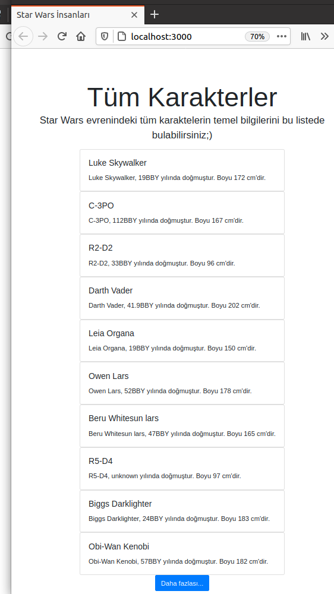

# NextJS ile Web API Tüketen bir React Uygulaması Geliştirmek

Geçen sene React ile ilgili basit birkaç örnek deneyimlemiş olmama rağmen 23 numaralı örnekte gördüm ki halen daha anlayamadığım kavramlar var. Tekrardan pratik yapmanın uygun olacağını düşündüm. Bu seferki amacım Star Wars için <https://swapi.dev> adresinden sunulan REST servisini tüketen ve karakterlerin listesini gösteren bir web uygulaması geliştirmek. Bunu yaparken hafif siklet kategorisinde sayılan ancak bir çok işi kolaylaştırdığı söylenen Next.Js isimli web framework'ünden faydalanacağım.

Örneğin dikkat çekici noktalarından birisi servisin kişi listesini sayfalama yoluyla vermesi. Yani tüm karakterleri tek seferde veren bir REST servisi yerine, diğer sayfaları da ayrı REST çağrıları ile veren bir servis söz konusu. Servisi çağrısı sonrası elde edilen her JSON içeriğinde previous, next gibi önceki ve ileriki servis noktalarını referans eden nitelikler var. İşleyiş olarak sayfanın altındaki "Daha fazlası..." yazan düğmeye bastıkça yeni içerik var olanın arkasına eklenecek ve liste aşağı doğru uzayıp gidecek. Bu durumu önyüz tarafında yönetmek için çekilen içeriğin, sonraki servis adresi bağlantısının bilgilerini korumam gerekecek. İşte bu noktada useState, useEffect gibi enstrümanlarla React Hooks'u tanımaya çalışmamın iyi olacağını düşünüyorum.

## Kurulum ve Ön Hazırlıklar

```bash

# Önce next.js destekli react uygulamasını oluşturalım (ben adını star-wars-peoples olarak isimlendirdim)
npx create-next-app

#Önyüz görünümünde Bootstrap bileşenlerini kullanabilmek için
npm install react-bootstrap bootstrap
```

>Kodsal değişiklikler pages altındaki index.js dosyasında yapılmıştır. Burayı incelemeniz yeterlidir. Bootstrap için sadece _app.js düzenlenmiştir.

## Çalışma Zamanı

Terminal'den aşağıdaki komutu verdikten sonra <http://localhost:3000> adresini ziyaret etmek yeterli olacaktır.

```bash
npm run dev
```



## Bölümün Bomba Sorusu

- "Daha fazlası..." butonu gibi "Azalt..." isimli bir button daha olsa ve buna basılınca state bir önceki konumuna dönse. Bu mümkün müdür?

## Ödevler

- Bomba soruyu oku? Eğer "mümkün" diyorsan yapmayı dene. Zor görünüyorsa "Sıfırla" başlıklı bir düğme koy ve basıldığında sayfanın ilk açılış konumundaki veri ile güncellenmesini sağlamayı dene.