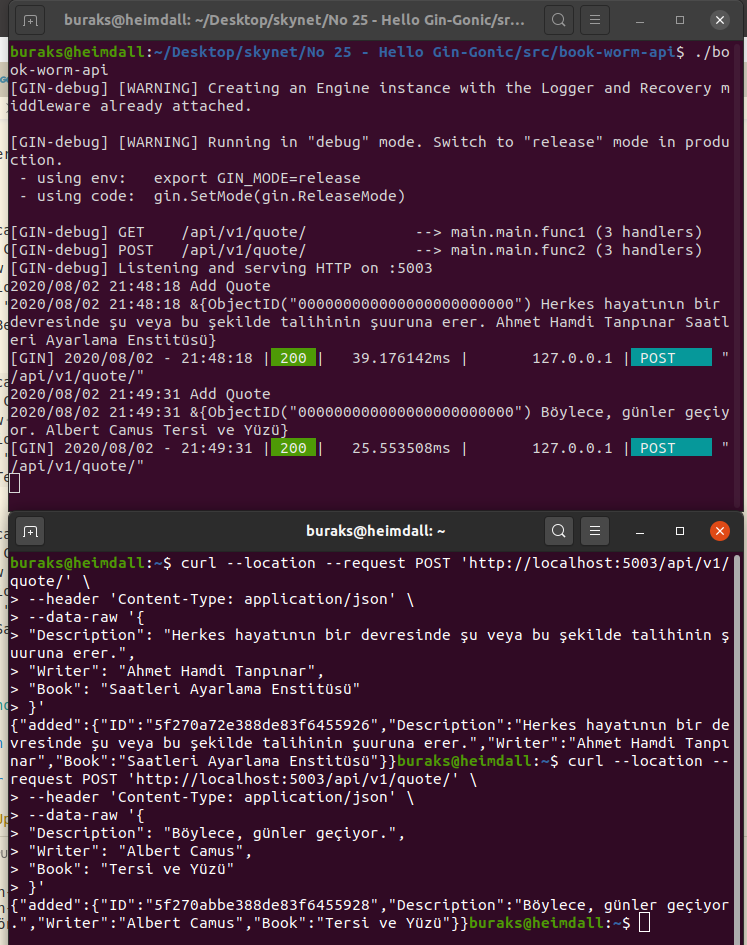
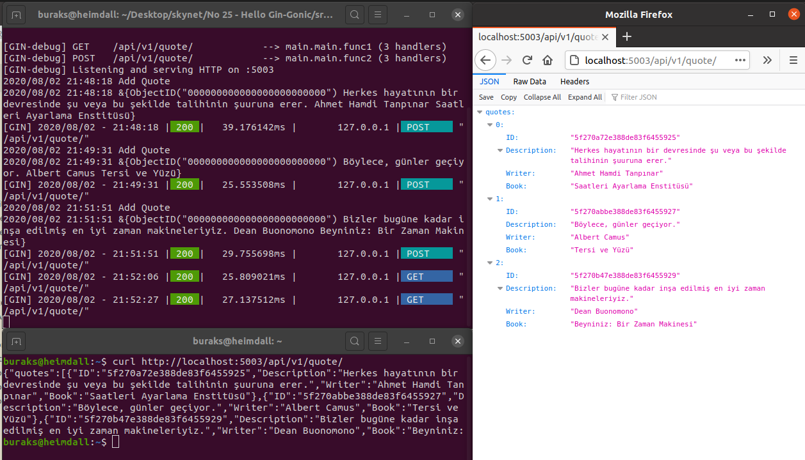

# GO Ortamında Minik Bir CRUD Servisini Gin-Gonic ile Geliştirmek

Gin-Gonic hafif siklet sayılan ama yüksek performansı ile öne çıkan _(muadili sayılan martini'den çok daha hızlı olduğu ifade ediliyor)_ bir web framework. Elbette açık kaynak. Middleware tarafında _(Yani Request ve Response'lar arasında)_ Recover ve Log desteği sunuyor. Tabii kendi middleware bileşenimizi yazıp ekleyebiliriz de. Recovery modülü en başından beri ekli olduğundan paniklemeyen bir framework :) Yani Go çalışma zamanında HTTP request'leri ile ilgili olarak bir panic oluştuğunda uygun bir 500 cevabı verebiliyor. Söylentilere göre bu özelliği sayesinde söz konusu servis her an ayakta ve çalışır durumda kalıyor. Bunlara ilaveten yönlendirmeleri _(routes)_ gruplandırabiliyoruz ki bu da örneğin versiyonlamayı kolaylaştırıyor. Bu kısa notlar yeterli. Sahada deneyimlemek lazım. Amacım mongodb üzerinde basit crud işlemlerini yaparken gin-gonic üstüne kurulmuş golang tabanlı bir servis geliştirmek. _(MongoDB için docker imajı kullanacağım)_

## Kurulum

```bash
# Ana klasörümüz ve gerekli go dosyaları oluşturulur
mkdir book-worm-api
cd book-worm-api
touch main.go

# gin-gonic ve diğer modüllerin yönetimi için
# mod uzantılı bir dosya oluşacaktır. Burada yüklediğimiz paket bilgilerini görebiliriz. 
# Genel isimlendirme standardı olarak github.com/buraksenyurt/book-worm-api kullanımı da tercih edilebilir
go mod init book-worm-api

# gerekli paketlerin yüklenmesi gin-gonic ve mongodb için
go get -u github.com/gin-gonic/gin go.mongodb.org/mongo-driver

# MongoDB tarafıyla eşlecek entity için
touch quote.go

# CRUD Operasyonları için
touch quotedata.go

# mongodb docker container'ının çalıştırılması ve veritabanının oluşturulması
# bookworms isimli bir veritabanı oluşturuyoruz ve root user ile password bilgisi de veriyoruz (Bunu production'da yapmayın tabii)
sudo docker run --name mongodb -e MONGO_INITDB_ROOT_USERNAME=scoth -e MONGO_INITDB_ROOT_PASSWORD=tiger -e MONGO_INITDB_DATABASE=bookworms -p 27017:27017 -d mongo:latest

exit
exit
```

## Çalışma Zamanı

Bu bir servis uygulaması olduğu için çalıştırdıktan sonra bir şekilde tüketmek gerekiyor. curl, postman gibi araçlar kullanılabilir veya bir client uygulama yazılabilir.

```bash
# önce bir build etmek lazım
go build

# sonrasında çalıştırabiliriz
./book-worm-api
```

İlk testler için aşağıdaki curl komutlarını kullanabiliriz

```bash

# Örnek birkaç alıntı girelim

curl --location --request POST 'http://localhost:5003/api/v1/quote/' \
--header 'Content-Type: application/json' \
--data-raw '{
"Description": "Bizler bugüne kadar inşa edilmiş en iyi zaman makineleriyiz.",
"Writer": "Dean Buonomono",
"Book": "Beyniniz: Bir Zaman Makinesi"
}'

curl --location --request POST 'http://localhost:5003/api/v1/quote/' \
--header 'Content-Type: application/json' \
--data-raw '{
"Description": "Böylece, günler geçiyor.",
"Writer": "Albert Camus",
"Book": "Tersi ve Yüzü"
}'

curl --location --request POST 'http://localhost:5003/api/v1/quote/' \
--header 'Content-Type: application/json' \
--data-raw '{
"Description": "Herkes hayatının bir devresinde şu veya bu şekilde talihinin şuuruna erer.",
"Writer": "Ahmet Hamdi Tanpınar",
"Book": "Saatleri Ayarlama Enstitüsü"
}'

# Şimdi de listeleme yapalım
curl http://localhost:5003/api/v1/quote/
```





## Bölümün Bomba Sorusu

- Nil

## Ödevler

- Lütfen Update ve Delete operasyonlarını da örneğe ekleyin