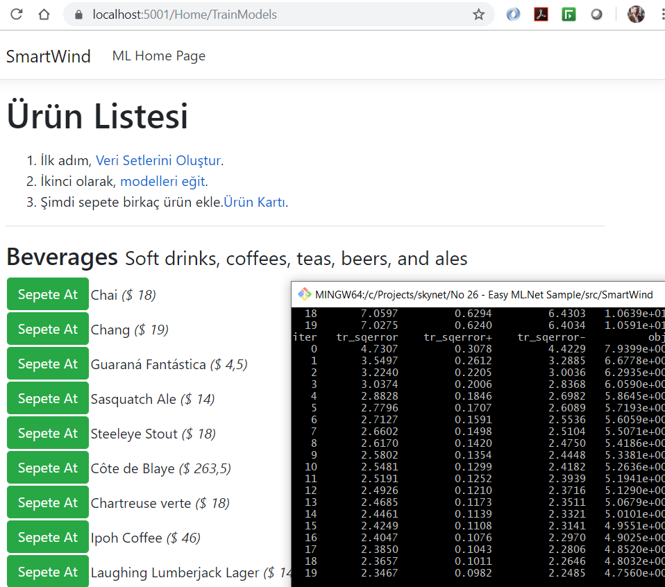
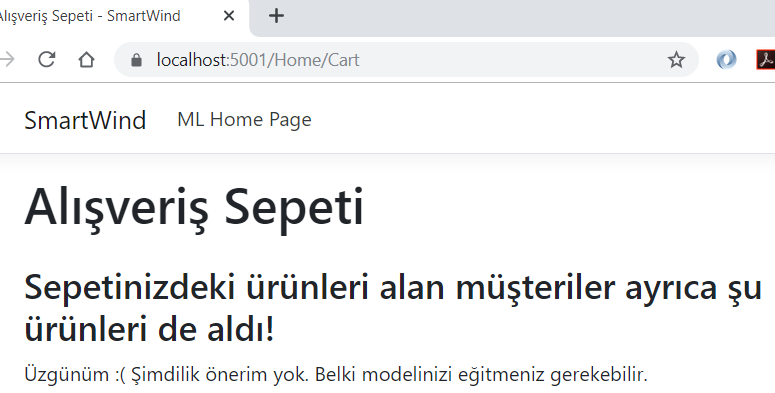
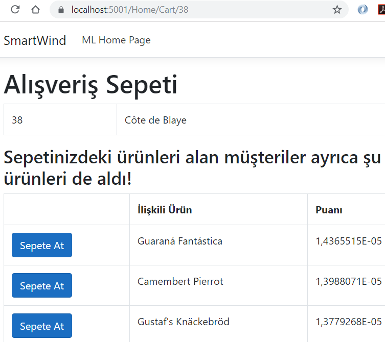
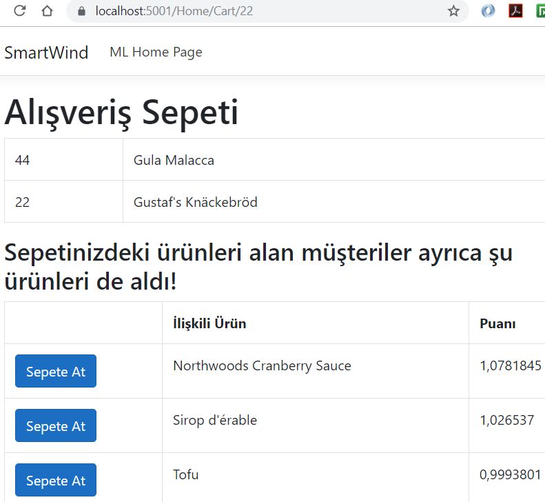

# Microsoft ML.Net Kullanarak Basit Bir Öneri Tahminleme Uygulaması Geliştirmek

Makine Öğrenmesi benim çok uzak olduğum bir konu. Yine de algoritmalar benden, modeli senin için eğitirim, basitçe kullanırsın diyen Microsoft'un ML.Net çatısını merak etmiş durumdayım. ML.Net, Microsoft'un platform bağımsız ve açık kaynak olarak sunduğu Machine Learning çatısıdır. Bu Framework'ten yararlanarak aşağıdakilerine benzer senaryolar kolayca işletilebilir.

- Classification: Müşterilerin geri bildirimlerinin duyarlılığını analiz ederek gelen yorumun positif veya negatif olup olmadığını tahminlemek.
- Image Classification: En bilinen senaryolardan. Bir fotoğrafın _(imgenin)_ hangi kategoriye ait olduğunu tahminlemek.
- Regression _(Value prediction)_: Değer bazlı tahminleme. Örneğin bir yere giderken kullandığımız taksi ücretini ya da bir seyahatin fiyatını tahminleme gibi.
- Recommendation: Kullanıcın geçmiş hareketliliklerine bakarak ona önerilerde bulunma.

Anladığım kadarıyla ML.Net ile veri setlerinin çeşitli tipte algoritmalarla eğitilmesi ve kullanılması nispeten kolay. Veri setlerindeki Feature adı verilen girdiler ve label olarak isimlendirilen çıktı değerleri kullanılarak eğitilen model, yeni girdilere göre bir tahminlemede bulunabiliyor.

Mark J. Price'ın aylardık çalışmakta olduğum C# 8.0 and .Net Core 3.0 - Modern Cross Platform Development Fourth Edition kitabının bir bölümü ML.Net'e ayrılmış durumda. Buradaki örneği tatbik ederek _(github reposundaki dosyaları bile copy-paste yapmadan, kitaptan bakarak tek tek yazmaya ve anlamaya çalıştım)_ ML.Net'in sahadaki kullanımını anlamaya çalıştım. Lakin bakarak yazmak ne kadar kolay olsa da işin özü seçilen Matrix Factorization öneri algoritmasını anlamak.

> Diğer ML.Net denemeleri için No 06 klasörü, Chapter05'teki örneklere de bakabilirsiniz.

## Uygulama

Örnek, Microsoft'un emektar Northwind veritabanını kullanıyor. Burada müşterilerin satın aldıkları ürünlere göre onlara öneride bulunacak bir kurgu söz konusu. Product tablosundaki ID değerleri ülke bazında bir matrise oturtuluyor _(İki kolonlu bir tuple liste. ProductRelation model sınıfı)_ İki kolonlu bu matris veri setimizi oluşturmakta. Bu veri setini baz alan Matrix Factorization algoritmasını kullanarak bir model eğitiyoruz. Çalışma zamanında kullanıcılar sepete bir ürün eklediklerinde, daha önceden eğitilmiş olan model gizemli güçlerini kullanarak diğer müşterilerin de aldığı ve bizim alabileceğimiz en potansiyel 3 ürünü gösteriyor.

> Northwind veritabanının Sqlite versiyonu Smartwind projesindeki Db klasörüne elle kopyalanmıştır

## Hazırlıklar

```bash
# MVC Uygulamasının Oluşturulması
dotnet new mvc -o SmartWind
cd SmartWind
mkdir Data
touch Data/Northwind.cs
touch Models/Category.cs Models/Product.cs Models/Order.cs Models/OrderDetail.cs Models/Customer.cs Models/CartItem.cs Models/Cart.cs Models/ProductRelation.cs Models/Recommendation.cs Models/EnrichedRecommendation.cs Models/HomeCartViewModel.cs Models/HomeIndexViewModel.cs /Views/Home/Cart.cshtml

# Veriseti dosyalarını tutacağımız klasör
mkdir wwwroot/DataSets

# Gerekli NuGet Paketleri (EF, ML.Net)
dotnet add package Microsoft.EntityFrameworkCore.Sqlite
dotnet add package Microsoft.ML
dotnet add package Microsoft.ML.Recommender
```

## Çalışma Zamanı

Uygulama aşağıdaki komut ile çalıştırlır.

```bash
dotnet run
```

[https://localhost:5001] adresine gidilir. Veri Setleri oluşturulur, model eğitilir ve sepete ürünler eklenir. Buna göre öneriler çıkar.









## Bölümün Bomba Sorusu

- Sepete ürün ekledikçe bazen aynı ürün yine öneriler kısmında görünüyor. Bunu engellemek için ne yapılabilir?

## Ödevler

- Sepete ürün ekleme ve görüntüleme işini aynı noktada üstlenen Cart action metodunu ayrıştırmaya çalışın.
- Sepetten ürün çıkartma fonksiyonelliğini ekleyin.