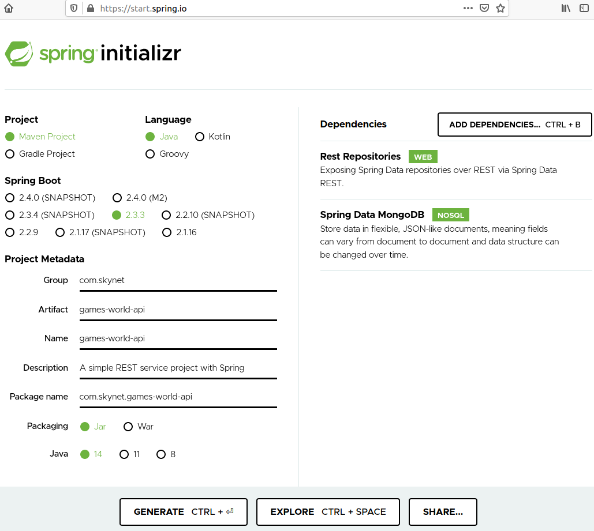
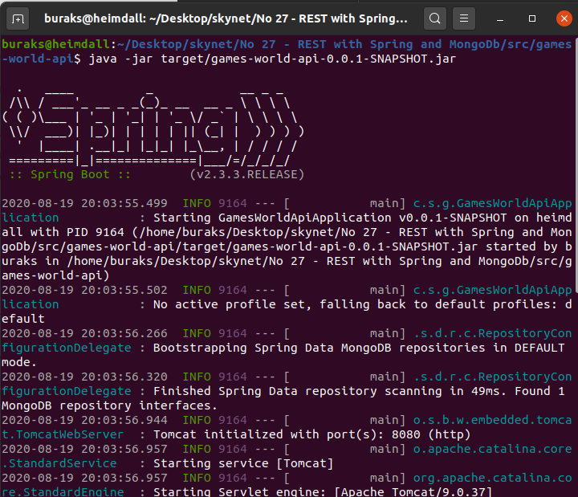
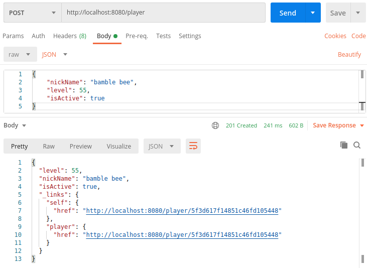
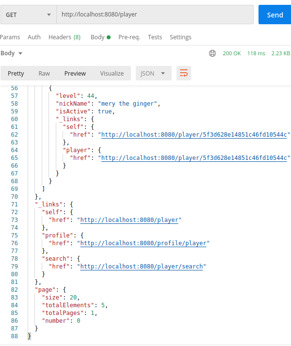
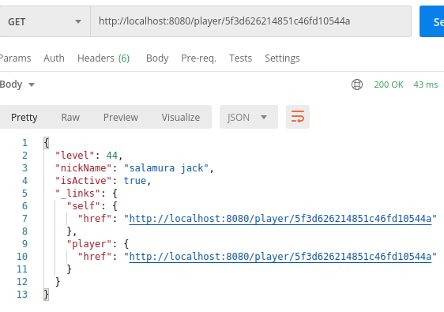
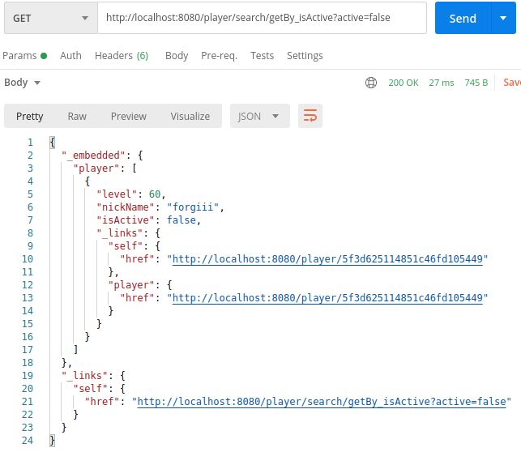
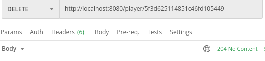
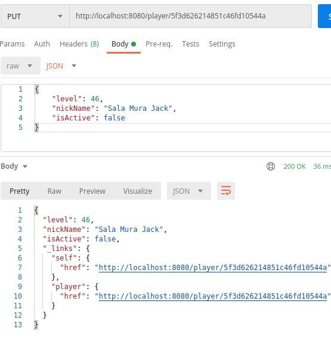

# Spring Boot ile MongoDb Kullanan Bir Rest Servisinin Geliştirilmesi

Spring Boot, Java ile uygulama geliştirmeyi _(Hatta Kotlin ve Groovy ile de kullanılabiliyor)_ oldukça kolaylaştıran Spring üzerine kurulmuş bir çatı _(Framework)_. Dahili DI mekanizması ve zengin paket desteği sayesinde otonom araçlardan akıllı televizyonlara, elektronik ticaretten bulut uygulamalara kadar birçok alanda Java'yı oldukça etkin kullanabilmemize olanak sağlıyor. Benim bu örnekteki amacım resmi dokümanından yararlanıp, MongoDb kullanan basit bir REST servisini geliştirmek. Spring hayatı o kadar kolaylaştırmış ki, onunla geliştirilen bir API servisi pek çok standardı otomatik olarak sağlıyor.

## Ön Gereksinimler

Uygulamamız Java'ya ve build mekanizması için Gradle veya Maven'a ihtiyaç duyuyor. Heimdall üstünde çalıştığım için bir Linux kurulumu yapmam icap etti.

```bash
# Ubuntu 20.04 tarafındaki kurulum için
sudo apt install openjdk-14-jdk

# Sonrasın bir versiyon kontrolü
java --version

# Apache Maven kurulumu içinse
sudo apt install maven

# Yine bir çalışıyor mu kontrolü tabii
mvn -version

# MongoDb için daha önceki örneklerde olduğu gibi docker imajı kullanmayı tercih ettim.
sudo docker run --name mongodb -p 27017:27017 -d mongo:latest
```

## Initialize ile Uygulamanın Oluşturulması

Spring Initializer uygulama iskeletini ve gerekli bağımlılıklarını kolayca oluşturmamızı sağlayan online bir araçtır. [Şu](https://start.spring.io/) adresten ulaşılabilir. Ben bu örnek için aşağıdaki bilgileri doldurdum. Uygulamaya REST özellikleri katmak için _Rest Repositories_ ve Mongo tarafı ile kolayca konuşabilmek için _Spring Data MongoDB_ bağımlılıkları eklendi.



Generate işlemi sonrası bizim için sıkıştırılmış bir uygulama paketi oluşur. Bunu indirip kodlamaya geçilebilir.

## Yapılanlar

- MongoDb dokümanının Java tarafındaki iz düşümü için src/main/java/com/skynet/gamesworldapi altında Player isimli java dosyası oluşturuldu.
- Yine aynı lokasyona Player nesnelerini kullanan ve MongoDb ile aradaki koordinasyonu sağlayacak olan PlayerRepository isimli bir Repository tipi (interface) eklendi

## Çalışma Zamanı

Ben Maven kullanacağımı belirttiğim için aşağıdaki şekilde ilerledim. _(mvnw dosyası bu örnek özelinde games-world-api klasörü altındadır)_

```bash
./mvnw spring-boot:run

# ya da paketi derleyip üretilen JAR dosyası ile de çalıştırılabilir
./mvnw clean package
java -jar target/games-world-api-0.0.1-SNAPSHOT.jar
```



## Testler

Uygulama çalışmaya başladıktan sonra Curl veya Postman gibi araçlarla test edilebilir. İşte benim yaptığım birkaç deneme.

```text
Yeni bir oyuncu eklemek için

http://localhost:8080/player
POST
JSON Body
{
    "nickName": "bamble bee",
    "level": 55,
    "isActive": true
}
```



```text
Birkaç oyuncu ekledikten sonra listelemek için

http://localhost:8080/player
GET

```

> Varsayılan olarak Spring REST paketi sayfalama özelliğini de otomatik getirir. Malum yüklü listeler içeren API servisleri veriyi mutlaka sayfalayarak döndürmektedir.



```text
Belli bir dokümanı (player verisini) çekmek için

http://localhost:8080/player/5f3d626214851c46fd10544a
GET
```



```text
Genişlettiğimiz repository sözleşmesine eklediğimiz metodun testi için.
Pasif olan oyuncular.

http://localhost:8080/player/search/getBy_isActive?active=false
GET

Aktif oyunclar içinse,
http://localhost:8080/player/search/getBy_isActive?active=true
GET
```



```text
Bir içeriği silmek için

http://localhost:8080/player/5f3d625114851c46fd105449
DELETE
```



```text
Veri güncelleme için (Komple set)

http://localhost:8080/player/5f3d626214851c46fd10544a
PUT
JSON Body

{
    "level": 46,
    "nickName": "Sala Mura Jack",
    "isActive": false
}
```



## Bomba Soru

- Ha bu Insert, Update, Delete için hiçbir yere kod yazmadık mı daaa! E nasil çalişiyır?
- Uygulamada MongoDB için bir bağlantı noktası tanımlamadık ancak sorun olmadı. Peki ya mongodb adresi standart portu kullanmıyorsa...Nereden değiştirebiliriz bu adresi?

## Ödevler

- MongoDb yerine PostgreSQL kullanan bir versiyon geliştirmeyi deneyin.
- Oyuncuların oynadığı oyunlara ait bilgilerin tutulduğu yeni bir POJO hazırlayıp Player ile ilişkilendiriniz
