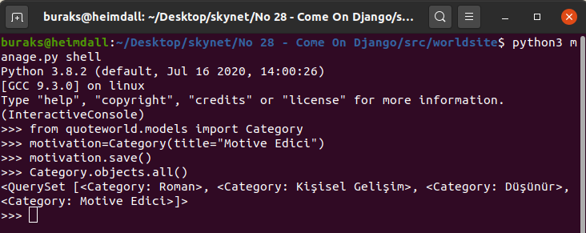
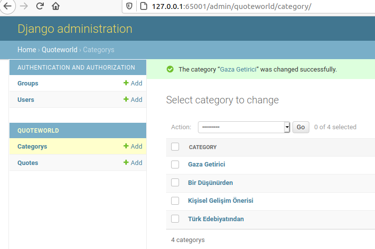

# Django ile Bir Web Uygulaması Geliştirmek

Bir zamanlar IoT cihazlarda uygulama geliştirmek için Python programlama dilini öğrenmeye çalışmıştım. O vakitler Flask ile basit REST Servisleri deneyimleme fırsatım da olmuştu ama Django ile etraflıca uğraşmamış bir web sitesi/uygulaması geliştirmeyi denememiştim. İşte rövanş zamanı. Amacım Django'nun resmi dokümanlarını takip ederek basit bir web uygulaması geliştirme deneyimini yaşamak. Örneği favori dostum Heimdall _(Ubuntu 20.04)_ ile birlikte geliştireceğim.

## Yapılanlar

Elbette sistemde python ve pek tabii django çatısının yüklü olması gerekiyor.

```bash
# Sistemde python yüklü olduğundan aşağıdaki komut ile django framework'ü yükledim
python -m pip install Django

# Kurulumdan emin olmak için versiyon kontrolü yaptım
python -m django --version

# Örneğin src klasörüne geçip aşağıdaki komutu kullanarak web site'ı oluşturdum(Project olarak düşünelim)
# Standart olarak bir web site şablonu oluşur. Bu aslında proje klasörüdür. Web Site gibi düşünürsek içinde birden fazla web application içerebilir
django-admin startproject worldsite

# manage.py dosyası özellikle django işleri için kullanacağımız komut satırı programıdır
# ki örneği bu haliyle belli bir porttan çalıştırmak için onu aşağıdaki gibi kullanmak yeterlidir.
# Port bilgisi girilmezse 8000 portu kullanılır.
# Aşağıdaki işlem sonrası komut satırında migration tarafının tamamlanmadığı(model oluşturduktan sonra migrate yaparız) uyarısı ile birlikte http://localhost:65001 adresinde uzaya doğru hareket eden bir roket figürü görülmelidir ;)
cd worldsite
python manage.py runserver 65001

# Şimdi bu site altında bir web uygulaması oluşturalım. Yukarıda belirtmiştim. Site birden fazla web uygulaması içerebilir ve herbirinin konfigurasyon yönetimi buradan yapılabilir
python manage.py startapp quoteworld

# quoteworld içerisinde örnek bir view oluşturulur.
cd quoteworld
touch views.py

# Ayrıca url map tanımları için birde urls.py dosyası eklenir.
touch urls.py

# Örnekte kullanılacak veri modelleri için models.py isimli bir modül oluşturuyoruz.
touch models.py

# Model sınıfları da oluşturulduktan sonra migration işlemi yapılabilir
# Migration işleminin quoteworld uygulaması için de çalışması için settings.py'de bildirim yapılmıştır.
# Migration tamamlandıktan sonra oluşan 0001_initial.py dosyasına bakmayı ve BigKahunaClub.sqlite3 veri tabanını incelmeyi unutmayın.
cd ..
python manage.py makemigrations quoteworld
python manage.py migrate

# Migrate işlemi başarılı olduysa terminali kullanarak veri üzerinde işlemler yapabiliriz de
# shell'i açmak için aşağıdaki komut kullanılır
# Örnek çalışma için aşağıdaki ekran görüntüsüne bakabiliriz
python manage.py shell
```



Kaldığımız yerden devam edelim.

```bash
# Migration işlemi sadece quoteworld model sınıfları için tablolar oluşturmaz.
# Varsayılan olarak gelen kullanıcı, grup sistemi ve diğer yönetsel işler (session management vs) için de gerekli tabloları üretir.
# Söz gelimi http://localhost:65001/admin sayfasına gidildiğinde bir login ekranı ile karşılaşırız.
# Buradan giriş yapacak bir super user QuoteWorld uygulamamızdaki tablolarda CRUD işlemleri de yapabilir. 
# Aşağıdaki komut ile admin sayfasına giriş yapacak superuser yetkisinde bir kullanıcı oluşturabiliriz.
# Ben scoth isimli bir kullanıcı oluşturdum. Şifresi de tiger2020. ;)
# Bu noktada birde bomba sorumuz var. Lütfen o kısma da bakın.
python manage.py createsuperuser

# Şimdi kategori listesini göstereceğimiz ana sayfayı tasarlayalım
# Bunun için bir template yolu oluşturacağız ve içerisine index.html ekleyeceğiz
# views.py içerisindeki index action'ı bu html içeriği ile birlikte çalışacak
cd quoteworld
mkdir templates
# Varsayılan olarak çalışma zamanı templates altına bakar
# Aynı sitede farklı uygulamaların aynı isimli template'lerinin karışmaması için
# quoteworld şeklinde yeni bir alt klasör daha söz konusudur
mkdir templates/quoteworld
touch templates/quoteworld/index.html

# Kategoriye tıklandığında bu kategorideki alıntıların gösterimi içinde aşağıdaki sayfayı kullanacağız
touch templates/quoteworld/qutoelist.html

# Yeni bir alıntının eklenmesinde kullanacağımız Form tipi için forms.py dosyasını kullanacağız
touch forms.py

# Yeni altının ekleneceği html sayfamız ise bu
touch templates/quoteworld/addQuote.html
```

## Bootstrap Desteği

Elbette üretilen standart HTML sayfaları son kullanıcı için oldukça yetersiz. Bu nedenle bootstrap kullanmayı düşündüm. Kurulum gayet basit.

```bash
pip install django-bootstrap4
```

Tabii bootstrap'i uygulamada kullanabilmek için INSTALLED_APPS kısmında bildirimini yapmak lazım. Bulun bakalım nerede?

## Çalışma Zamanı

quoteworld web uygulaması sunucu çalıştırma şeklimiz gereği http://localhost:65001/quoteworld adresi üzerinden hizmet verecektir. 

```bash
# manage.py ile aynı yerdeyken
python manage.py runserver 65001
```

>NotCompletedException();

## Bomba Sorular

- Varsayılan olarak gelen Sqlite desteğine istinaden db.sqlite3 isimli bir dosya veriliyor. Lakin benim örneğimde bu veritabanının adı BigKahunaClub.sqlite3. Sizce migrate işleminin bu veritabanını kullanacağını nerede belirtmiş olabilirim?
- Admin sayfasında, superuser tarafından quoteworld uygulamasındaki Category ve Quote verilerinin yönetilebilmesini sağlamak için nereye ne eklenmiştir? _(Yani aşağıdaki görüntüyü elde etmek için)_
- csrf_token hangi amaçla kullanılmaktadır
- Yeni bir alıntı eklediğimiz sayfadaki Formumuz, model ile otomatik ilişkilendirilmiştir. Peki örneğin content alanını multiline text haline nasıl getirebiliriz? Yani QuotePostForm'a bağlanan model alanları üzerinde özelleştirme işlemlerini nasıl yapabiliriz?



## Ödevler

- Alıntılarda önemli bir eksik var. Yazar bilgisini giriyoruz ama hangi kitaptan olduğu veya anonim olup olmadığını bilmiyoruz. Quote modeline book isimli bir alan ekleyin. Bunun sonucunda migration işlemi de yapmanız gerekecek. Ayrıca bu bilgiyi uygulamada ilgili sayfalara yerleştirmelisiniz de.
- Alıntıları silme ve güncelleme için gerekli ilaveleri yapınız.