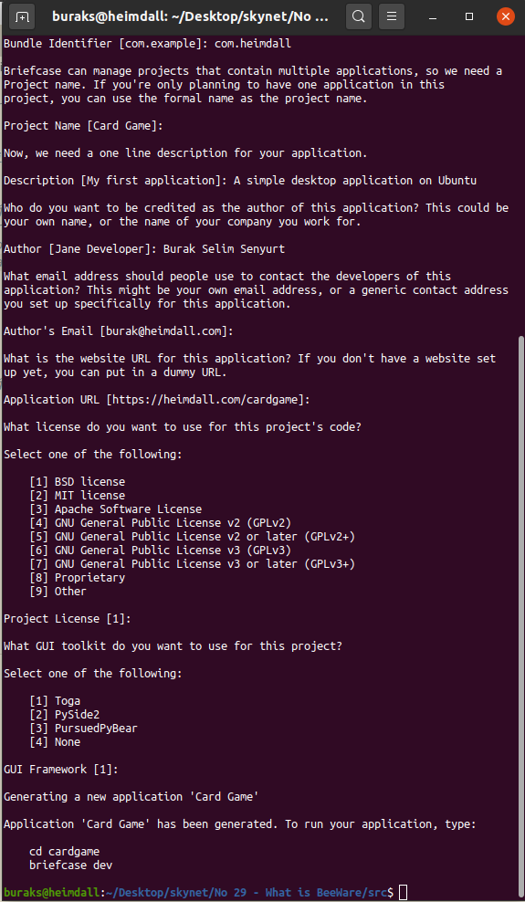
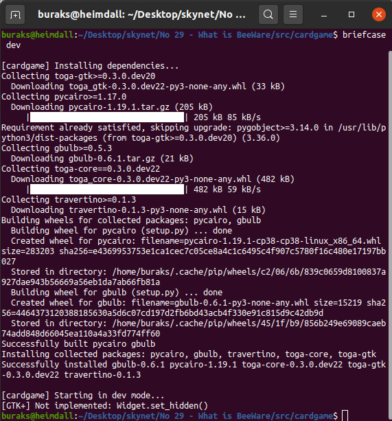
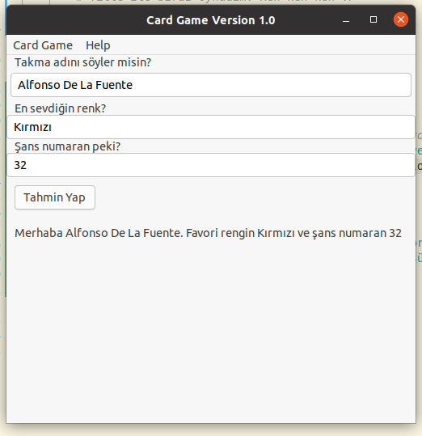

# BeeWare ile Linux Platformunda Desktop Uygulaması Geliştirmek ve Android Sürümünü Oluşturmak

Python ile ilgili bir şeyler ararken BeeWare isimli bir çalışmaya rastladım. Her yerde python ile native uygulama geliştirmek gibi bir felsefesi vardı. _(Eee zaten python her platformda yüklenip kullanılmıyor mu? Yok, öyle değil aslında)_ BeeWare ürünü macOS, Linux, Windows platformunda native uygulamalar geliştirmek haricinde iOS ve Android için de destek sunan bir araçlar ve kütüphaneler topluluğu esas itibariyle. Söz gelimi iOS ve macOS platformundaki Objective C kütüphaneleri ile Python arasında köprü görevi gören _Rubicon ObjC_ isimli bir araç sunuyor. Java kütüphaneleri ile bir iletişim mi söz konusu. O zaman _Rubicon Java_ var. Diğer yandan cross-platform için _Toga_ isimli bir widget kütüphanesi kullanıyor. Ayrıca python projelerini tek başına çalışabilir uygulamalar haline getirmek için _(standalone native application)_  _Briefcase_ isimli bir aracı var. Şöyle düşünebiliriz; Android için Gradle çıktısı, iOS için XCode proje çıktısı, Linux için AppImage, Windows için MSI Installer ve macOS İçin doğrudan çalışabilir uygulama çıktıları üretebiliyoruz. Bana bir Xamarin kokusu verdi gibi ama du bakalım. _(Bu arada BeeWare'in Logo'su acayip tatlı)_ İddialı bir platform. Benim amacım Heimdal _(Linux 20.04)_ üzerinde bir masaüstü uygulaması geliştirmek.

## Ön Hazırlıklar

```bash
# Sistemde Python yüklü olsa bile ekstra bazı kütüphaneler de gerekiyor
# Lakin bu paketleri hangi amaçla yüklüyoruz, araştırmam lazım. Mazallah güvenlik açığı filan da olabilir. Aman dikkat!
sudo apt-get install libgirepository1.0-dev libcairo2-dev libpango1.0-dev libwebkit2gtk-4.0.37 gir1.2-webkit2-4.0

# Şimdi Python paketinin dağıtımında devreye girecek Briefcase aracını yükleyelim
# Bu arada 20.04 üstünde cookiecutter versiyonunu beğenmedi Heimdall. O nedenle cookiecuttor'ı da pip üstünden install ettim
python3 -m pip install briefcase

# Adettendir kurulan versiyonu bir kontrol etmek iyi olabilir
briefcase --version

# Şimdi yeni projenin açılışını yapabiliriz
briefcase new

# Sorulan sorulara verdiğim cevaplar doğrultusunda cardgame isimli bir proje oluştu. 
# Carg Game isimli projenin GUI framework olarak Toga'yı seçtim. 
# Buna göre projenin Linux, macOS, Windows dağıtımlarındaki gereksinimleri ile birlikte
# diğer sorduğu sorulara() verdiğim cevaplar pyproject.toml (toml = Tom's Obvious Minimal Language) içerisine yazıldı.
# Bu dosyayı incelemekte yarar var.
```

_Kurulum aşamasından örnek ekran görüntüsü_



## Çalışma Zamanı

linux, macOS, Windows... Hepsinde aşağıdaki terminal komutları ile uygulamayı çalıştırabiliriz.

```bash
cd cardgame
briefcase dev
```

_İlk çalışma sırasında üzerinde olduğumuz platforma göre gerekli bağımlılıklar indirilir. Toga paketleri gibi._



_Örnek bir çalışma zamanı görüntüsü_



## Dağıtım _(Deployment)_

Uygulama şu ana kadar development modda çalıştı. Ancak bunu paket haline getirip ilgili platformlara dağıtmak için bir dizi işlemden geçirmek gerekiyor. Normalde Linux için bir dağıtım paketi oluşturmayı düşünüyordum ancak bu uygulamayı Android'e paketleyebilir miyim diye de merak ettim. İşte uygulamanın android sürümüne dönüştürülmesi için yapılanlar.

```bash
# Uygulama klasöründeyken create ile android app oluşturulur (dakikalarca sürebiliyor)
briefcase create android
# ve build komutu ile de apk dosyası üretilir. Card Game/app/build/outputs/apk/debug/app-debug.apk altında oluşur. (Gerekli SDK, NDK paketlerini indirdiği için ilk seferinde dakikalarca sürebiliyor)
briefcase build android

# Kontrol amaçlı olarak build edilen sürümü aşağıdaki gibi çalıştırılabilir
# Burada sanal bir emülator'den yararlanılabileceği gibi gerçek bir Android cihazda kullanılabilir
# Ben Create a new Android Emulator seçeneğini kullandım.
briefcase run android
```

_Geliştirdiğimiz uygulamanın Android için çalışan sürümünden bir görüntü_


> Bu örnek için andorid klasörü tüm bağımlılıkları ile birlikte 500 megabyte'tan fazla yer tuttu. APK dosyası ise 50 Mb'den biraz fazlaydı. Bana epeyce büyük geldi.

## Bomba Soru

> throw new ICantFindAnyQuestionException();

## Ödevler

- Uygulamadan girilen verileri SQLite veritabanına aktarmayı deneyin. Doğrudan bağlantı ile veya bir REST servis aracılığıyla olabilir.
- macOS üzerinden çalışıyorsanız iOS sürümünü üretmeyi deneyebilirsiniz.