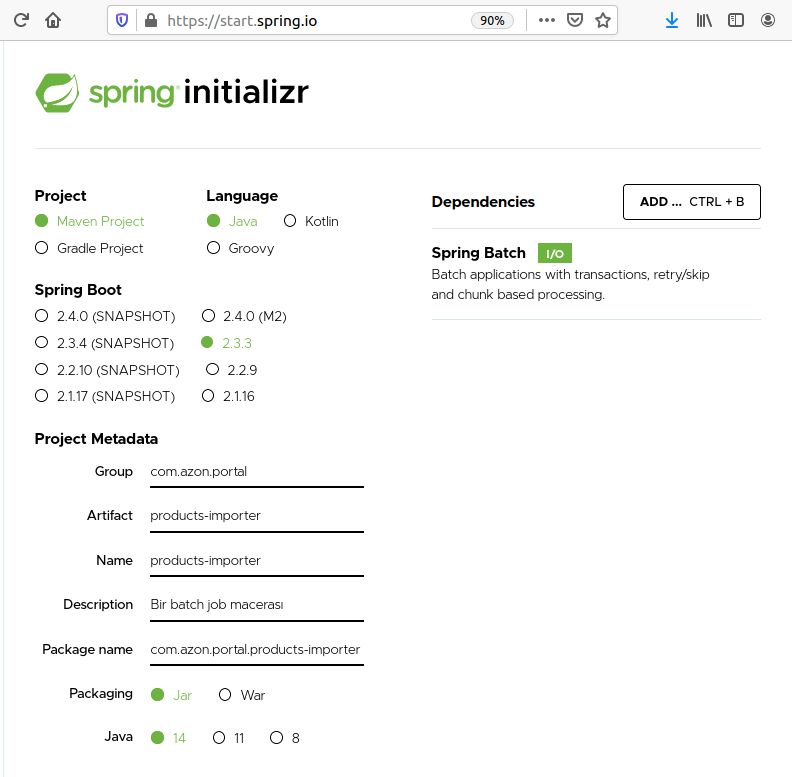

# CSV İçeriğini Veritabanına Alan Bir İşi Spring ile Geliştirmek

CSV gibi içerikler ile veri transferi halen daha popülerliğini koruyor. Bir sistemin ürettiği çıktının CSV formatında başka bir sisteme alınmasından bahsediyorum. En bilinen süreçlerden birisi CSV içeriğinin alınması, belki özel işlemlerden de geçirilerek bir veritabanına aktarılması. Benim merak ettiğim bu tip bir yığın veri işini Spring ile nasıl kolaylaştırdıkları. Sanırım 27 numaralı örneğin etkisinde kaldım. Spring'ten faydalanıp Java ile bir şeyler yapmak hoşuma gitti. Amacım basit bir CSV içeriğini SQLite veritabanındaki bir tabloya aktarmak.

## Hazırlıklar

Heimdal _(Ubuntu 20.04)_ üstünde JDK, Maven gibi aparatlar zaten yüklü. Kod editörü olarak da Visual Studio Code'u kullanıyorum. Spring projesinin ilk açılışı için elbette [şu](https://start.spring.io/) adrese uğramak gerekiyor. Batch işlemleri için Spring Batch ve SLQ tarafı içinse HyperSQL Database isimli paketler kullanılacak.

## Çalışma Zamanı

## Bomba Sorular

## Ödevler