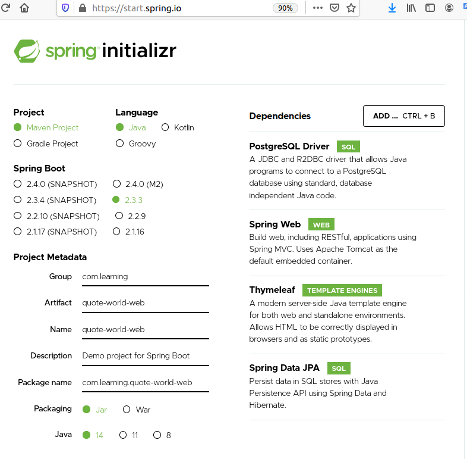
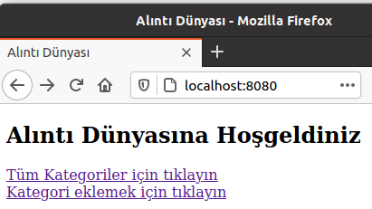
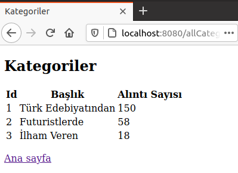
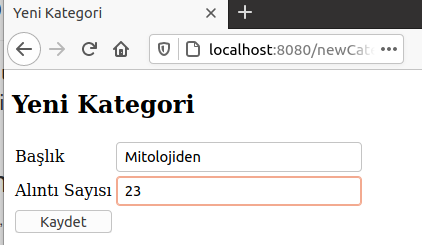
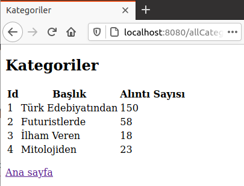

# Spring Boot ile PostgreSQL Kullanan Basit Bir Web Uygulaması Geliştirmek

Spring Boot maceralarım devam ediyor. Bu sefer PostgreSQL veritabanını kullanan bir Web uygulaması geliştirmek istiyorum. Nitekim Spring Boot kullanarak bir web uygulaması hiç geliştirmedim. PostgreSQL tarafında Heimdall sistemini kirletmemek adına docker container kullanacağım. Basit bir MVC düzeneği olacak. Statik bir web sayfası dışında listeleme ve yeni nesne ekleme adımlarında template'lerden faydalanacağım.

## PostgreSQL Hazırlıkları

Docker imajını ve örnek veritabanını hazırlamak için aşağıdaki terminal komutlarını kullandım.

```bash
# Container'ı Tokyo ismiyle ayağa kaldıralım
sudo docker run --name Tokyo -e POSTGRES_PASSWORD=P@ssw0rd -p 5432:5432 -d postgres
# Üzerinde bash açıp
sudo docker exec -it Tokyo bash
# PostgreSQL veritabanımızı oluşturalım
psql -U postgres
Create Database qworld;
```

## Uygulamanın İnşaası

İlk iş olarak [şu](https://start.spring.io/) adrese gidip POM içeriğini ve uygulamayı hazırlamak lazım. PostgreSQL tarafı için _PostgreSQL Driver_ , temel web uygulaması kabiliyetleri için _Spring Web_ , temel MVC şablonlarını kullanabilmek için _Thymeleaf_ ki bunu bir türlü telaffuz edemiyorum, Object Relational Map aracı Hibernate içinse _Spring Data JPA_ isimli bağımlılıkları yüklüyoruz. 



Sonrasında indirilen uygulama içeriği üzerinde gerekli geliştirmeleri yapıyoruz.

```bash
cd quote-world-web
# Controller klasörü ve sınıfı
mkdir src/main/java/com/learning/quoteworldweb/controller
touch src/main/java/com/learning/quoteworldweb/controller/CategoryController.java

# Model klasörü ve sınıfı
mkdir src/main/java/com/learning/quoteworldweb/model
touch src/main/java/com/learning/quoteworldweb/model/Category.java

# Repository klasörü ve sınıfı
mkdir src/main/java/com/learning/quoteworldweb/repository
touch src/main/java/com/learning/quoteworldweb/repository/CategoryRepository.java

# Servis sözleşmesi ve sınıfı
mkdir src/main/java/com/learning/quoteworldweb/service
touch src/main/java/com/learning/quoteworldweb/service/ICategoryService.java src/main/java/com/learning/quoteworldweb/service/CategoryService.java

# statik indeks sayfası
touch src/main/resources/static/index.html

# Kategorileri listelemek ve yeni bir tane eklemekte kullanılmak üzere iki template sayfası
touch src/main/resources/templates/allCategories.html src/main/resources/templates/newCategory.html

# Veritabanı tablo şeması ve örnek veri girişleri için ilgili sql dosyaları
# application.properties dosyasındaki ayarlara göre uygulama başlarken schema dosyasına bakıp eğer yoksa tabloyu oluşturmalı
# ve örnek verileri eklemeli
touch src/main/resources/schema.sql src/main/resources/data.sql
```

## Çalışma Zamanı

Uygulamayı maven üzerinden aşağıdaki terminal komutu çalıştırabiliriz. Sonrasında localhost:8080 portuna gitmemiz yeterli olacaktır.

```bash
./mvnw spring-boot:run
```









## Bomba Sorular

- Bir template içerisinden model nesnesinin ilgili alanlarıyla nasıl bağlantı kuruluyor, açıklayınız.
- CategoryController sınıfındaki newCategory metodunda model nesnesinin attribute'larına yeni bir Category nesnesi eklememizin sebebi nedir? Eklemezsek ne olur?

## Ödevler

- Uygulamaya kategori silme ve güncelleme operasyonlarını ekleyiniz.
- PostgreSQL yerine MongoDb veritabanını kullanmayı deneyiniz.
- Görüntü fark edeceğiniz üzere berbat. Şu uygulamaya bir bootstrap giydirseniz olmaz mı?