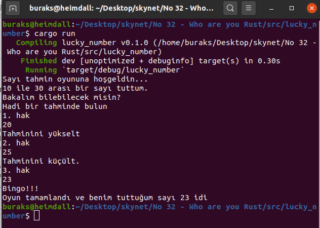
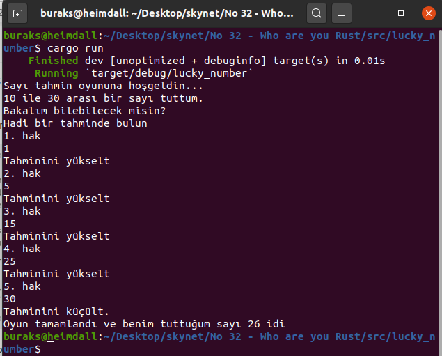
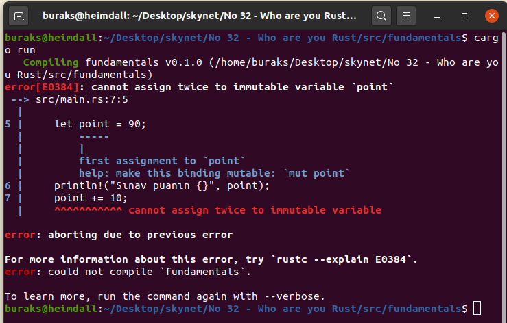
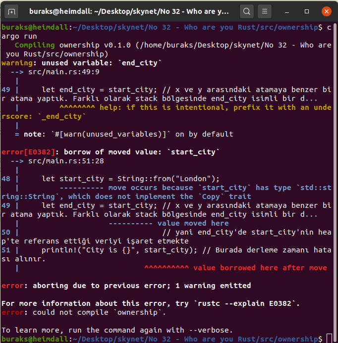
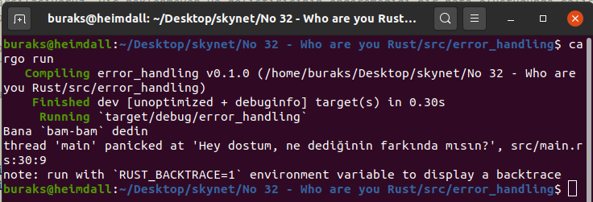
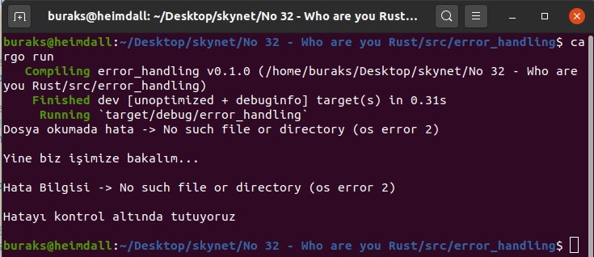
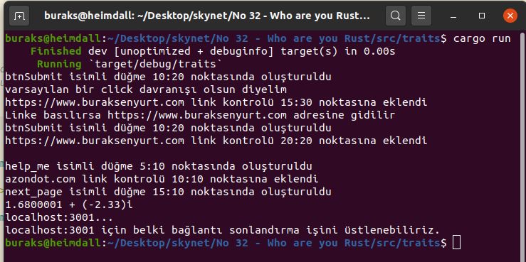
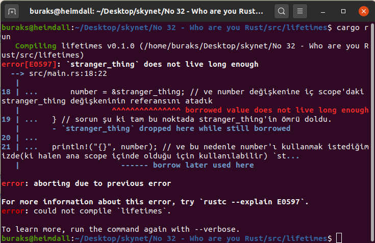

# Stackoverflow Sevgi Anketinde Yıllardır Bir Numara Çıkan Programlama Dili Rust Kimdir?

Stackoverflow'un [2020 yılı geliştirici anketine göre](https://insights.stackoverflow.com/survey/2020#technology-most-loved-dreaded-and-wanted-languages-loved) en sevilen programlama dilinin Rust olduğunu söyleyebiliriz. Hatta bu son yıllarda hep böyle. Nedir onu bu kadar özel yapan merak ediyorum. Bunu anlamanın tek yolu onunla bir şeyler karalamak. Resmi dokümantasyonuna göre ilk tespitlerim şunlar.

- Rust geliştiricilerin _Rustaceans_ deniyor
- İlk söylenmesi gereken şey Rust'ın amacının sistem seviyesinde programlama yapmak olduğu. C ve C++ gibi bir dil olduğunu düşünebiliriz.
- Şu sıralar çok popüler olmaya başlayan Deno'nun Rust ile yazıldığını söylesem...Ya da Microsoft Azure IoT Edge'in çok büyük bir kısmının onunla yazıldığını ifade etsem. İşletim sistemleri _(TockOS, Tifflin, RustOS, QuiltOS, Redox)_, oyun motorları, derleyiciler, container'lar, VM'ler, Linux dosya sistemleri vs, ls komutunun alternatifi olan exa vs... Yani Rust ile yazılım ve yazılım platformları geliştirildiğini ifade edebiliriz. Bu nedenle Rust donanım odaklı bir dil desek yeridir. Donanımı etkin kullanmaya çalışır.
- Rust ortamında Garbage Collector gibi bir mekanizma yoktur. Amaç çalışma zamanı performansının artırılmasıdır. Dilin hedeflerinden birisi de hızdır zaten. _(Hatta değişkenler bile varsayılan olarak immutable oluşur. Ufak veri yapılarında-Data Structures bu önemli bir performans kazanımıdır. Yüklü veri yapılarında ise mutable kullanımı daha uygun olabilir nitekim referans etmek yığının bir kopyasını oluşturarak çalıştırmaktan daha mantıklıdır)_
- Diğer iki önemli hedefi de eş zamanlılık _(Concurrency)_ ve güvenli bellek kullanımıdır.
- Rust derlemeli bir dildir. Hatta derleme çıktısı WebAssembly'da olabilir.
- Pek çok diğer modern dilde olduğu gibi Rust'ın da etkili bir paket yönetim mekanizması vardır. İsmi de gayet makul ve mantıklı. _Cargo_
- Dilin arkasında Mozilla Labs'ın gücü var. Hatta [servo isimli yüksek performans vaat eden tarayıcı motoru](https://servo.org/) da Rust ile geliştirilmiş.
- Dilin diğer karekteristik özelliklerini elbette kod üstünde anlamaya çalışacağım.

## Kurulum

Önce Rust ortamını hazırlamak lazım. Ben Heimdall _(Ubuntu 20.04)_ üstünde ilerliyorum. Geliştirmeler için Visual Studio Code'dan yararlanacağım.

```bash
curl https://sh.rustup.rs -sSf | sh

# Dilin genel özelliklerini tanımak için bir dosya üstünde çalışalım
touch WhoAreYouRust.rs
```

## Örneklerden Anahtar Notlar

Dilin genel özellikleri ile ilgili dikkatimi çeken birkaç anahtar noktayı kendime not olarak alayım.

- factorial; 
    - mutable değişken tanımlama,
    - recursive metot parametresi için match kullanımı,
    - kütüphane bildiriminin nasıl yapıldığı
    - ekran girdisinin parse edilmesi
- lucky_number;
    - harici kütüphane nasıl bildirilir _(toml)_,
    - for döngüsünde aralık bildirimi,
    - parse sonucunun match ile ele alınması,
    - continue, break kullanımı,
    - compare işlem sonucunun match ile ele alınması,
- fundamentals;
    - immutable olmak ya da olmamak,
    - constant'lar ciddi ciddi immutable
    - shadowing,
    - rust statik türlü bir dildir,
    - Destructuring,
    - tuple kullanımı,
    - fonksiyonlarda return kullanma zorunluluğu olmaması,
    - fonksiyonlarda match kullanımı,
    - for döngülerinde iter ve rev ile ileri geri hareket edebilme,
    - loop döngüsü,
    - slice veri türü,
- ownership;
    - String tipleri arasında yapılan atama sonrası atanan tipin scope dışında kalması _(move)_ ,
    - Metot parametre ve dönüşlerinde sahipliğin _(ownership)_ değişmesi,
    - & referencing ve * deReferencing operatörleridir,
    - borrowing,
    - aynı scope içinde birden fazla mutable referans atamasına izin yok, _(Data Race kısıtı)_ ,
- structs;
    - struct update syntax,
    - tuple görünümlü struct kullanımı,
    - impl blokları ile struct veri yapısına kendi çalışma zamanı örneği ile çalışacak metotlar eklenebilir
- enums;
    - enum değişkenleri farklı türde ve sayıda veri yapısını parametre olarak kullanabiliyor,
    - Null tipi yok ama Option<T> üstünden None tanımlanabilir,
    - enum veri yapısı ile pattern matching kullanılabilir,
    - Option<T> ile match kullanımı,
- mercury; _(bir module örneği)_
    - modül öğeleri varsayılan olarak private nitelik taşır _(yani modül dışında kullanılamaz)_,
    - modül içi struct veri yapıları da varsayılan olarak private özelliklidir ve hatta alanları da,
    - crate _(sandık)_ içerisindeki bir enstürmana _(örneğin bir struct)_ nasıl erişiriz _(:: notasyonu)_,
    - pub ile modül üyesini public kullanıma açarız,
    - super ile bir üst katmandaki elemanlara ulaşabiliriz _(bulunduğum modülden bir üst modüldeki bir elemana ulaşmak gibi)_,
    - use ile modüle elemanlarına daha kolay ulaşabiliriz,
    - modüller dosya/klasör hiyerarşisine göre kullanılabilirler _(azon örneğine bakın)_
- collections;
    - 3 temel koleksiyon var; vector _(Depicable Me'deki gru'nun rakibi olan değil)_ , string ve hash map,
    - vector türünde dikkat çeken fonksiyon ve operatörler pop, push, iter, iter_mut, * _(dereference)_, & , 
    - vector ile enum veri yapısı da kullanılabilir,
    - String, UTF-8 kodlamasını kullanır,
    - String'lere push_str veya push ile ekleme yapılabilir,
    - Çok fazla String'in birleştirilmesi gerektiğinde + yerine format! makrosu tercih edilmelidir,
    - Bir String'in uzunluğu hiç de beklediğimiz sayı olmayabilir,
    - Key:Value çiftlerinden oluşan koleksiyonlar için HashMap,
    - Bir HashMap'in key ve value dizileri vector koleksiyonlarından oluşturulabilir,
- error_handling;
    - iki tür hata kategorisi var: Kurtarılabilir olanlar(recoverable) ve tabii ki kurtarılabilir olmayanlar(unrecoverable)
    - panic! makrosu kurtarılabilir olmayan senaryolarda söz konusu,
    - Result<T,E> tipi,
    - Winding ve Unwinding,
    - RUST_BACKTRACE=1 cargo run ile stacktrace benzeri hata detayına ulaşılabilir,
    - Error propagating, unwrap, expect,
    - ? operatörü ile Result<T,E> çıktılarını ele almak,
- generics;
    - kod tekrarının önüne geçmekte sıklıkla kullanılır,
    - struct ve sturct'a uygulanan metotlar generic olabilirler,
    - generic tip için Trait bildirimi yapmak gerekebilir,
    - trait ile struct'lar için ortak davranış sözleşmeleri bildirebiliriz _(tam olarak interface değil, tam olarak abstract sınıf da değil. Değişik bir şey)_,
    - trait'ler boyutsuzdu bu nedenle bir vector dizisi yapılmak istendiğinde box yapısına başvurmak gerekir,
    - trait'ler fonksiyonlara parametre olarak geçirilebilir ve hatta döndürülebilir,
    - built-in trait'leri yeniden programlayabiliriz _(operator overloading)_,
- lifetimes;
    - Tüm referans türlerinin bir yaşam ömrü _(lifetime)_ vardır,
    - _lifetime_ ve _scope_ kavramları birbirlerine benzer ama aynı şey değildirler,
    - generic lifetime parametreleri _(' ile tanımlananlar)_,
    - Bir fonksiyon lifetime referans ile dönüyorsa parametrelerinden en az birisinin de lifetime referans olması gerekir,

## Çalışma Zamanı

```bash
# Rust kodlarını derlemek için 
rustc WhoAreYouRust.rs

# Çalıştırmak içinse
./WhoAreYouRust

# Cargo'dan bahsetmiştik (Kargo grubu geldi aklıma. Ne dinlerdim ama?)
# Cargo ile derleme, paket yönetimi ve daha bir çok işlem yapılabiliyor.
# Örnekleri Cargo ile geliştireceksek
# Klasör yapısını inceleyin ve toml dosyasına bakın. Projenin genel özellikleri ile bağımlı olduğu diğer paketler burada yer alacak.
# Kodlar src altındaki main.rs'tedir.
cargo new factorial
cd factorial

# Cargo üstünde build için
cargo build
# ve çalıştırmak için
cargo run

# Derleme yapmadan kodu kontrol etmek için
cargo check

# Release almak için
cargo build --release

# factorial örneğinde rand isimli rastgele sayı üretme kütüphanesinin kullanımı için toml dosyasında değişiklik yapıldı. (Bul bakalım)
# rand kütüphanesinin 0.5.3 sürümünü kullandık. Ek kütüphaneler cargo build komutu ile indirilir. Güncellenmeleri gerektiğinde cargo update komutu kullanılabilir.

# Elbette benzer işleri yapan fonksiyonellikleri bir arada tutmak vb işlerde module, package ve crate gibi yapılar kullanılıyor
# Yeni bir modül oluşturmak için aşağıdaki gibi bir komutu kullanabiliriz
cargo new --lib mercury

# Dosyalara bölünmüş modül kullanımı örneği için aşağıdaki yolu izleyebiliriz
# azon altındaki client.rs main fonksiyonunu içerir ve libraries içerisindeki modülü kullanmaktadır
# client.rs'in libraries klasöründeki modülü kullanabilmesi için modül adının mod.rs olması gerekiyor
mkdir azon
cd azon
touch client.rs
mkdir libraries
touch libraries/mod.rs
# derleme için aşağıdaki komutu kullanmak yeterli
rustc client.rs && ./libraries/
# sonrasında şu komutla uygulamayı çalıştırabiliriz
./client
```

> factorial sonrası geliştirilen diğer örneklerde cargo aracından yararlanılmıştır.

_factorial programına ait örnek ekran çıktısı_


_lucky _ number isimli sayı tahmin oyunundan iki görüntü_





_fundamentals isimli örnekte immutable atam ihlaline ait çalışma zamanı hatası_



_ownership örneğindeki barrowed move olayı_



_errorhandling örneğinden bir kuple panic! havası_



_errorhandling örneğinden Result<T,E> ile olayı kontrol altında tutmaya çalışma_



_traits örneğinden bir ekran görüntüsü_



_lifetimes örneğinde derleme zamanı hatasının görüntüsü_



## Bomba Sorular

- Rust dilinde değişkenler neden varsayılan olarak immutable işaretlenir?
- factorial örneğindeki expect fonksiyonları hangi hallerde devreye girer? panic durumları bu kod parçasında nasıl ele alınır?
- lucky_number örneğindeki match kullanımlarının ne işe yaradığını bir arkadaşınıza anlatınız?
- Büyük veri yapısına sahip bir tipi mutable mı kullanmak uygundur, immutable olarak mı? Yoksa duruma göre değişir mi?
- shadowing hangi durumlarda mantıklı olabilir?
- Ne zaman array ne zaman vector kullanmak uygun olur?
- C# dilinde String atama ve metotlara parametre olarak geçme davranışları ile Rust tarafındakileri karşılaştırın.
- ownership uygulamasının aldığı derleme zamanı hatasının sebebi nedir?
- Hiçbir alan _(field)_ içeren bir struct tanımlanabilir mi? Buna izin veriliyorsa amaç ne olabilir?
- structs örneğinde yer alan println!("{}", mouse.title); kod parçası açılırsa neden derlenmez? _(Line: 18)_
- Yine structs örneğinde 19ncu satırdaki kod, mouse değişkeni mut ile mutable yapılsa dahi derleme hatasına neden olacaktır. Neden?
- Bir enum yapısındaki değişkenler başka enum değişkenlerini de içerebilir mi?
- Bir vector koleksiyonunda farklı tipten elemanlar tutmak istersek ne yaparız?
- String'leri + operatörü ile birleştirirken neden & ile referans adresi kullanırız?
- collections örneğinde a_bit_off_word değişkenine siyah isimli metindeki ilk karakteri almak ve panic durumunun oluşmasını engellemek için ne yapılabilir?
- Unwinding kabiliyeti nasıl etkinleştirilir?
- traits isimli örnekte yer alan Action içerisindeki initialize metodunun Hyperlink fonksiyonu için kullanılmasını istemezsek nasıl bir yol izlememiz gerekir
- _lifetimes_ isimli programdaki #1 örneğinde oluşan derleme zamanı hatasını nasıl düzeltebilirsiniz?
- Bir fonksiyon birden farklı generic lifetime parametreleri kullanabilir mi?

## Ödevler

- lucky_number örneğindeki cpm işlem sonucunu match yerine if blokları ile tesis ediniz.
- luck_number örneğinde loop döngüsü kullanmayı deneyiniz
- Bir kitabı birkaç özelliği ile ifade eden bir struct yazıp, bu kitabın fiyatına belirtilen oranda indirim uygulayan metodu geliştiriniz _(Metot, impl bloğu ile tanımlanmalı)_
- mercury isimli kütüphaneyi başka bir rust uygulamasında kullanabilir misiniz? Nasıl?
- Bir String içeriğini tersten yazdıracak fonksiyonu geliştiriniz? _(rev kullanmak yasak)_
- error_handling örneğinde 69ncu satırda başlayan ifadede i32'ye dönüşemeyen vector değerlerini hariç tuttuk. Geçersiz olan değerleri de toplayıp ekrana yazdırabilir misiniz? _(ipucu : partition fonksiyonu)_
- İki kompleks sayının eşit olup olmadığını kontrol eden trait'leri geliştiriniz
- Iterator trait'ini yeniden programlayarak Fibonnaci sayı dizisini belli bir üst limite kadar ekrana yazdırmayı deneyiniz