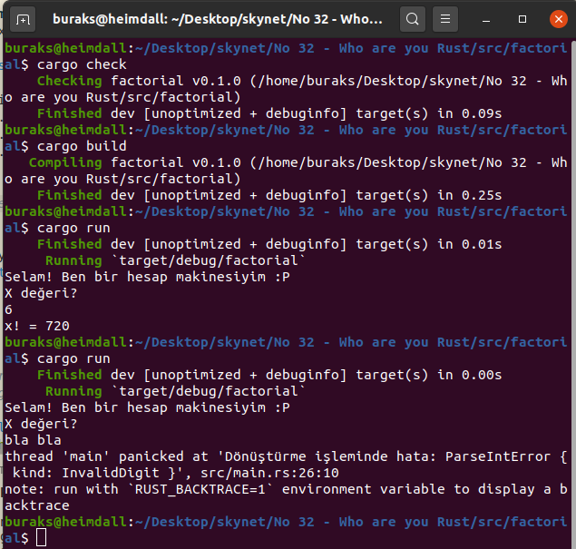

# Stackoverflow Anketlerinin Yıllardır Bir Numara Çıkan Programlama Dili Rust Kimdir?

Stackoverflow'un [2020 yılı geliştirici anketine göre](https://insights.stackoverflow.com/survey/2020#technology-most-loved-dreaded-and-wanted-languages-loved) en sevilen programlama dilinin Rust olduğunu söyleyebiliriz. Hatta bu son yıllarda hep böyle. Nedir onu bu kadar özel yapan merak ediyorum. Bunu anlamanın tek yolu onunla bir şeyler karalamak. Resmi dokümantasyonuna göre ilk tespitlerim şunlar.

- İlk söylenmesi gereken şey Rust'ın amacının sistem seviyesinde programlama yapmak olduğu. C ve C++ gibi bir dil olduğunu düşünebiliriz.
- Şu sıralar çok popüler olmaya başlayan Deno'nun Rust ile yazıldığını söylesem...Ya da Microsoft Azure IoT Edge'in çok büyük bir kısmının onunla yazıldığını ifade etsem. İşletim sistemleri _(TockOS, Tifflin, RustOS, QuiltOS, Redox)_, oyun motorları, derleyiciler, container'lar, VM'ler, Linux dosya sistemleri vs, ls komutunun alternatifi olan exa vs... Yani Rust ile yazılım ve yazılım platformları geliştirildiğini ifade edebiliriz. Bu nedenle Rust donanım odaklı bir dil desek yeridir. Donanımı etkin kullanmaya çalışır.
- Rust ortamında Garbage Collector gibi bir mekanizma yoktur. Amaç çalışma zamanı performansının artırılmasıdır. Dilin hedeflerinden birisi de hızdır zaten.
- Diğer iki önemli hedefi de eş zamanlılık _(Concurrency)_ ve güvenli bellek kullanımıdır.
- Rust derlemeli bir dildir. Hatta derleme çıktısı WebAssembly'da olabilir.
- Pek çok diğer modern dilde olduğu gibi Rust'ın da etkili bir paket yönetim mekanizması vardır. İsmi de gayet makul ve mantıklı. _Cargo_
- Dilin arkasında Mozilla Labs'ın gücü var. Hatta [servo isimli yüksek performans vaat eden tarayıcı motoru](https://servo.org/) da Rust ile geliştirilmiş.
- Dilin diğer karekteristik özelliklerini elbette kod üstünde anlamaya çalışacağım.

## Kurulum

Önce Rust ortamını hazırlamak lazım. Ben Heimdall _(Ubuntu 20.04)_ üstünde ilerliyorum. Geliştirmeler için Visual Studio Code'dan yararlanacağım.

```bash
curl https://sh.rustup.rs -sSf | sh

# Dilin genel özelliklerini tanımak için bir dosya üstünde çalışalım
touch WhoAreYouRust.rs
```

## Çalışma Zamanı

```bash
# Rust kodlarını derlemek için 
rustc WhoAreYouRust.rs

# Çalıştırmak içinse
./WhoAreYouRust
```



## Bomba Sorular

## Ödevler