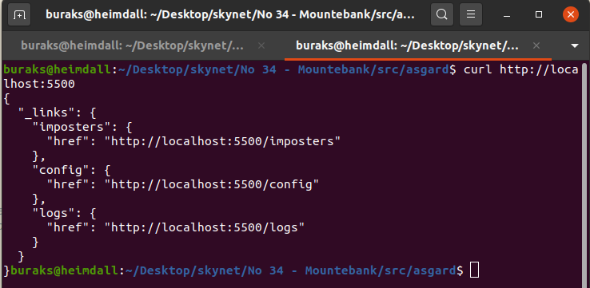

# Mountebank ile Mock Servis Desteği Sunmak

Mountebank, ne zamandır merak ettiğim ve denemek istediğim araçlardan birisiydi. Test senaryolarında kullanmak isteyeceğimiz mock servislerini kolayca inşa edebilmemize olanak sağlayan bir araç olarak tanımlayabilirim _(Şimdilik)_ Örneğin test kodumuz arka tarafta belki bir veritabanına bağlanan belki başka bir servis zincirini çağıran ya da farklı bağımlıkları olan bir servisi kullanmak zorunda olabilir. Normal şartlarda bu servisin ayakta olması zorunludur ki testimiz yürüsün. Ancak o anki test vakasının ilerleyen adımlarının işletilmesi için illaki bu servisin gerçekten de vereceği çıktıya ihtiyacımızı yoktur. Test vakası adımlarının devamı için o servisin vereceği çıktının verilmiş gibi yapılarak ilerlenilmesi tercih edilen yöntemlerdendir. Hem aynı veri setini kullanarak çalışan bir testin, veri değişikliklerinden etkilenmemesi de istenir. Böyle durumlarda asıl servimiş gibi hareket eden _(Sahtekar/Taklitçi gibi isimlendirebiliriz bunları)_ ama testin ihtiyacı olup asıl vakayı bozmayacak şekilde kullanılabilen servisleri test senaryosu içerisine monte edebiliriz. Yani bir mock servis ile teste devam edelim diyebiliriz. İşte Mountebank, mock servislerin host edilmesi noktasında oldukça kullanışlı bir araç olarak karşımıza çıkıyor. CI/CD hatlarına da entegre edilebildiği ifade ediliyor _(ki henüz gözümle görme şansım olmadı)_ İşte bu çalışmamın amacı Heimdall üstünde onu deneyimlemek ve nasıl çalıştığını, ne gibi bir çözüm sunduğunu anlayabilmek.

## Ön Hazırlıklar

Aşağıdaki adımları izleyerek devam edebiliriz.

```bash
mkdir asgard
cd asgard
npm init --yes
# Mountebank paketini npm aracı ile yüklüyoruz
npm i --save mountebank

mkdir src
cd src
# port bilgilerini tutacağımız bir konfigurasyon dosyası ile 
# Bir Mountebank örneğini ayağa kaldırmaktan sorumlu index dosyasını oluşturuyoruz
# Bunlar src dizini altında konuşlanabilirler
touch ports.js index.js

```

## Çalışma Zamanı

Uygulamanın çalışma zamanı için aşağıdaki adımları takip edebiliriz.

```bash
# Mountebank server'ını ayağa kaldırmak için asgard klasörü altında aşağıdaki komutu vermek yeterli
# bunun işletilmesi için package.json'a start komutunu ekledik.
# Normal o src klasörü altındaki index.js dosyasını çalıştırıyor
# Aşağıdaki komut sonrası sunucunun ayakta olup olmadığının sağlaması için
# http://localhost:5500 adresine gidebiliriz(Bir JSON içeriği görmemiz lazım)
npm start
```

_Mountebank server'ı npm start ile ayağa kaldırdığımızda 5500 portundan gelecek olan json içeriği_



## Bomba Sorular

## Ödevler