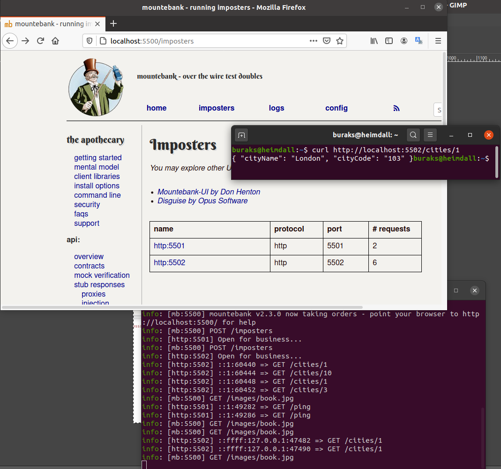
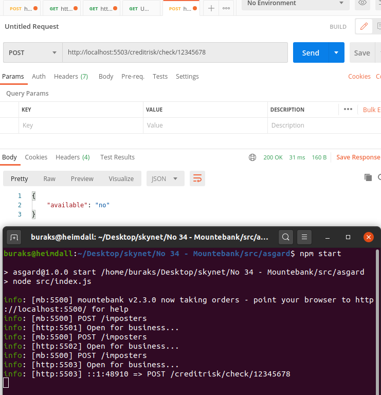
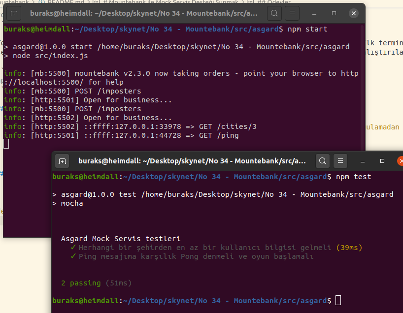
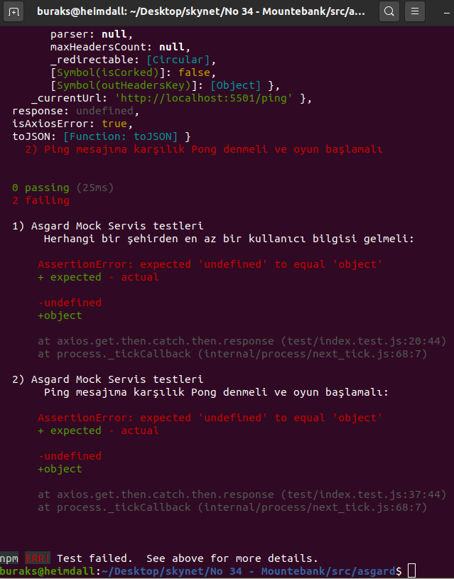

# Mountebank ile Mock Servis Desteği Sunmak

Mountebank, ne zamandır merak ettiğim ve denemek istediğim araçlardan birisiydi. Test senaryolarında kullanmak isteyeceğimiz mock servislerini kolayca inşa edebilmemize olanak sağlayan bir araç olarak tanımlayabilirim _(Şimdilik)_ Örneğin test kodumuz arka tarafta belki bir veritabanına bağlanan belki başka bir servis zincirini çağıran ya da farklı bağımlıkları olan bir servisi kullanmak zorunda olabilir. Normal şartlarda bu servisin ayakta olması zorunludur ki testimiz yürüsün. Ancak o anki test vakasının ilerleyen adımlarının işletilmesi için illaki bu servisin gerçekten de vereceği çıktıya ihtiyacımızı yoktur. Test vakası adımlarının devamı için o servisin vereceği çıktının sanki verilmiş gibi yapılarak ilerlenilmesi tercih edilen yöntemlerdendir. 

Üstelik kullandığı servisin hep aynı veri setini kullanarak çalışan bir testin, veri değişikliklerinden etkilenmemesi de istenebilir. Böyle durumlarda asıl servimiş gibi hareket eden _(Sahtekar/Taklitçi gibi isimlendirebiliriz bunları)_ ama testin ihtiyacı olup asıl vakayı bozmayacak şekilde kullanılabilen servisleri test senaryosu içerisine monte edebiliriz. Yani bir mock servis ile teste devam edelim diyebiliriz. 

İşte Mountebank, mock servislerin host edilmesi noktasında oldukça kullanışlı bir araç olarak karşımıza çıkıyor. Mountebank kendisi ile iletişim için bir REST API sunuyor. Bu API'yi kullanarak Mountebank'a mock servisler eklenebiliyor. Yani bir mock servis ihtiyacımız varsa bunu Mountebank'a yüklemek için HTTP Post çağrısı ile bir şeyler göndermemiz _(Stub'lardan oluşan Imposter aktörleri)_ gerekiyor. Mountebank'ın CI/CD hatlarına da entegre edilebildiği ifade ediliyor _(ki henüz gözümle görme şansım olmadı)_ İşte bu çalışmamın amacı Heimdall üstünde onu deneyimlemek ve nasıl çalıştığını, ne gibi bir çözüm sunduğunu anlayabilmek.

## Senaryo

Mountebank sunucu uygulamasını ayağa kaldırırken kendisine otomatik olarak en az iki mock servisi kayıt edeceğiz. Bu servisleri imposter olarak görebilmeli ve curl, postman veya herhangibir tarayıcıdan tüketebilmeliyiz. Ayrıca Mountebank sunucusu ayakta iken yine Postman gibi bir aracı kullanıp yeni bir mock servis bildirimini gönderebilmeliyiz. Mountebank uygulaması ve ilgili servisler ayakta iken elbette bir birim test üzerinden bu servislerin tüketimini de ele alsak iyi olabilir.

## Ön Hazırlıklar

Aşağıdaki adımları izleyerek devam edebiliriz.

```bash
mkdir asgard
cd asgard
npm init --yes
# Mountebank paketini npm aracı ile yüklüyoruz
# Birde yazacağımız mock servisleri Mountebank sunucusuna bildirmek için
# node-fetch paketinden yararlanacağız. Dolayısıyla onu da ekliyoruz.
npm i --save mountebank node-fetch

mkdir src
cd src
# port bilgilerini tutacağımız bir konfigurasyon dosyası ile 
# Bir Mountebank sunucusunu ayağa kaldırmaktan sorumlu index dosyasını oluşturuyoruz
# Bunlar src dizini altında konuşlanabilirler
touch ports.js index.js

# ve ilk Mock Service'imiz için aşağıdaki dosyayı kullanabiliriz
# yine src altında olabilir
touch ping-service.js

# İkinci servisimizde herhangi bir şehir bilgisini getirmek için kullanacağımız bir mock servis
# Şehir bilgileri normalde bir veritabanında tutuluyor ve primary key değerine göre çekiliyor.
# Ancak test senaryomuzda zaten belli şehirleri alıp ilerlememiz mümkün. Yine de bunu bir servis üstünde
# yapmamız lazım. İşte mock servis bu noktada devreye giriyor (şehir bilgilerini cities.csv dosyasında tutuyoruz)
touch city-service.js
```

## Çalışma Zamanı

Uygulamanın çalışma zamanı için aşağıdaki adımları takip edebiliriz.

```bash
# Mountebank server'ını ayağa kaldırmak için asgard klasörü altında aşağıdaki komutu vermek yeterli
# bunun işletilmesi için package.json'a start komutunu ekledik.
# Normal o src klasörü altındaki index.js dosyasını çalıştırıyor
# Aşağıdaki komut sonrası sunucunun ayakta olup olmadığının sağlaması için
# http://localhost:5500 adresine gidebiliriz(Bir JSON içeriği görmemiz lazım)
# Hatta gelen json'da belirtilen adreslere giderek yüklenen imposter'ları, servis hareketlerine ait log içeriklerini ve konfigurasyonu görebiliriz.
npm start
```

_Mountebank server'ı npm start ile ayağa kaldırdığımızda 5500 portundan gelecek olan json içeriği_


Mock Servis örneklerini ekledikçe, imposter sözleşmelerinde belirtilen route tanımlarına giderek kayıt edilen servislerin çalışıp çalışmadığı kontrol edilmelidir. Örneğin ping-service'i Mountebank'a ekledikten sonra <http://localhost:5501/ping> adresine talete bulunup, stub'ın response kısmında belirtiğimiz pong cevabını almamız gerekir.


Ayrıca birden fazla servisi Mountebank'a ekledikten sonra _(ister kod yoluyla ister Postman gibi araçlarla Post ederek olsun)_ <http://localhost:5500/imposters> gibi adresten bunları izleyebilir, gelen talep sayılarına bakabiliriz. Ben ikinci servisi de ekledikten sonra aşağıdaki ekran görüntüsünde olduğu gibi durumu gözlemleyebildim.



Mountebank uygulaması ayakta iken Postman veya muadili bir araçla aşağıdaki çıktıyı gönderdiğimizde söz konusu servisin imposter olarak eklendiğini de görürüz. Yani ille de uygulama içerisinde kodla servis yüklememiz şart değildir. Mountebank REST Api şeklinde bir arabirim sunduğunda ekleme, silme vb işlemleri doğru içerikten oluşan talepler ile sağlayabiliriz. Tabii mountebank sunucusu kapandığında bu mock servislerde ömürlerini tamamlayacaktır.

```text
Kullandığım adres : http://localhost:5500/imposters
Http metodu : POST
Body tipi : raw/json
Body içeriği :

{
    "port": 5503,
    "protocol": "http",
    "stubs": [
        {
            "predicates": [
                {
                    "equals": {
                        "method": "POST",
                        "path": "/creditrisk/check/12345678"
                    }
                }
            ],
            "responses": [
                {
                    "is": {
                        "statusCode": 200,
                        "headers": {
                            "Content-Type": "application/json"
                        },
                        "body": {"available":"no"}
                    }
                }
            ]
        }
    ]
}

```



## Testler

Mock servisleri yazdım. İyi güzel de bunları Nodejs tarafındaki testlerde nasıl kullanacağım peki. İşin içerisine Mocha ve Chai paketlerini katsam güzel olabilir. Hatta Mock servis çağrılarını gerçekleştirmek için axios ideal. asgard ile paralel yeni bir proje açıp devam edeyim.

```bash
# Asgard klasöründe önce gerekli test ve servis haberleşme paketlerimizi yükleyelim
# Mocha : Belki en popüler test framework'lerinden birisi
# Chai : Behavioral Driven Design'ın TDD üstünde başarılı bir uyarlaması
# Axios : Mountebank servis çağrıları için kullanacağımız modül
npm i --save axios mocha chai

# Sonra yine asgard klasörü içerisindeyken test isimli bir klasör açalım.
# ve içerisine test dosyamızı koyalım
# Ayrıca asgard'a ait package.json içerisinde de gerekli test komutunu vermemiz gerekiyor
mkdir test
touch ./test/index.test.js
```

Test kodlarını tamamladıktan sonra yine iki terminal üzerinden örnekleri denemek lazım. İlk terminalde Mountebank sunucusunu ayağa kaldırıp mock servisleri devreye sokmamız gerekiyor. İkinci terminal ise yine asgard klasörü altında çalıştırılacak aşağıdaki komutu işletmeli.

```bash
npm test
```

_Yazılan iki testin de başarılı olma haline ait bir görüntü_



_Mountebank servisleri ayakta değilkenki durum_



## Bomba Sorular

- Mountebank uygulamasına bir mock servis sözleşmesini _(imposter)_ NodeJs harici bir uygulamadan da _(Örneğin bir .Net Core)_ yollayabilir miyiz?
- Bir imposter dosyasına birden fazla stub yüklenebilir mi?
- Peki bir stub içerisinde n sayıda prediction ve response çifti tanımlanabilir mi?
- Eklenen bir imposter'ı nasıl silebiliriz?

## Ödevler

- Eğer yukarıdaki bomba soruya cevabınız evetse, boşuna evet demiş olmayın. Bir örneğini yapın ;)
- Olmayan bir şehir id'si için HTTP 404 Not Found durumunu verecek örnek bir Mock Service'i Postman yardımıyla Mountebank sunucusuna kayıt ettirmeyi deneyiniz.
- Test vakalarını içerisinde mock servisi gerçekten de kullanan fonksiyon çağrıları haline getirmeye çalışın.