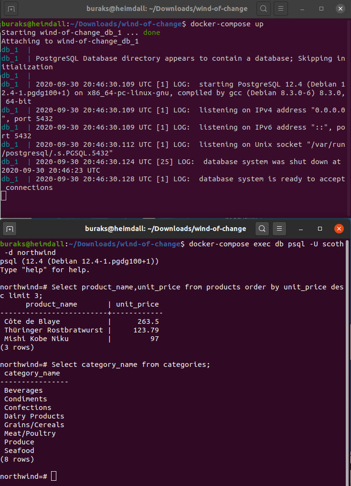
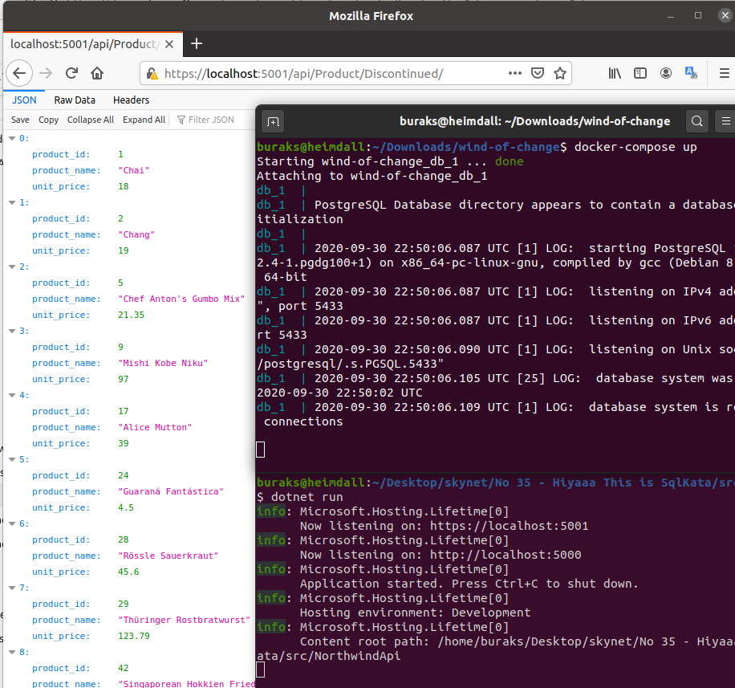
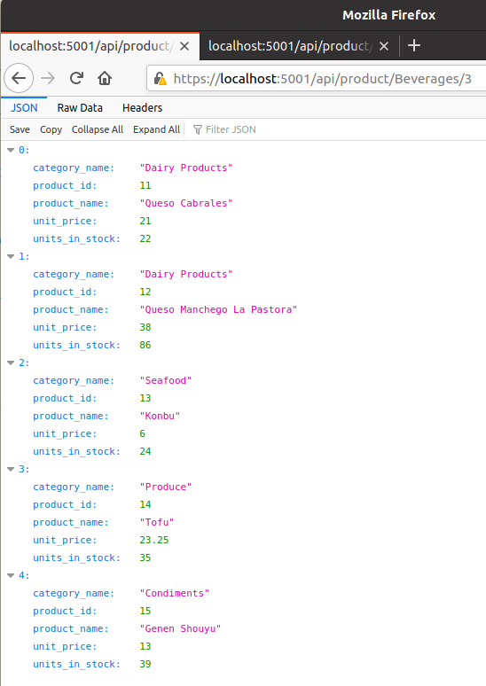
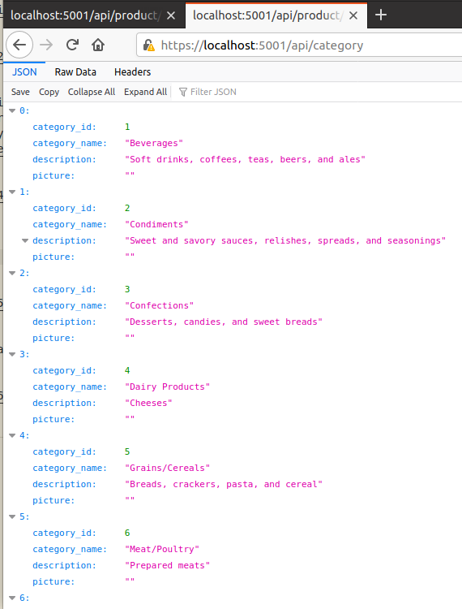
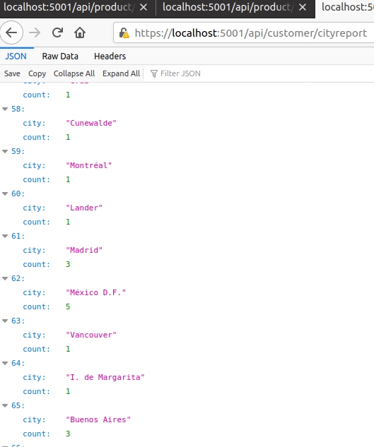
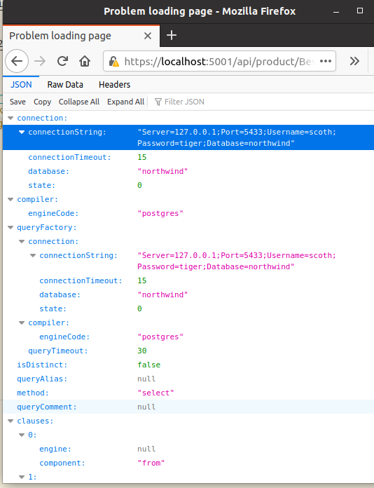

# .Net Core Web Api Tarafında SqlKata ile Sevimli SQL İşlemleri

[SqlKata](https://sqlkata.com/), bir süredir sağda solda okuduğum makale ve github çalışmalarından dolayı merak edip kurcalamak istediğim bir kütüphaneydi. Öncelikle ismi çok hoş _(Code Kata'yı çağrıştırıyor bana)_ C# ile geliştirimiş paketin temel amacı SqlServer, PostgreSql, Firebird, MySql gibi veritabanları için kod tarafında ortak bir sorgu oluşturma/derleme arabirimi sunmak ama bunu LINQ sorgu metotları üzerinden SQL dilinin anlaşılır rahatlığında, injection yemeden _(Parameter Binding tekniğini kullandığ için)_ , cache gibi performans artırıcıları kullanarak sağlayabilmek. Tabii konuşmayı bir kenara bırakıp kod yazarak onu tanımaya çalışmak en doğrusu.

## Ön Hazırlıklar

Ben örnek olarak SqlKata paketini bir PostgreSql veritabanı üzerinden kullanmayı tercih ettim. Daha önceden de sıklıkla yaptığım gibi bir Docker imajı kullanacağım. Ancak elimde hazır bir veritabanı olsa güzel olabilirdi. Microsoft'un Adventure Works ve Northwind gibi eğitimlerde kullanılan çok güzel veritabanları var. Postgresql için hazırlanmış olan hatta Docker container olarak çalıştırılabilecek bir versiyonunu da [şu github adresinden](https://github.com/pthom/northwind_psql) buldum _(wind-of-change klasöründe docker-compose ve sql script dosyasını bulabilirsiniz)_

```bash
# container'ı ayağa kaldırmak için wind-of-change klasöründe aşağıdaki terminal komutunu kullanabiliriz
docker-compose up

# ikinci bir terminalden veya pgAdmin gibi bir araçla Northwind içeriğine bakabiliriz
# Ben scoth kullanıcı adını tanımlamıştım.
docker-compose exec db psql -U scoth -d northwind

# Yukarıdaki komut sonrası açılan psql cli'de birkaç SQL ifadesi deneyebiliriz
# Örneğin En pahalı 3 ürünü listeleylim
Select product_name,unit_price from products order by unit_price desc limit 3;
# veya kategorilerin adlarını
Select category_name from categories;
```



Aslında psql arabirimini veya pgAdmin benzeri bir aracı kullanmayacağız. Zaten amacım SqlKata ile bu Postgresql'e veritabanına bağlanıp bir takım işlemler yapabilmek. Denemeleri bir .net Core Web Api projesinde yapayım diyorum.

```bash
# Önce src klasöründe bir api projesi açayım
dotnet new webapi -o northwind-api

# Gerekli paketleri yükleyelim
# Postgresql için npsql ve SqlKata için SqlKata :)
dotnet add package Npgsql
dotnet add package SqlKata
dotnet add package SqlKata.Execution
```

## Çalışma Zamanı

Web api hizmetinin çalışmaya başlamasından önce tahmin edileceği üzere docker-compose ile Postgresql imajının ayakta olması gerekmektedir. Sonrasında aşağıdaki terminal komutu ile ilerleyebiliriz.

```bash
dotnet run watch
```

Gelelim deneme sonuçlarına...

```text
Yazdığım ilk sorgu discontinued değeri 1 olanları döndüren bir action idi

https://localhost:5001/api/product/discontinued
```



```text
Bir kategoriye ait ürünlerin birkaç bilgisini getiren ama bunu yaparken sayfalama tekniğini kullandığımız çalışma.
Dikkat edileceği üzere 3ncü sayfadan itibaren ilk 5 kayıt getirilmiştir. 
Verinin çok olduğu Web API kurgularında sayfalama oldukça önemlidir.
https://localhost:5001/api/product/Beverages/3
```



```text
En basit operasyonlardan birisi de elbette kategorilerin getirilmesi
https://localhost:5001/api/product/categories/
```



```text
Müşterilerin bulundukları şehre göre gruplanması.
```



## Bomba Sorular

- localhost:5001/api/product/Beverages talebini göz önüne alalım. Beverages kategorisindeki ürünlerin listesini almayı bekliyoruz. Ancak kod tarafında yapacağımız minik bir değişiklik yüzünden aşağıdaki gibi connection string bilgisini görme ihtimalimiz var. Öncelikle bu nasıl oluşmuş olabilir, ikinci olarak bunun önüne nasıl geçilebilir.



## Ödevler

- Yazılan uygulamayı OData servise dönüştürmeye çalışın.
- Postgresql yerine MySql sürücüsünü kullanmayı deneyin.