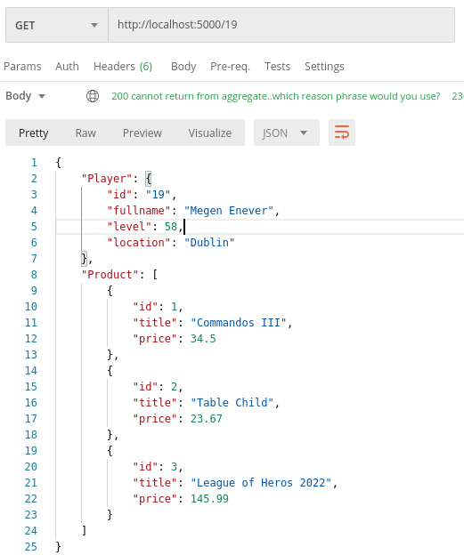
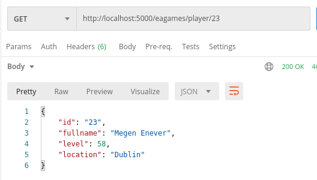
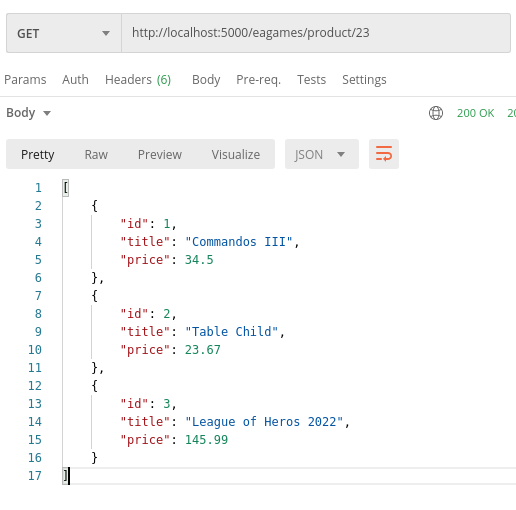
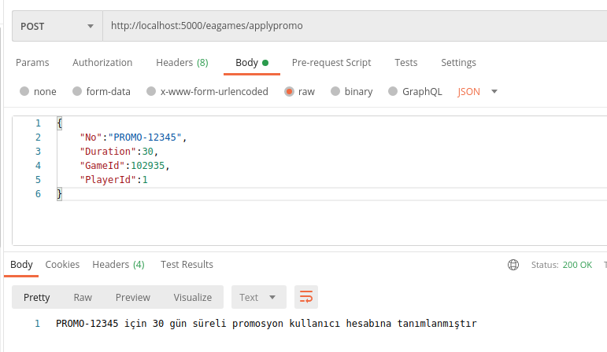

# Ocelot - Bir API Gateway Denemesi

Uzun süre önce bankada çalışırken nereye baksam servis görüyordum. Bir süre sonra ana bankacılık uygulaması dahil pek çok ürünün kullandığı sayısız servisin yönetimi zorlaşmaya başladı. Bir takım ortak işlerin daha kolay ve etkili yönetilmesi gerekiyordu. Müşterek bir kullanıcı doğrulama ve yetkilendirme kontrolü _(authentication & authorization)_, yük dengesi dağıtımı _(load balancing)_, birkaç servis talebinin birleştirilmesi ve hatta birkaç servis verisinin birleştirilerek döndürülmesi _(aggregation)_, servis verisinin örneğin XML'den JSON gibi farklı formata evrilmesi, servis geliş gidişlerinin loglanması, yönlendirmeler yapılması _(routing)_, performans için önbellekleme yapılması _(caching)_, servis hareketliliklerini izlenmesi _(tracing)_, servislerin kolayca keşfedilmesi _(discovery)_ , çağrı sayılarına sınırlandırma getirilmesi, bir takım güvenlik politikalarını entegre edilmesi, özelleştirilmiş delegeler yazılması _(custom handler/middleware)_ , tüm uygulamalar için ortak bir servis geçiş kanalının konuşlandırılması ve benzerleri. Sonunda Java tabanlı WSO2 isimli bir API Gateway kullanılmasına karar verildi. Geçtiğimiz günlerde de yine konuşma sırasında [Ocelot](https://github.com/ThreeMammals/Ocelot) isimli C# ile yazılmış açık kaynak bir ürünün adı geçti ve tabii ki bende bir merak uyandı. Kanımca hafif siklet mikroservis veya servis odaklı mimari çözümlerinde düşünülebilir. Ama önce denemem lazım.

>Ocelot'un oldukça doyurucu bir [dokümantasyonu](https://ocelot.readthedocs.io/en/latest/index.html) olduğunu da belirteyim.

## Senaryo

Örnekte şöyle bir senaryoyu icra etmeye çalışacağım. Oyuncu detaylarını getiren, ona öneri oyunları ürün olarak sunan, kazandığı bir promosyonu sistem kaydetmesini sağlayan üç kobay servis tasarlayacağım. İstemci uygulama _(Console şeklinde düşünmüştüm ama Postman bile yeterli olur)_ bu birkaç servis çağrısı için API Gateway'e gelecek. Yani istemciler bu servisler için aslında tek bir noktaya gelip API Gateway üzerinden konuşacaklar. İlk etapta ocelot paketini kullanan gateway uygulaması basit bir router olacak gibi duruyor. Hatta iki servis çıktısını birleştirerek döndüren bir aggregation fonksiyonelliği de katılabilir. Sonrasında daha fazla neler yapılabileceğine bir bakmam lazım.

## Ön Hazırlıklar

Hayali olarak birkaç servise ihtiyacım var. Tamamını .net core web api olarak tasarlamak işime geliyor. Ancak gerçek hayat senaryosunda farklı programlama dilleri ve çatıları ile geliştirilmiş servisler kullanmak daha mantıklı olacaktır.

```bash
mkdir services
cd services
# İlk olarak kobay servislerimizi ekleyelim
# Fonksiyon başına bir servis gibi oldu ama
# amacımız bilindiği üzere Ocelot'un kurgusunu anlamak

# Oyuncu bilgilerini getireceğimiz bir servis
dotnet new webapi -o GamerService

# Oyuncuya önerilecek promosyonların çekileceği bir servis
dotnet new webapi -o PromotionService

# Oyuncunun daha önce satın almış olduğu ürünleri getirecek bir servis
dotnet new webapi -o ProductService

# ve Ocelot Servis Uygulamasının oluşturulup gerekli Nuget paketinin eklenmesi
cd ..
dotnet new web -o Bosphorus
dotnet add package ocelot
# Bu uygulamada kritik olan nokta ocelot konfigurasyonunun durduğu json dosya içerikleri
cd Bosphorus
touch ocelot.json
```

## Çalışma Zamanı

Öncelikle kobay servislerin ayağa kaldırılması lazım. GamerService, ProductService ve PromotionService isimli servisleri kendi klasörlerinde _dotnet run_ ile çalıştırabiliriz. Kobay servisler aşağıdaki adresten ayağa kalkacaktır.

GamerService -> http://localhost:6501
ProductService -> http://localhost:7501
PromotoionService -> http://localhost:8501

Sonrasında Bosphorus isimli Ocelot'u kullanan uygulamayı ayağa kaldırıp localhost:5000/19 şeklinde bir talep gönderebiliriz. İlk örnek Aggregation'ı taklit etmekte ve promosyon ekleme için yönlendirme yapmaktadır. GamerService ve ProductService'e ortak çağrı yapıp, arka planda çağırılan servis çıktılarını tek bir JSON paketinde birleştirip geriye döndürür ;)

```json
{
    "Routes": [
        {
            "UpstreamPathTemplate": "/eagames/player/{id}",
            "UpstreamHttpMethod": [
                "Get"
            ],
            "DownstreamPathTemplate": "/player/{id}",
            "DownstreamScheme": "http",
            "DownstreamHostAndPorts": [
                {
                    "Host": "localhost",
                    "Port": 6501
                }
            ],
            "Key": "Player"
        },
        {
            "UpstreamPathTemplate": "/eagames/product/{id}",
            "UpstreamHttpMethod": [
                "Get"
            ],
            "DownstreamPathTemplate": "/api/product/suggestions/{id}",            
            "DownstreamScheme": "http",
            "DownstreamHostAndPorts": [
                {
                    "Host": "localhost",
                    "Port": 7501
                }
            ],
            "Key": "Product"
        },
        {
            "UpstreamPathTemplate": "/eagames/applypromo",
            "UpstreamHttpMethod": [
                "Post"
            ],
            "DownstreamPathTemplate": "/applier",            
            "DownstreamScheme": "http",
            "DownstreamHostAndPorts": [
                {
                    "Host": "localhost",
                    "Port": 8501
                }
            ]
        }
    ],
    "Aggregates": [
        {
            "RouteKeys": [
                "Player",
                "Product"
            ],
            "UpstreamPathTemplate": "/{id}"
        }
    ]
}
```

Bunu test etmek için localhost:5000/19 adresine Postman ile çağrı atabiliriz.



İlk örnekteki UpstreamPathTemplate tanımlarına göre http://localhost:5000/eagames/player/23 adresine yapılan çağrı http://localhost:6501/player/23 adresine yönlendirilecektir.



Benzer şekilde http://localhost:5000/eagames/product/23 şeklinde yapılacak çağrıda http://localhost:7501/api/product/suggestions/23 adresine yönlendirilir.



PromotionService içerisinde de bir POST metodumuz vardı. Ocelot.JSON için yaptığımız tanıma göre http://localhost:5000/eagames/applypromo adresine gelen talebi, http://localhost:8501/applier adresine yönlendirmiş olacağız. İşte örnek POST içeriği ve sonuç...

```json
{
    "No":"PROMO-12345",
    "Duration":30,
    "GameId":102935,
    "PlayerId":1
}
```




_Load Balancer Örneği Eklenecek_

## Bomba Sorular

- Gateway arkasında XML içerik döndüren bir servis metodu olduğunu düşünelim. Gateway'e bu servis için gelen çağrı karşılığında XML yerine JSON döndürmemiz mümkün olur mu? Bunu Ocelot üzerinde tanımlayabilir miyiz?

## Ödev

- En az iki servisi daha farklı programlama dilleri ile senaryoya dahil ediniz _(NodeJs, Java, Rust, GO olabilir mesela)_