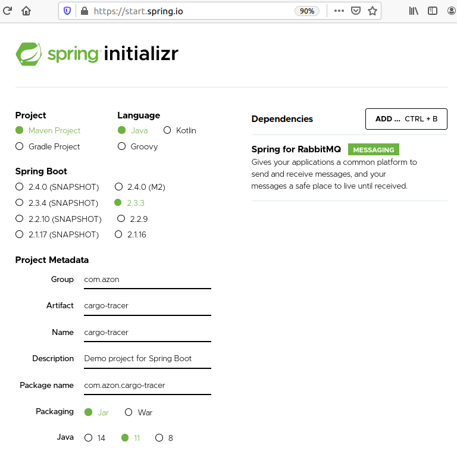
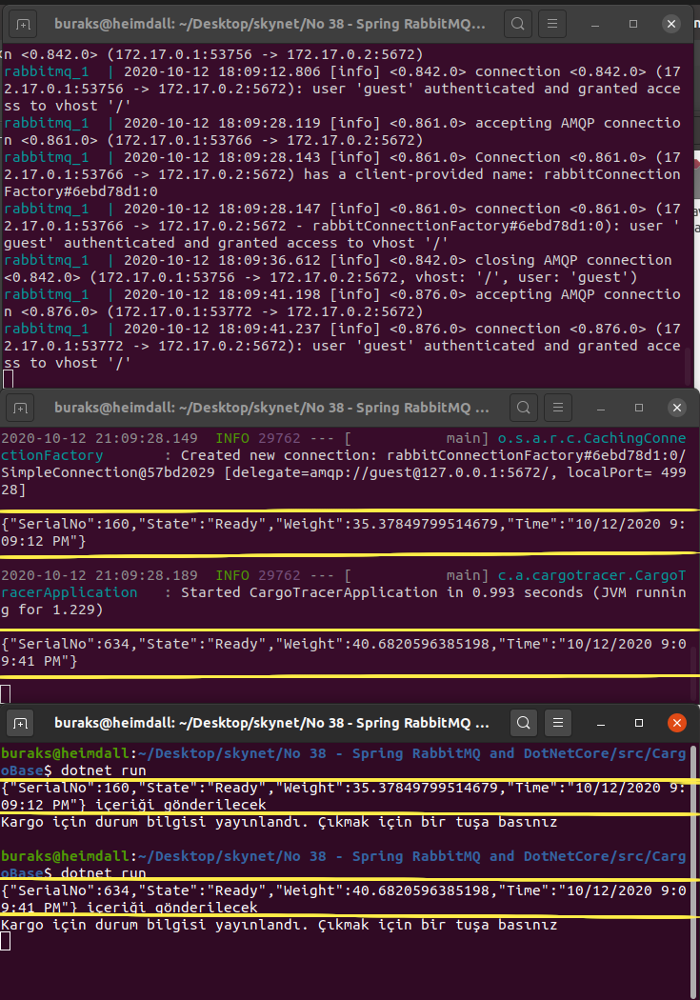

# .Net Core Tarafından RabbitMQ'ya Mesaj Göndermek ve Java Tarafından Dinlemek

Çok sık karşılaştığımız senaryolardan birisidir. Bir uygulama kendi bünyesinde gerçekleşen bir olay sonrası başka bir uygulamayı haberdar etmek ister ya da başka bir uygulamanın yaptıklarından haberdar olmak isteyen bir uygulama vardır. Bunun bir çok sebebi olabilir. Örneğin uygulamalar farklı teknolojilerde yazılmıştır ancak ortak iş süreçleri üzerinde koşmaktadır. Gerçek bir senaryo koyalım ortaya. Kargo çıkışı gerçekleştiren yeni nesil bir uygulama bu çıkışlar için düzenlediği irsaliyelerin bir devlet kurumuna gönderilmesi sırasında yine aynı kurumun legacy başka bir sisteminin süreçlerine dahil olmak durumundadır. Karşılıklı olarak asenkron bir iletişim gereklidir. Burada asenkron bir haberleşme olması kaçınılmazdır ve söz konusu olaylardan çok çok fazla sayıda işlem olabilir. Yani asenkron bir kuyruk sistemi epeyce iş görecektir.

Örnek çalışmadaki amacım RabbitMQ'yu Heimdall üstünde olabilecek en basit haliyle çalıştırmak, bir .Net Core Console uygulamasından belli bir topik için bu kuyruğa mesaj yollamak ve oldukça yabancısı olduğum Spring tarafındaki bir Java uygulamasından da gönderilen mesajları almak.

## Ön Hazırlıklar

Heimdall _(Ubuntu 20.04)_ yüklü bir RabbitMQ hizmeti yok. Aslında kurmayı da istemiyorum. Docker veya Docker-Compose kullanmak işime gelir.

```bash
# Bu nedenle bir docker-compose.yml oluşturup çalıştırsam yeterli olur
# İçine bakın tabii :)
touch docker-compose.yml
# Çalıştırmak için
docker-compose up

# SENDER
# RabbitMQ'ya mesaj gönderecek uygulamamız bir .Net Core uygulaması olacak
dotnet new console --name CargoBase
# Gerekli Nuget paketleri de aşağıdaki gibi ekleyebiliriz
# Birisi RabbitMQ ile konuşmak için
dotnet add package RabbitMQ.Client
# Diğer Console uygulamasında nesneyi JSON serileştirmekte yardımcı olsun diye
dotnet add package Newtonsoft.Json
```

Alıcı tarafı Spring ile oluşturacağız. Bu nedenle [Spring Initializr](https://start.spring.io/) adresine gidip gerekli proje bilgilerini doldurup oluşan uygulamayı kullanarak ilerleyeceğiz. Ben ilgili bilgileri aşağıdaki gibi doldurdum. Tabii burada kritik nokta Spring for RabbitMQ kütüphanesinin de bağımlı bileşen olarak belirtilmesi.



```bash
# RabbitMQ mesajlarını dinleyecek java servisini
# src/main/java/com/azon/cargotracer altında oluşturabiliriz
touch EventListener.java
```

## Çalışma Zamanı

Çalıştıracağımız üç uygulama var. Öncelikle docker-compose ile RabbitMQ tarafını ayağa kaldırmalıyız. Ardından mesaj gönderecek olan dotnet core uygulamasını kullanabiliriz. Java uygulaması çalıştırıldıktan sonra ilgili RabbitMQ kuyruğunu dinleme konumunda olacaktır. Onu dotnet core uygulamasından öncede çalıştırabiliriz. Mesaj yakaladıkça ekrana basacaktır.

```bash
# Rabbit tarafı için
docker-compose up

# Console uygulaması için (Mesaj gönderen taraf)
dotnet run

# Maven ile Java tarafını başlatmak için
./mvnw spring-boot:run
```

Dikkat edileceği üzere Console uygulamasında iki kere gönderdiğimiz JSON mesaj içerikleri, Java uygulamasına ait terminal ekranına da düşmüştür.



## Bomba Sorular

- Varsayılan halde java uygulaması localhost sunucusuna ve standart Rabbit portuna gideceğini nereden biliyor?

## Ödevler

- Java uygulamasını birden fazla kuyruğu dinleyecek şekilde organiza etmeye çalışın.
- Uygulamada kullandığımız kuyruğa başka platformda yazılmış bir programdan da mesaj gönderip dinleyici Java tarafında kimden geldiğini anlamaya çalışacak bir geliştirme yapın.