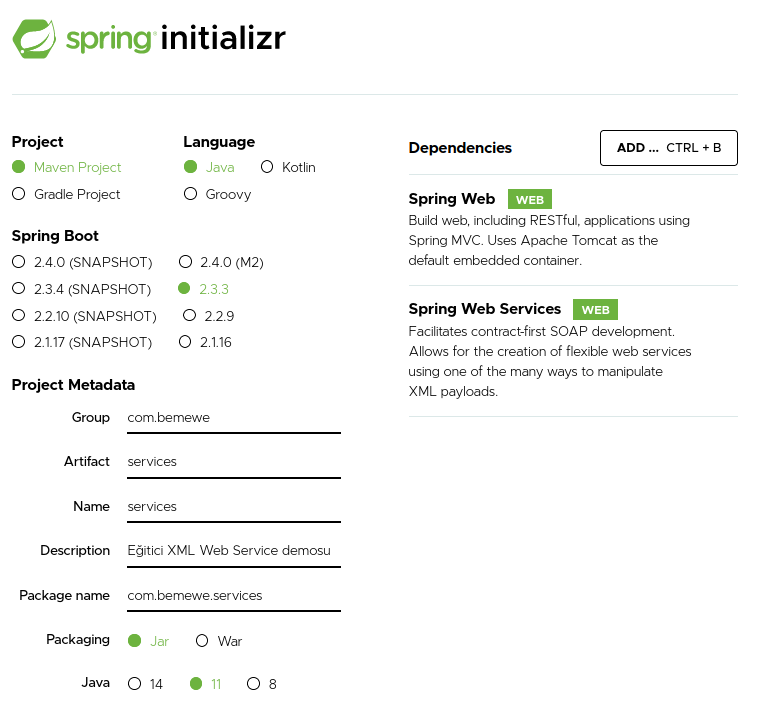
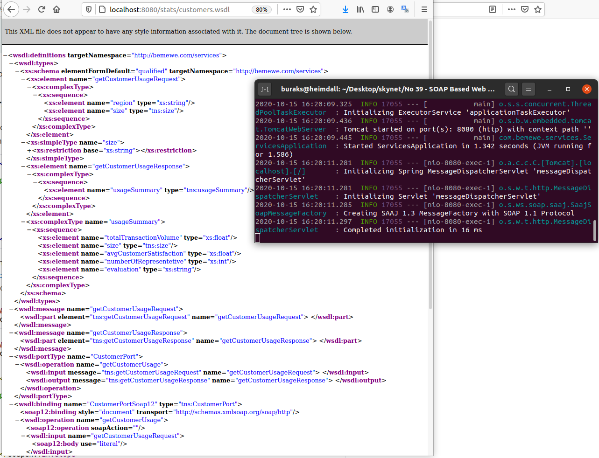
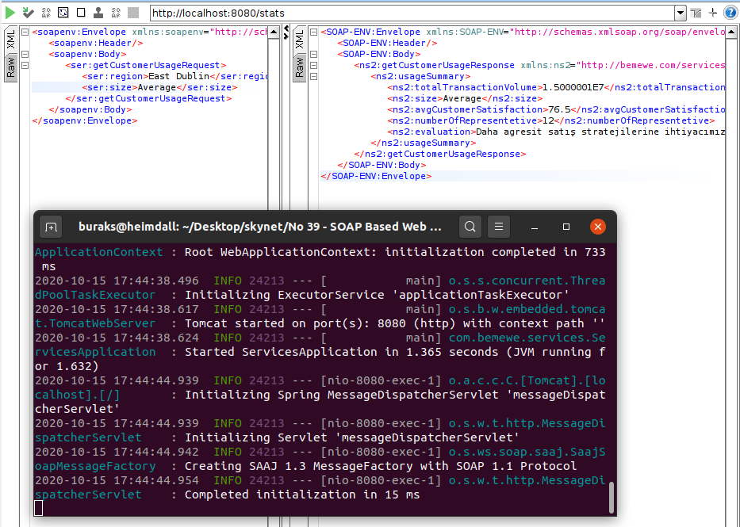

# Spring Tarafında Eski Usül Soap Based XML Web Service Yazmak Ne Kadar Zor Olabilir?

Kısa bir süre önce değerli bir çalışma arkadaşım kullanmaya çalıştığı Java tabanlı XML Web servis ile epeyce sorun yaşadı. Söz konusu servisi .Net tarafından tüketmeye çalışıyordu ancak XML şeması da epeyce karmaşık olan servis iletişim noktasında şema adlarına kızıyor, header içeriğini beğenmiyor sürekli naz yapıyordu. Arkadaşım allem etti kallem etti sorunun altından girip üstünden çıkıp çözdü. Bu olaylara kısmen tanıklık ettikten sonra yahu Java tarafında XML Web Service geliştirmek şimdilerde daha bir kolay değil midir diye düşünmeye başladım. Yol doğal olarak beni Spring'e ve resmi dokümantasyonuna götürdü. Amacım yönergeleri takip edip Spring ile basit bir XML Web servisinin nasıl yazıldığını deneyimlemek. Günümüzde neredeyse tüm servisler REST, gRPC, OData ve benzeri kavramlar üzerinde konuşuyor olsalar da özellikle kurumsal çapta ve uzun yıllardır hayatta olan pek çok uygulama halen daha SOAP _(Simple Object Access Protocol)_ temelli XML Web servislerini kullanıyor.

Örnekte bir firmanın belli bir bölgedeki müşteri segmentine ait birkaç özet bilginin döndürüleceği kobay bir servis operasyonu söz konusu olacak. Mesela bölge ve müşteri segmenti seviyesini verip geriye o bölgedeki toplam işlem hacmi, müşteri memnuniyeti oranı, strateji özeti, temsilci sayısı gibi detayları döndüreceğiz.

## Ön Hazırlıklar

Diğer spring çalışmalarında da olduğu gibi işe [https://start.spring.io/](https://start.spring.io/) adresine gidip projeyi üreterek başlamak gerekiyor. Daha önceki örneklerde olduğu gibi Maven kullanacağım. Bu sefer Spring Web, Spring Web Services paketlerine ve wsdl4j _(Java için WSDL kullanıcığımız bildireceğimiz dependency)_ tanımlamasına gereksinimimiz var. Detaylar için adres pom.xml...



Tabii birkaç dosya ekledik ve değişiklikler yaptık.

```bash
# SOAP Based Web Servisinin olmassa olmazı tabii ki içereceği operasyon
# ve bu operasyonların kullanacağı veri tiplerinin tanımlandığı
# XSD - XML Schema Definition dosyası (uygulama klasöründeyken)
# Firmanın belli bir şehirdeki müşterilerine ait istatistiki özet getirecek bir servisi olduğunu varsayalım
# XSD ile biraz haşırneşir olmak gerekiyor
touch src/main/resources/customer.xsd

# XSD şeması hazır. Request, Response verimizi tanımladık
# Kodda kolay kullanabilmek için onu karşılayacak bir Java sınıfı da gerekiyor
# Bunun için JAXB (Java Architecture for XML Binding) plug-in'ini kullanıyoruz
# XSD yi karşılayacak POJO (Plain Old Java Object) sınıfını otomatik üretiyor
# Ancak bu destek için pom.xml dosyasında bir plug-in tanımı eklemeliyiz (jaxb2-maven-plugin artifact'ini bulun)
# plug-in eklendikten sonra target klasöründe XSD'ye bağlı sınıflar otomatik olarak üretilir

# Şema hazır. Şema karşılığı POJO hazır. Peki ya asıl işi yapan sınıf.
# Veri odaklı bir iş söz konusu olduğu için bir Repository tasarlanması öneriliyor
touch src/main/java/com/bemewe/services/CustomerRepository.java

# Serivse gelecek SOAP talepleri çok doğal olarak kod tarafında bir sınıfla karşılanmalı
touch src/main/java/com/bemewe/services/CustomerEndpoint.java

# Repository ve Endpoint sınıfları hazır ancak yeterli değil. 
# Web Service konfigurasyonu için de bir dosya kullanacağız
touch src/main/java/com/bemewe/services/ServiceConfiguration.java
```

>XSD şeması aslında okunabilir bir formatta. Servisin request ve response mesajları getCustomerUsageRequest ve getCustomerUsageResponse elementleri ile tanımlanıyor. Bu mesajların içeriğinde ilkel _(primitive, xs önekli olanlar)_ ve karmaşık _(complex, tns önekli alanlar)_ tipler kullanıyoruz. Yani mesajın hangi veri yapılarından oluşacağını XSD üzerinde tanımlıyoruz.

## Çalışma Zamanı

Kodlama faslı tamamlandıktan sonra örneği maven üzerinden çalıştırıp http://localhost:8080/stats/customers.wsdl adresinden ilgili WSDL dosyasına ulaşmaya çalıştım.

```bash
./mvnw spring-boot:run
```

İlk etapta WSDL içeriğine ulaşabilmek mutlu etti. SOAP 1.1 ve 1.2 standartlarında operasyon desteği sunabilen bir servisimiz mevcut.



Tabii bunu birde tüketmek gerekiyor. SOAPIU bu anlamda ideal ve pratik bir çözüm. Heimdall _(Ubuntu 20.04)_ indirdikten sonra bir hevesle servisimi denemek istedim. SOAP UI aracına servisi başarılı bir şekilde çekebildiğimi gördüm. Ne varki Request denemesinden sonra _Implementation of JAXB-API has not been found on module path or classpath._ şeklinde bir hata aldım. Çalıştığım tarih itibariyle jaxb'nin aşağıdaki paketini kullanmam öneriliyordu.

```xml
<dependency>
    <groupId>com.sun.xml.bind</groupId>
    <artifactId>jaxb-impl</artifactId>
    <version>2.3.3</version>
</dependency>
```

POM.xml üzerinde gerekli değişikliği yaptıktan sonra çağrılarıma cevap almayı başardım.

```xml
<soapenv:Envelope xmlns:soapenv="http://schemas.xmlsoap.org/soap/envelope/" xmlns:ser="http://bemewe.com/services">
   <soapenv:Header/>
   <soapenv:Body>
      <ser:getCustomerUsageRequest>
         <ser:region>East Dublin</ser:region>
         <ser:size>Average</ser:size>
      </ser:getCustomerUsageRequest>
   </soapenv:Body>
</soapenv:Envelope>
```



### Peki Ya .Net Core Tarafı

Aslında SOAP talebini HttpClient ve benzeri tipler ile yollayıp almak mümkün. Ancak ilk sürümlerinden beri .Net tarafında geliştirme yapanlar wsdl ve svcutil gibi araçların getirdiği kolaylıkları bilir. Kullanmak istediğimiz servisin .Net tarafında proxy sınıfını oluşturmak kodlamada işimizi epey kolaylaştırıyor _(du)_. Sorun şu ki SOAP tabanlı Web Service'ler özellikle protokolün hantallığı dolayısıyla daha az kullanılmakta. Kurumsal projelerde var olanlar da genellikle evrilmeye çalışılmakta. Dolayısıyla bir .Net Core uygulaması üzerinden servisi tüketmek istediğimizde elimizde Visual Studio varsa servis referansını ekleyerek ilerlenebilir. Bununla birlikte dotnet-svcutil aracına başvurulabilir ama o da sistemde .Net Core 2.1 gerektiriyor. SoapCore gibi üçüncü parti Nuget paketleri de söz konusu.

## Bomba Sorular

- Bir Soap Response mesajında n sayıda nesne içerecek bir koleksiyon döndürebilir miyiz? Döndürebilirsek bunun için XSD'de nasıl bir değişiklik yapmamız gerekir.
- customer.xsd için üretilen JAXB dosyaları nerededir?

## Ödevler

- CustomerRepository üstünden gerçek bir veritabanına _(Bir MongoDB Container olabilir)_ bağlanıp ilgili istatistiklerin oradan gelmesini sağlayın.
- Servisin SOAP 1.2 standardını destekleyecek şekilde çalışmasını sağlayın.