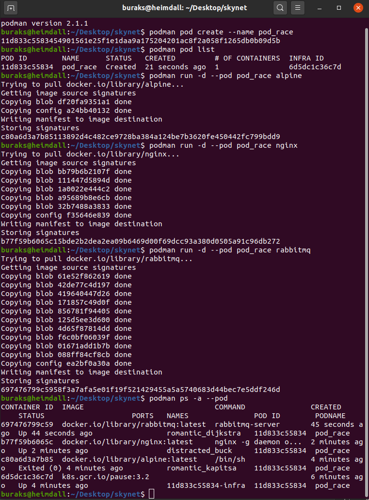

# Docker Yerine Podman _(Pod Manager)_ Kullanmak

Bugün Heimdall üstünden birşeyler kurcalamak istediğimde ilk olarak docker imajı olup olmadığına bakıyor _(kuvvetle muhtemel buluyor)_ ve hemen container'ı ayağa kaldırıp denemelere başlıyorum. Ya da yeni bir ortam hazırlamak istediğimde Dockerfile'ı hazırlıyor ve imajını inşa ettiriyorum. Container teknolojileri denince çoğumuzun aklına Docker'dan başka bir şey gelmiyor. _"Gerçekten böyle mi?"_ diye düşünürken Podman isimli araçla karşılaştım ve Docker'ın güçlü bir alternatifi olarak nasıl kullanıldığını öğrenmem gerektiğine karar verdim.

Esasında Docker'ı tek bir container aracı olarak düşünmemek lazım. Sonuçta Open Container Initiative tarafından belirlenmiş standartlara uyan araçlar mevcut. Open Container Initiative üç temel özelliğin olmasını vurguluyor. Container çalışma zamanı _(runtime)_ , dağıtım stratejisi _(distribution)_ ve images _(images :D )_ Podman'de bu standartlara uyan bir araç. Yani Podman ile hazırlanan imajlar Docker ile de uyumlu diyebiliriz.

Red Hat tarafından açık kaynak geliştirilen Podman özünde Pod _(Hani Kubernetes'in en küçük işlem birimi)_ sistemine dayanıyor. Dolayısıyla Kubernetes'e göç etmek _(migration)_ kolay. Pod'lar içerisinde birden fazla Container söz konusu olabilir. Docker gibi deamon'a ihtiyaç duymuyor. Root kullanıcıyı da şart koşmuyor. Standart bir kullanıcı söz konusu ise onun için açtığı bir namespace'i kullanıyor. Diğer yandan öğrendiğim kadarıyla sadece Linux sistemlerde çalışıyor. Bununla birlikte Docker Compose'un karşılığı henüz yok _(Doğrulanmamış bilgi)_

## Kurulum

Tabii ilk olarak Heimdall _(Ubuntu 20.04)_ üstünde Podman'i kurmam lazım. 

>Güncel kurulum bilgilerine [https://podman.io/getting-started/installation](https://podman.io/getting-started/installation) adresinden bakılabilir.

```bash
# Podman resmi dokümantasyonundaki adımları takip ederek kurulumu yaptım
. /etc/os-release
echo "deb https://download.opensuse.org/repositories/devel:/kubic:/libcontainers:/stable/xUbuntu_${VERSION_ID}/ /" | sudo tee /etc/apt/sources.list.d/devel:kubic:libcontainers:stable.list
curl -L https://download.opensuse.org/repositories/devel:/kubic:/libcontainers:/stable/xUbuntu_${VERSION_ID}/Release.key | sudo apt-key add -
sudo apt-get update
sudo apt-get -y upgrade 
sudo apt-get -y install podman

# Sonrasında bir versiyon kontrolü de yaptım
podman -v
```

## Çalışma Zamanı

Birkaç komutla Podman'i incelemeye başlayalım.

```bash
# İlk ilgi çekici kısım bir pod oluşturmak ve
# bu pod içerisine n sayıda container yerleştirmek

# Önce pod'u oluşturalım (adı pod_race olsun)
podman pod create --name pod_race

# pod listesine bir bakalım
podman pod list

# Bu pod içinde bir tane alpine imajından container başlatalım
podman run -d --pod pod_race alpine

# Hadi bir tane de nginx imajından http server container'ı çalıştıralım (aynı pod içinde)
podman run -d --pod pod_race nginx

# Hatta bir tane de rabbitmq container'ı başlatalım. O da aynı pod içinde olsun.
podman run -d --pod pod_race rabbitmq

# Şimdi pod_race isimli pod'un içindeki container'lara bakabiliriz
podman ps -a --pod

# Aşağıdaki komutla yüklü olan image'lara da bakabiliriz
podman images

# Bir podu durdurabiliriz. Bu içindeki Container'ları da durduracaktır.
podman pod stop pod_race

# Pek tabi oluşturulan bir podu içerisindeki container'lar ile birlikte silebiliriz de
podman pod rm pod_race
```



```bash
# Podman ile uzak depolardaki imajları kolayca arayabiliriz

# Mesela sevgili MariaDB imajlarını aradığımızı, 20 yıldız üstünde olup automated özellikli olanları bulmak istediğimizi düşünelim
podman search mariadb --filter=stars=20 --filter=is-automated

# ya da resmi bir imaj arayıp açıklamasınında tamamını(--no-trunc) istersek şunu kullanabiliriz
podman search mariadb --no-trunc --filter=is-official

# Hatta çıktı tablosundaki kolonlardan sadece istediklerimizi de mustache stilindeki parametrelerle değiştirebiliriz
podman search --format "table {{.Name}} {{.Stars}}" mariadb --filter=stars=20

# Uzak repolardaki kendi imajlarımızı da aratmak isteyebiliriz elbette.
# Mesela Quay.io'da ki imajlarımızı aratmak istedik
# Aşağıdaki komutla bunu yapabiliriz?
# Lakin kuvvetle muhtemel öncesinde Quay.io için Login olmamız gerekebilir
# Podman bunu da sağlar
podman login quay.io
podman search quay.io/

# Uzak diyarlardaki imajları terminalden nasıl arayacağımızı gördük
# Bazen belli bir imajın özelliklerine sisteme indirmeden detayda da bakmak isteyebiliriz
# İşte bir örnek
skopeo inspect docker://docker.io/alpine:latest
```


> Varsayılan kurulumda image registery adresleri olarak docker ve quay kullanılır. Başka adresler eklemek istersek _(mesela private repo'lar)_  /etc/containers/registries.conf dosyasını düzenlemek gerekir.

### Skopeo

Podman ile ilgili bilgileri araştırırken yanında yardımcı başka araçları da görebiliyoruz. OCI ilkelerine göre imaj oluşturmayı kolaylaştıran Buildah _(Kanımca Build Yeaaa diye telafuz ediliyor)_ veya yukarıda bir imajın detay özelliklerini öğrenmek ve aynı zamanda depolar arası container transferlerini _(kendi deponuzdan docker.io veya quay.io gibi public registery noktalarına ya da tam tersi vb)_ kolaylaştıran skopeo gibi araçlar. Skopeo için []() adresinde işletim sistemine uygun adımlar takip edilebilir. Ben Heimdall için aşağıdaki adımları takip ettim.

```bash
. /etc/os-release
sudo sh -c "echo 'deb http://download.opensuse.org/repositories/devel:/kubic:/libcontainers:/stable/x${NAME}_${VERSION_ID}/ /' > /etc/apt/sources.list.d/devel:kubic:libcontainers:stable.list"
curl -L https://download.opensuse.org/repositories/devel:/kubic:/libcontainers:/stable/x${NAME}_${VERSION_ID}/Release.key | sudo apt-key add -
sudo apt-get -y update
sudo apt-get -y install skopeo
```

## Bomba Sorular

- pod_a ve pod_b iki ayrı pod olsunda. pod_a içindeki bir container pod_b içindeki bir container ile iletişim kurabilir mi? Örneğin pod_a'da ki bir .net web api, pod_b'deki mongodb container'ını kullanabilir mi?

## Ödevler

- Podman benzeri OCI standartlarına uyan başka container teknolojileri var mı araştırınız?