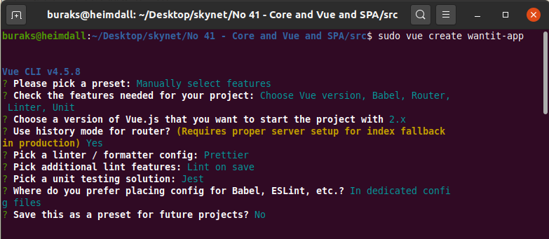

# .Net Core ve Vue.js Kullanarak Single Page Application Geliştirmek

Bu çalışmadaki amacım backend tarafta .Net Core, frontend tarafta Vue.js kullanılan basit bir Single Page Application geliştirmek. Bu oldukça yaygın kullanılan bir kombinasyon diyebilirim. Bulunduğum şirkette yeni nesil uygulamaların çoğu önyüz tarafında Vue kullanırken, iş kuralları ve veri odaklı iletişim noktalarında .Net Core ile yazılmış Web API'leri tüketiyor.

## Ön Hazırlıklar

Örneği Heimdall _(Ubuntu 20.04)_ üstünde geliştiriyorum. Öncelikle Vue uygulamasını kolayca inşa etmemi sağlayacak komut satırı arayüzünü _(CLI-Command Line Interface)_ yüklemem gerekti.

```bash
# Tabii sistemimde node.js ve npm de yüklüydü
npm install -g @vue/cli

# Uygulama klasör ağacının inşaası
mkdir wantit-app
cd wantit-app

# vue uygulamamızı oluşturalım
# Manually ilerleyip aşağıdaki ekran görüntüsünde yer alan seçimleri yapabiliriz 
vue create showcase

# web api tarafı ise bir .net core uygulaması
dotnet new webapi -o showcaseapi
```



## Çalışma Zamanı

## Bomba Sorular

## Ödevler