# Vue.js İçin Bebek Adımları _(Vue 2 Tabanlı)_

Frontend tarafındaki javascript çatıları _(Framework)_ söz konusu olduğunda gerçekten çok cahilim. Evet şirkette .Net Core Web API servislerini kullanan Vue.js uygulamaları söz konusu ve bunların üstünde geliştirmeler yapıyoruz ama temelleri öğrenmek adına başa dönüp bebek adımlarını atmam gerektiğini düşünüyorum. Vue'nun resmi dokümanı bu anlamda işimi görecektir.

## Hazırlıklar

Aslında çok büyük bir hazırlığa gerek. Temel konular için Vue'nun CDN kaynağından yararlanacağım tekil HTML sayfalarını kullanmayı düşünüyorum. Bebek adımları için ideal.

```bash
cd src

# İlk olarak Reactive olma halini anlamaya çalışalım
touch vue_is_reactive.html

# İkinci örnek attribute binding ile ilgili
touch vue_attribute_binding.html

# Üçüncü örnek akış kontrol ifadeleri ile ilgili
touch vue_conditional_render.html

# Dördüncü örnek bir listenin döngüsel olarak ele alınması
touch vue_for_loop.html

# Beşinci örnekte olay(Event) aksiyonlarına bakıyoruz
touch vue_event_handling.html

# Altıncı örnek verinin depolanması yerine hesaplanılmasına odaklanır
touch vue_computed_props.html

# Yedinci örnek kalabalıklaşan app nesne özellikleri sebebiyle component kullanımını ele alır
touch vue_components.html

# Sekizinci örnek form ile veri ekleme konusunu ele alır
touch vue_forms.html
```

## Çalışma Zamanı

HTML sayfalarını bir tarayıcıda açmak yeterli. Sırasıyla örneklerden elde ettiğim sonuçları da aşağıya ekran görüntüleri şeklinde alabilirim.

### vue_is_reactive Örneğine Ait Ekran Çıktıları


### vue_attribute_binding Örneğine Ait Ekran Çıktıları


### vue_conditional_render Örneğine Ait Ekran Çıktıları


### vue_for_loop Örneğine Ait Ekran Çıktıları

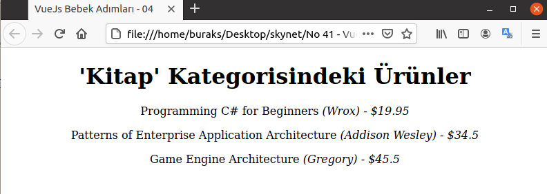

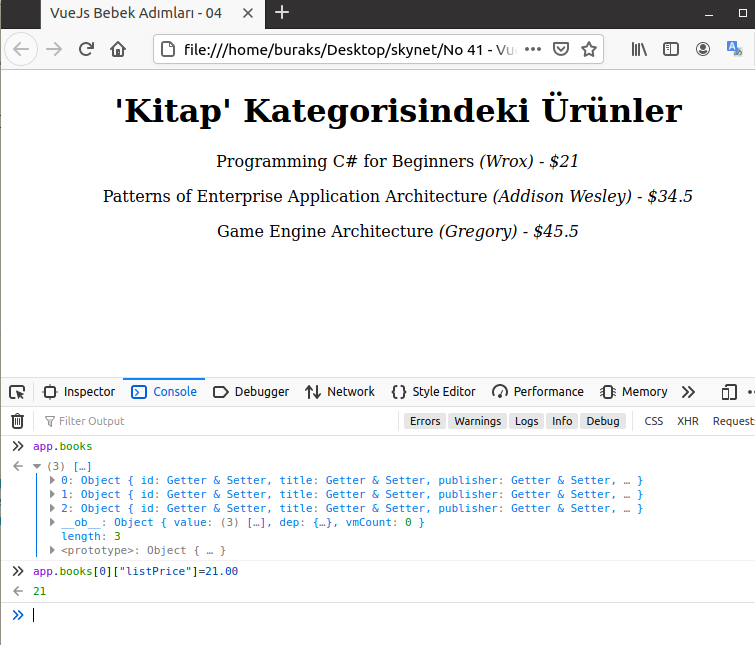

### vue_event_handling Örneğine Ait Ekran Çıktıları

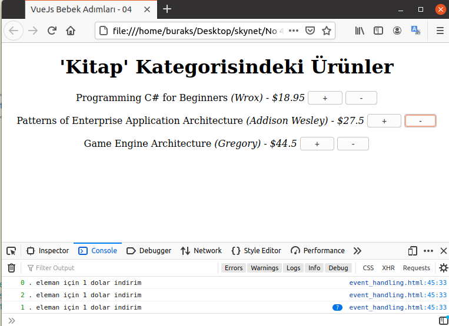

_Sonradan örnek bir css niteliğini book nesnesinin color özelliğine bağladım_

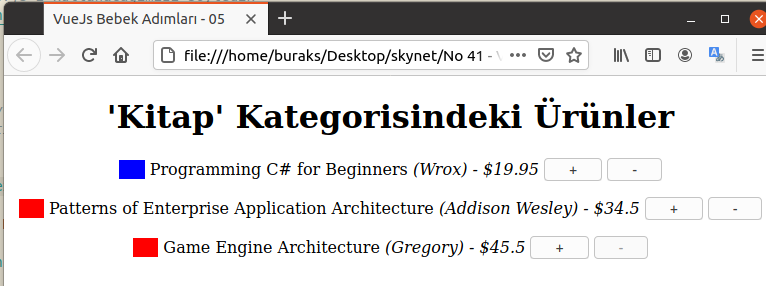

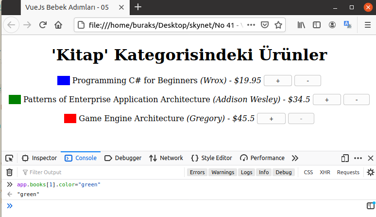

### vue_computed_props Örneğine Ait Ekran Çıktısı

_Mouse bir kitap üstüne geldikçe ürün fiyatının güncel kurdan karşılığı alt tarafa yansıtılır.

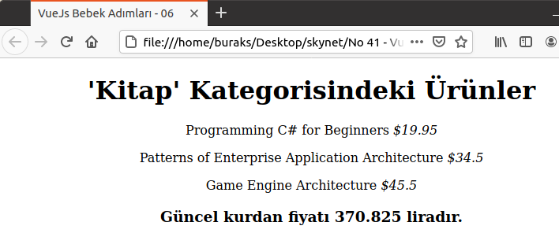

### vue_components Örneğine Ait Ekran Çıktıları

_Tasarımın şiddetine takılmayın :D_

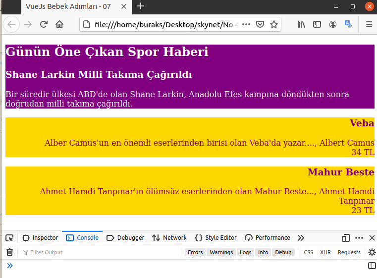

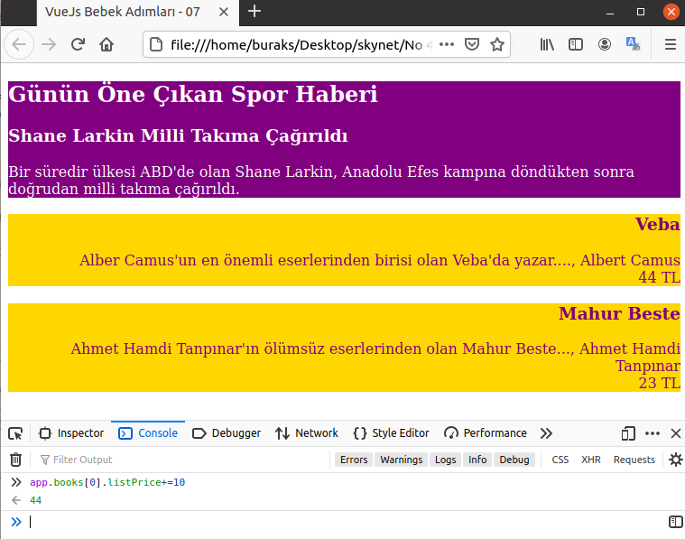

_Alt bileşenden üst bileşene mesaj gönderip bir olayın işletilmesi_
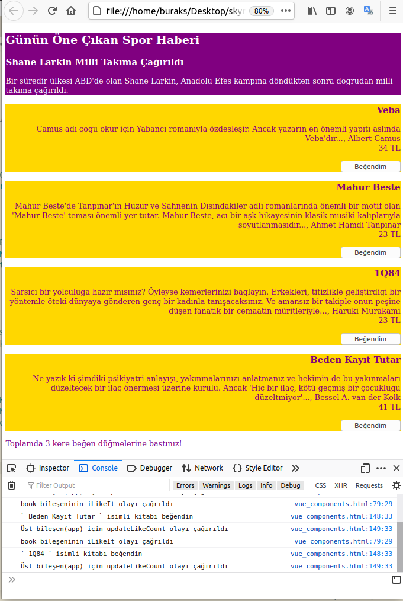

### vue_forms Örneğine Ait Ekran Çıktıları

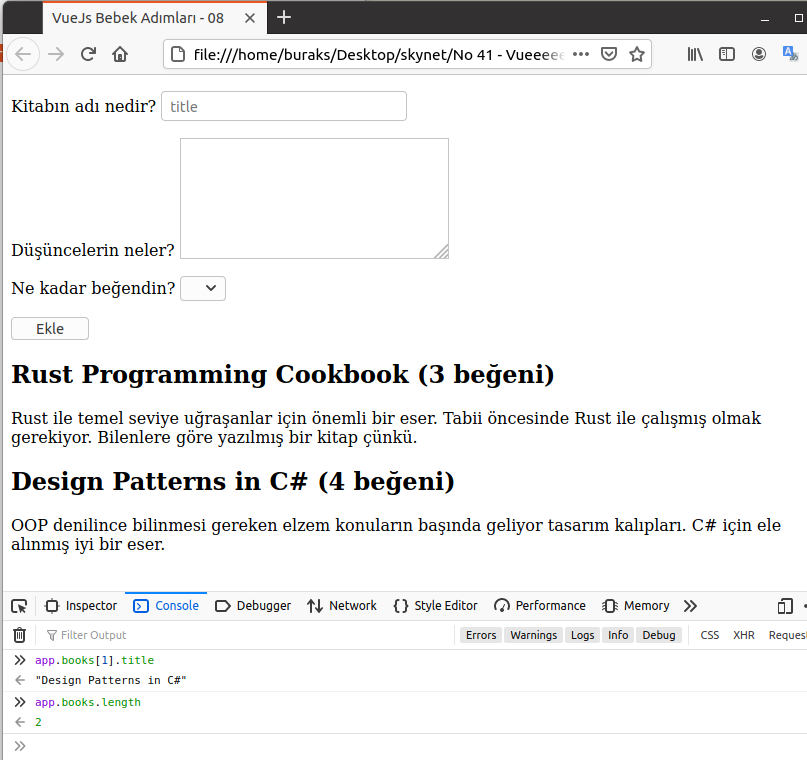

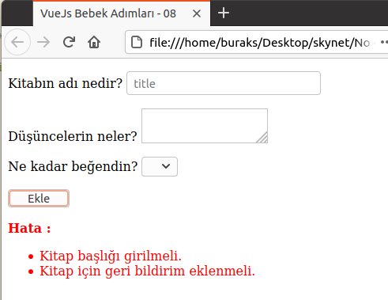

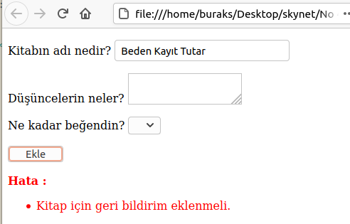

## Bomba Sorular

- Vue.js'te v-switch direktifi var mıdır? Yoksa bile kullanmanın bir yolu olabilir mi?
- vue_event_handling örneğinde tek bir karakter ekleyerek oluşacak bug'ı bulun.
- Vue.component ile bileşen tanımlanırken computed, methods özelliklerini kullanabilir miyiz?
- vue_components.html örneğinde yer alan data neden bir fonksiyon şeklinde tanımlanmıştır?
- _"Props'lar üst bileşenden alt bileşene veri aktarımında kullanılırlar"_ ifadesi doğru mudur?

## Ödevler

- vue_attribute_binding.html örneğinde kitap fotoğrafına bir link bağlayın _(a href)_ ve _href_ niteliğinin data nesnesindeki _url_ isimli özellikten beslenmesini sağlayın.
- vue_conditional_render.html örneğinde, level değişkeninin Small, Medium, Large, XLarge olmasına göre sayfanın sağ üst köşesinde S,M,L,XL harflerinin şöyle janjanlı imajlar şeklinde görünmesini sağlayın.
- vue_for_loop örneğinde yer alan level değerini kullanarak kitap fontlarını renklendirmeyi deneyin. 100 için farklı bir renk, 300 için farklı bir renk vb
- vue_event_handling örneğinde fiyat azaltmada 0 ve eksi değere geçilmesini önleyin. Ayrıca her ürün fiyatı için bir üst artırma limit olsun ve artışlar bu değeri geçemesin.
- Vue antrenmanı yaptığınız herhangi bir sayfada, yine ürünleri listeleyin. Ancak bir ürün adının üstüne geldiğinizde ürünün fotoğrafını olduğu bir div aktif hale gelsin. Yani ürün adı üstüne gelince fotoğraf gösterilmesini yapmayı deneyin. Popup ile uğraşmayın, sayfadaki bir div alanı görünür hale gelsin yeterli. 
- Okduğunuz son beş kitabın sadece başlıklarını listeleyen bir bileşen tasarlayın. Bu bileşende her başlık yanında "Detay" isimli bir Button olsun. Bu düğmeye basınca kitapla ilgili detayları içeren başak bir bileşen başlığın hemen altında görünür hale gelsin.
- Vue_forms.html örneğinde kitap ekledikçe ekrana listeliyoruz. for döngüsünde book isimli bir bileşen kullanmayı deneyiniz?
- Vue_forms.html'de title ve summary alanlarını zorunlu tuttuk. Bunlara ek olarak summary için maksimum 250 karakter girilmesine izin verecek şekilde doğrulama fonksiyonelliğini geliştirin.